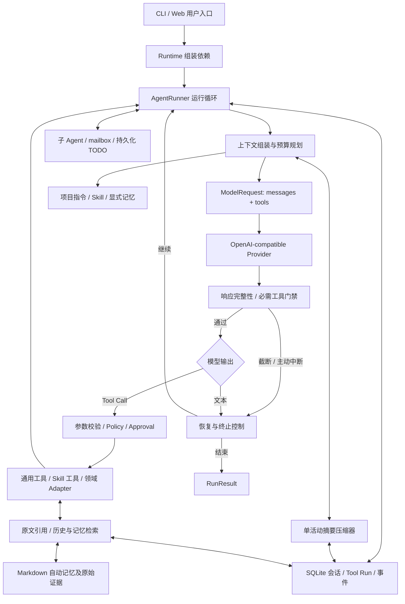

# Agent / 大模型应用研发：上下文管理架构与面试手册

> 整理日期：2026-09-07
>
> 实现核对基线：`5ed983d`（`feat: add persistent session todo plans`）
>
> 2026-09-10 补充核对：Skill 历史交付、整组保留和请求恢复按 `875750c` 更新；历史指标不重测。
>
> 2026-09-13 补充核对至 `1fea79e`：更新双路径默认策略、正文门限、独立验收及后续计划；扩展技术追问，新增 Q23—Q25。历史实验沿用各自冻结版本，本轮未重跑模型。
>
> 2026-09-16 核对至 `2bb51f4`：修正双路径证据范围、tail 预算和错误恢复的适用路径，补充 `745ad3c` 的进程清理与响应恢复。差异、默认开关和验证入口见[实现核对记录](implementation-audit.md)。
>
> 适用角色：上下文管理模块核心开发，目标岗位为 Agent / 大模型应用研发。
>
> 本文将当前实现、历史实验和后续计划分开记录。历史指标不代表当前版本重新实测；第一人称回答是口述草稿，使用时按本人实际主导、参与和协作的范围调整。

阅读路线：第 1 节准备开场，第 2–3 节准备架构白板，第 4、7 节准备项目深挖，第 5 节核对指标，第 6 节练习追问。时间紧时先看第 10 节速记，再展开自己实际负责的部分。

岗位导向、个人贡献、平台扩展和能力缺口的口述练习见[招聘文档 F01—F12](agent-hiring-mainland-2026-09.md#hiring-followups)。这里集中解释技术机制，避免重复维护同一套项目介绍。

2026-09-14 补充：[开发负责人简历成稿](resume-materials.md#context-owner-resume)、[负责人开场](#owner-introduction)与 [Q22 职责追问](#q22-ownership)，用于将已有技术素材组织为一项完整经历；历史实验未重测。

## 1. 面试时如何介绍这个项目

### 1.1 30 秒版本

> 这个项目是一个本地优先的通用 CLI Agent，通过模型调用、工具执行和 Skill 扩展，支持代码操作以及鲲鹏迁移、性能分析等任务。我是上下文管理模块的核心开发，主要解决长任务中历史膨胀、压缩停顿、工具协议被截断，以及压缩后如何恢复原始证据的问题。设计上把持久会话和模型请求视图分开，结合分层预算、单活动摘要、近期原文和按需回读，在控制输入成本的同时保留任务目标与可追溯性。

### 1.2 两分钟版本

> Agent 的上下文会随工具执行持续增长，而且里面混合了项目规则、用户目标、历史结果、长期记忆和运行状态。直接保留最后几轮会丢掉目标和关键证据；把所有历史反复拼进去，又会增加 token、缓存失效和超限风险。
>
> 我负责的部分把上下文拆成带来源、保留策略、优先级和原子组的 `ContextItem`。每次调用前先做预算选择，再按稳定前缀、历史和动态尾部组织请求。旧历史使用一个可替换的活动摘要，近期执行保留原始消息；当前任务中已被压缩覆盖的用户目标和 steering 单独按原始角色回放。
>
> 压缩也是一个有失败状态的工程流程。新摘要先生成和校验，再通过事务发布；失败不推进游标。原始会话和外置正文保留，摘要有来源范围、哈希和父版本，可以回读、回滚和重建。大工具结果则使用 blob 引用和按需检索，避免每轮重复传全文。
>
> 验证上，我会分别看协议正确性、质量保留和成本。仓库的历史受控实验中，调整稳定前缀后，Fast 场景的全请求加权缓存命中率从 70.44% 到 84.81%，每逻辑轮折算成本下降 35.02%。这组是离线实验；另外一次固定合成任务的 20 次真实模型压缩回放全部通过门禁，p95 为 9.96 秒。真实业务上的长期质量和任务完成率仍需要更大样本验证。

### 1.3 个人贡献的表达边界

| 范围 | 建议表达 |
|---|---|
| 上下文分层、预算、组装、压缩、恢复 | 按实际贡献使用“我设计 / 实现 / 优化了”，准备对应源码和取舍 |
| 大结果外置、引用回读、记忆进入上下文的方式 | 说明自己负责的数据流、生命周期或集成部分 |
| 评测框架与历史指标 | 区分“我设计并运行的实验”和“项目已有评测结果” |
| Agent 主循环、Provider、子 Agent、领域工具、Web | 作为整体架构及协作接口介绍；不默认声明全部由自己独立开发 |

最值得展开的三个亮点：**请求视图与事实源分离、可恢复的事务化压缩、兼顾正确性的成本评测**。

<a id="owner-introduction"></a>

### 1.4 以“上下文管理机制开发负责人”开场

以下按本人实际承担方案、主要实现和验证职责起草，与[简历成稿](resume-materials.md#context-owner-resume)配套，口述约一分钟：

> 我在这个项目中担任上下文管理机制的开发负责人，负责方案设计、核心实现和验证。这个模块要解决的是长任务不断积累日志、源码和工具结果后，如何在有限模型窗口内保留目标、控制输入，并在压缩失败或会话恢复时继续工作。
>
> 我主导的架构把持久会话与每次模型请求的视图分开：旧历史生成可替换摘要，近期保留完整工具组，大结果通过引用按需读取。关键约束包括用户目标保留、工具调用与结果配对，以及摘要发布失败不推进游标；这些约束贯穿请求组装、存储和恢复流程。
>
> 验证上，我把事实和协议检查作为质量门禁，再比较成本。历史离线缓存对照中，优化请求布局使 Fast 每逻辑轮折算成本降低 35.02%。这组数据对应当时的固定布局和负载；当前策略的整题效果另用任务验收评估。

如果实验由他人执行，最后一段按实际改为“我定义验收标准并分析结果”或“我负责实现，项目已有评测显示……”。团队分工和推进经历只在本人确实承担时展开。

## 2. 整体架构：上下文模块处在什么位置

### 2.1 系统全貌



主链路是：**用户提出任务 → 构造上下文 → 模型决定动作 → 程序校验并执行工具 → 持久化结果 → 构造下一次上下文**。

上下文模块控制的是“本次模型能看到什么、以什么身份和顺序看到、花多少输入预算、缺失时怎样恢复”。权限决策、工具真实执行和业务验收分别由对应模块承担。

### 2.2 四类数据及其职责

| 数据 | 内容 | 作用与边界 |
|---|---|---|
| 持久会话与事件 | 原始角色、用户输入、Assistant、Tool Call / Result 记录、执行事件 | 审计和恢复依据；压缩不会删除或改写既有 Transcript |
| 外置 blob | 大消息、工具结果的完整正文，按内容 SHA-256 寻址 | 会话记录可保存预览与引用；完整证据由 Transcript 与 blob 共同提供 |
| 压缩版本 | 摘要、覆盖范围、游标、父版本、来源哈希、用户锚点 | 有损且可替换的派生视图；不能代替原始用户证据 |
| 长期记忆与资源 | 显式记忆、自动记忆、项目指令、Skill 文件 | 分别按来源和生命周期加载；自动记忆也是派生知识，归因时需回原文 |

**关键区分：原文可恢复，不等于每次请求都无损。** 预算装箱、摘要和预览都会省略信息；保留事实源是为了后续能检索和纠错。

实现入口：[Runtime](../../src/bot/cli/runtime.py)、[AgentRunner](../../src/bot/core/agent.py)、[会话存储](../../src/bot/sessions/store.py)。

## 3. 上下文核心设计

### 3.1 把 Prompt 变成有类型的请求规划

`ContextItem` 的主要字段包括：

| 字段 | 解决的问题 |
|---|---|
| `layer` | 这段内容属于规则、记忆、摘要、历史还是运行状态 |
| `message` | 最终角色、正文和工具协议字段 |
| `source` / `trust` | 内容来源和内部信任标记，便于审计 |
| `retention` | 必留、已检查点化、可回读或一次性交付等保留语义 |
| `priority` / `token_estimate` | 在预算有限时如何选择 |
| `atomic_group` | 哪些消息必须整体保留或移除 |
| `position` / `metadata` | 恢复时间顺序和携带额外状态 |

保留策略包括 `PINNED`、`CHECKPOINTED`、`REHYDRATABLE`、`DISPOSABLE`。当前 Planner 先找出含
pinned 项的完整原子组并整组保留，再按其他组的优先级和新旧程度装箱；这些枚举不意味着四套
独立的智能调度算法。某条 Skill Tool Result 必留时，其调用及同批其他结果也必须保留。

**是否选入与最终排序是两步。** 不能把“出现在前面”理解为“预算优先级最高”，也不能把 `ContextTrust` 理解成已经执行的权限隔离。

### 3.2 最终请求长什么样

默认 `memory.context_mode="on_demand"`、`skills.context_mode="history"` 下，主请求按以下顺序发送：

```text
唯一 system：代码内置 Core Policy
  ↓
synthetic user：Project Instructions → Environment → Skill Catalog
               → Tool Catalog（需要时）→ Explicit Memory
  ↓
原始 user：已被压缩覆盖、需要保留的活动任务目标与 steering
  ↓
assistant(name=context_compaction)：唯一活动摘要
  ↓
历史：cursor 之后的 User / Assistant / Tool Call / Tool Result
      自动 Skill 正文随 Tool Result；显式及恢复正文为 synthetic user
  ↓
synthetic user：Runtime Note（含 Router 提示及运行状态）

tools：通过请求顶层字段独立发送，按名称稳定排序
```

自动记忆默认不直接注入正文。仅在 `eager` 兼容模式中，自动索引位于 Explicit Memory 后、Transcript 前；旧版本“自动记忆放在尾部”的实验记录不代表当前实现。

只有持久布局为 `legacy` 的兼容会话仍在 Tool Catalog 后保留 Active Skill 层。新模式下
Skill 绑定属于当前 Run，Run 结束关闭；历史正文不会立刻删除，也不代表下一 Run 已激活。
必要正文被压缩覆盖时从原版 blob 恢复，发送前验证完整内容和工具配对，失败则停止执行。
实现、会话迁移和单样本行为证据见 [Skill 历史交付实施与验证](../evaluations/skill-context-validation.md)。

synthetic user 使用保留的 `name` 和 `bot.context.v1` 信封，明确 `is_current_user_message=false`、`can_authorize=false`。真实用户消息保留原始角色且不使用这些合成名称。摘要使用 Assistant 角色，因为它是模型对历史的派生表述。

请求发送前还检查：只有内置 Core Policy 能使用 `system`，合成上下文必须携带有效来源信封。信封用于减少来源混淆，真实权限仍需 Policy、Approval 和执行器落实。

### 3.3 Token 预算为什么分软硬两层

```text
hard = min(
  configured_input_limit,
  model_context_window
    - max(output_reserve, configured_model_max_output)
    - protocol_reserve
    - safety_margin
)
target = floor(hard × auto_compact_threshold)
```

以默认配置、未额外指定模型最大输出为例：

- 模型窗口 `131072`；配置输入上限 `120000`。
- 输出预留 `4096`，协议预留 `2048`，安全余量 `2048`。
- `hard = min(120000, 122880) = 120000`。
- 自动压缩阈值 `0.8`，因此 `target = 96000`。

`target` 用于提前减载和触发压缩，`hard` 用于最终输入边界判断。输入计数覆盖 `messages` 和顶层 Tool schema。

| 子预算 | 默认值 | 说明 |
|---|---:|---|
| 显式记忆 | 8,000 tokens | eager 模式下与自动索引共享 |
| 活动 Skill 正文 | 16,000 tokens | 聚合上限；history 必需正文完整交付，压缩后恢复；仍放不下则停止 |
| 业务 Tool schema | 16,000 tokens | 内部恢复工具优先保留，子预算不是绝对总上限 |
| Tool Result 内联摘录 | 4,000 tokens | 长正文通过引用恢复 |
| 近期连续原文 | 20,000 tokens | 有界目标；最新单个不可拆组可例外超过 |
| 摘要正文 | 通常约 3,000 tokens | 双路径提示词中的软目标；`compaction_summary_target_tokens` 用于旧 CURRENT 请求；原 4K 正文发布门限已取消 |
| 旧 CURRENT 压缩输入 | 60,000 tokens | 默认按 80%，即 48,000 规划；不用于描述默认双路径 |
| 默认双路径输入 | 按模型窗口和输出预留规划 | 恢复后的完整投影还须满足总输入和低水位要求，默认低水位 40K |
| 压缩请求最大输出 | 独立兜底默认 8,192 tokens | 前缀路径继承主请求输出额度；32K 是历史实验配置，非固定默认 |

`TokenEstimator` 仍是启发式估算。官方 DeepSeek V4 Flash 已接入 `estimate_input_tokens()`，
使用对应 tokenizer、消息编码和工程余量；其他模型沿用原计数路径，不能声称服务端计数总有
精确上界。Provider 超限时每个执行 step 最多修复一次，存在 Skill 依赖时本地装箱失败也使用
同一次额度；超限修复失败不再调用模型收尾。计数口径见[输入 token 校准](../architecture/input-token-calibration.md)。

### 3.4 工具消息必须按原子组处理

一个 Assistant 消息可能包含多个 Tool Call，对应结果必须一起进入请求。例如：

```text
Assistant: call A + call B
Tool: result A
Tool: result B
```

预算裁剪或压缩边界不能只保留 `result B`，也不能留下调用却丢掉对应结果。否则既可能触发 Provider 协议错误，也会让模型错误理解执行状态。

中断恢复时，在请求副本中把已有结果移到所属调用旁；对允许修复的历史中断调用补充“中断 / 状态未知”的结果，丢弃无对应调用的孤儿结果。仍在执行的调用不凭空闭合，压缩器停在安全边界之前。以上操作不回写、篡改原始 Transcript，也不会把未知执行结果标成成功。

### 3.5 单活动摘要：把压缩做成可恢复状态机

单活动摘要是持久化与恢复方式，双路径是候选摘要的生成策略，两者可以同时成立。默认
`a_fallback` 先复用已有真实出站请求快照，一次可恢复失败后做独立摘要；两者生成的候选
仍经过检查再发布。以下表示共享的发布约束，不是每条策略都执行相同的区间规划算法。

```text
读取当前 ready 版本及 cursor
  → 选择更早的连续、安全原子前缀
  → 创建 building 记录
  → 生成候选摘要
  → 校验章节、来源范围、生成完整性及适用的恢复输入预算
  → 事务内再次校验 parent 仍是当前活动版本
  → 旧 ready 改为 superseded，新 building 改为 ready

任一步失败：building → failed；不推进原活动 cursor
```

核心字段包括 `covered_start_position`、`covered_end_position`、`delta_start_position`、`parent_id`、`source_sha256`、`anchor_positions_json`、`status`。

- 每个会话最多一个 `ready` 和一个 `building`，由 SQLite 部分唯一索引约束。
- 新版发布时再次比较父版本，避免迟到的压缩结果覆盖已经更新的摘要。
- 主模型只接收一个活动摘要；默认双路径前缀保留主请求形状，独立兜底输入是“已有摘要 + 上次 cursor 之后、本次覆盖范围内的原始消息”。两条路径发布同一覆盖范围，但兜底不会自动重读已被旧摘要覆盖的全部原文。
- 旧 CURRENT 采用增量“旧摘要 + 新增原文”，并默认每累计 5 个成功版本尝试原文重建；这不是双路径的周期策略。重建还受输入窗口约束，不能保证无限长任务始终能定期全量重建。
- 恢复时重新校验来源哈希和摘要结构；最新版本无效则沿父链寻找可用版本。
- 支持 `/compact`、`/compact rebuild`、`/compact rollback <compaction-id>`，以及历史和压缩源回读工具。

`source_sha256` 覆盖持久消息字段，包括 reasoning 和 blob 引用；不会展开 blob 再重复哈希。blob 自身按内容哈希寻址。**这些哈希证明来源一致性，不证明摘要语义正确。**

最新路径与边界见[双路径默认策略](../designs/compaction-dual-path-default.md)、[正文门限调整](../designs/compaction-summary-body-limit-removal.md)；面试追问见 [Q23](#q23-dual-path)。

### 3.6 近期原文与用户锚点为什么要分开

“保留最后三轮用户对话”看似合理，但一次用户任务可能产生几十次工具调用。把三轮当成硬下限，会让近期尾部无限突破预算，压缩也无法推进。

基础选择器从尾部按完整原子组回扫，下一组使 tail 超过 20K 就停止。强制压缩的“三条真实用户
消息”只是预算内停止条件，不计合成 Skill：先达到三条就停，预算先到也停。只有最新单个
原子组本身超过 20K 时允许例外，最终仍受主请求硬限制约束。

这只是初始边界。默认双路径还用 `StrategyCompactor.select_boundary()` 检查包含 Skill 恢复、
用户锚点等内容的完整投影，并预留摘要输出；必要时向后扩大覆盖范围，缩短 raw tail，
以满足低水位。20K 不是最终请求一定保留的原文下限。

为避免单轮长任务中用户目标被压进摘要后变得模糊，系统把当前活动 Run 的真实用户输入及 steering 作为锚点候选，仅保存本次已经覆盖的部分，并按原始 `role=user` 回放。仍在 raw tail 中的用户消息不重复回放。这样 tail 可以从完整 Assistant 消息开始，而用户目标仍有直接来源。

### 3.7 大结果外置与一次性交付

```text
已接收并保留的工具结果 → 内容寻址 blob
            → 请求中保留有界预览 + context_ref
            → 模型按 query 定位，或按 offset / limit 读取
            → 正文只进入下一次实际消费该结果的模型请求
            → 后续只回放短收据，原引用仍可再次读取
```

普通长消息默认约超过 5K tokens 时也会外置；普通 Tool Result 完整正文写 blob，长结果内联摘录受 4K 预算约束。引用回读是例外：它已有源 blob，不把检索结果再外置成第二层 blob。

这里的“完整正文”以执行器实际保留的内容为限。命令输出默认受 `agent.max_tool_output_bytes=1_000_000`
约束；上游已截断或未采集的日志不在 blob 中，不能靠引用恢复，需另存日志文件后读取。

Skill 正文也是例外，但生命周期不同：history 模式把完整正文作为持久历史交付，不走 4K
预览，也不在下一响应后换成收据。资源交付视图保护到下一次有效响应，之后仍按普通历史管理。

一次性交付并非“生成后马上删除”：只有该原子组实际被 Planner 选入且 Provider 完成响应后，内存中的正文才过期为收据。若本轮没选入，不提前过期。

同内容通过 SHA-256 去重，但访问依据是 session 授权关系，知道引用 ID 不等于有权限读取。fork 继承相应引用授权，其他会话需要显式授权。

取舍：节省跨轮重复输入，但模型马上需要全文或后续再次使用同一证据时，会增加检索往返。当前 blob query 会把完整内容读入进程再搜索，还不是数据库内流式全文检索。

### 3.8 自动记忆为什么改成按需检索

历史故障是把自动记忆作为最新真人输入之后的 synthetic user 反复注入，模型可能将派生内容理解成“用户刚说过的话”。

默认路径使用四级确定性 Router：

| 决策 | 含义 |
|---|---|
| `NONE` | 当前任务无需自动记忆，不注入其正文 |
| `SUGGEST_SEARCH` | 存在词法相关候选，建议模型检索 |
| `REQUIRE_SEARCH` | 明确依赖过去约定，必须检索 |
| `REQUIRE_EVIDENCE` | 涉及“用户是否说过”等归因，先搜索再读取原始证据 |

检索正文使用 `tool` 角色一次性交付。支持命名 Tool Choice 的 Provider 可以直接指定工具；不支持时，Agent 在持久化和执行前检查必需工具，丢弃提前结束或错误工具的响应并有界重试。

Router 主要依靠规则和词法匹配，包括中文片段匹配，不是向量检索或完整语义推理器。原始证据门禁可以保证模型有机会看到证据，仍不能数学保证最终答案正确理解证据。

09-16 的[小记忆切换设计](../designs/small-memory-switch-design.md)拟改为 `catalog/full` 并移除 Router，
但尚未实施；当前 `MemoryConfig` 仍只接受 `on_demand/eager`。

本节依据：[上下文组装](../architecture/context-assembly.md)、[可恢复压缩](../architecture/recoverable-context-compaction.md)、[Memory Router](../architecture/memory-routing.md)、[配置模型](../../src/bot/config/models.py)。

## 4. 遇到的问题、定位方法与解决方案

4.1—4.7 保留早期故障复盘。特别是 4.2 中独立压缩模型、关闭 thinking 和 4K 正文门限属于当时的处理方案；默认双路径及后续发布规则已经改变，当前口述以第 3、6 节为准。4.8 补充最新运行时恢复边界。

### 4.1 稳定内容排错位置，导致缓存命中差

- **现象**：会话持续增长时，稳定显式记忆没有进入可复用前缀；压缩之后出现明显 miss 峰值。
- **根因**：旧布局把显式记忆放在增长中的会话后，运行时动态内容又靠前；Tool 注册顺序也可能制造无意义变化。
- **处理**：稳定项目 / Skill Catalog / 显式记忆靠前，摘要与原文保持因果顺序，动态状态放最后，Tool schema 按名称排序；新会话的 Skill 正文位于历史加载位置。
- **验证**：固定 workload hash、seed、输入规模和预算；观察逐请求首个变化片段、cache read / miss、压缩 epoch 和每逻辑轮成本，并先通过正确性门禁。
- **取舍**：显式记忆、Skill 或工具集合确实发生变化时仍会破坏前缀；摘要更换也必然产生新的 epoch，不能靠排序消除所有 miss。
- **证据**：第 5.1 节的历史对照实验。

### 4.2 压缩长时间停顿，失败后还重复付出高成本

- **现象**：历史基线有数分钟等待；压缩输出截断后，重发原文或缩范围再次生成，重复消耗时间和 token。
- **定位**：拆开请求输入、可见摘要、reasoning、finish reason、恢复分支和耗时，发现不能把所有失败归结为输入太长。
- **处理**：压缩模型与运行时主模型切换解耦；3K 软目标、4K 可见硬限制；默认范围级溯源；在仓库适配的 DeepSeek 官方端点上关闭压缩请求 thinking；按错误类型选择恢复动作。
- **取舍**：摘要更短仍可能损失细节；关闭 thinking 的配置具有端点适用范围；历史前后实验负载不同，不能宣称单个改动带来了全部收益。
- **证据**：第 5.2 节及[失败分析](../archive/context-compaction-failure-analysis.md)。

下面是旧 CURRENT 的分类恢复路径；其中正文硬门限已停用，不能作为默认 `a_fallback` 的执行表。

| 错误 | CURRENT 分类恢复方向 | 原因 |
|---|---|---|
| 空响应 | 同一生成请求有限重试 | 可能是一次性空输出 |
| 格式错误 | 只修复候选摘要 | 原文已经处理，不必重新生成全部内容 |
| 长度截断 | 凝练候选摘要 | 输出截断不等于输入范围太大；完整正文超 4K 不再单独拒绝 |
| 限流、超时、传输错误 | 同范围有限重试和退避 | 保持任务不变，恢复基础设施问题 |
| Context overflow | 缩小安全原子输入范围 | 这是直接的输入超限证据 |
| 鉴权、支付、配置、持久化失败 | 停止该压缩流程 | 重试模型不能修复这些问题 |

CURRENT 单次 `compact()` 默认最多 8 个请求、每请求 90 秒；费用在请求之间以 0.25 美元为停止阈值，最后一次请求可能越过阈值。

默认 `a_fallback` 最多一次前缀请求、一次独立兜底，每请求默认 90 秒，两条路径合计默认 180 秒。
前缀缺失或不可复用时直接独立摘要；空输出、格式、截断、意外 Tool Call 及可重试 Provider 错误等
可转兜底；鉴权、配额、来源或父版本变化等直接停止。它不走上述 repair／condense／缩范围循环。
有剩余费用上限时先保守预留；失败不发布，普通压力下策略默认退避 300 秒。
显式 `/compact` 外层仍有 600 秒、8 请求等命令预算；空闲会话没有真实出站快照，只做独立摘要。

### 4.3 保留轮数与保留预算冲突，长单轮压不动

- **根因**：用户轮数和工具轨迹长度没有固定关系，“至少三轮”可能远超预算。
- **处理**：20K 有界连续 tail，加活动用户锚点；在完整 Assistant 边界切分长单轮，Tool Call / Result 保持原子性。
- **验证**：构造一个用户任务产生大量工具调用、运行中追加 steering 的轨迹，检查游标能推进、原始用户锚点仍可见、工具协议仍平衡。
- **取舍**：更早执行步骤进入摘要，需要细节时再回原文；最新超大原子组仍可能触发最终硬限制。

### 4.4 新摘要失败或晚到，破坏已有恢复点

- **根因**：如果先覆盖旧摘要再生成，失败就丢失恢复点；如果不检查父版本，较早启动的慢请求可能覆盖新结果。
- **处理**：`building → ready` 事务发布、唯一活动版本、发布时校验 parent、来源哈希和父版本链。
- **验证**：失败不推进、持久化失败不再次调用模型、来源损坏后回退、回滚和原文重建等测试。
- **取舍**：版本与原文需要存储空间；哈希发现来源不一致，发现不了同来源上的错误总结。

### 4.5 工具中断、steering 插入，形成不合法历史请求

- **根因**：用户新输入可能插在调用和结果之间；进程中断可能留下未闭合调用；直接按消息数截断可能产生孤儿结果。
- **处理**：按工具批次建原子组，在请求副本中修复协议，活动未完成调用阻止越过安全压缩边界。
- **验证**：完整多工具批次、缺失结果、孤儿结果、活动调用与历史调用分别覆盖。
- **取舍**：历史“状态未知”需要重新观察实际环境，不能从协议补齐推导工具执行成功，也不能自动重放有副作用的命令。

### 4.6 大结果每轮重复回放，检索后又形成第二份长历史

- **根因**：仅外置原始 Tool Result 不够，回读全文若永久进入 Transcript，后续仍然反复支付输入成本。
- **处理**：有界预览、内容寻址引用、query 定位、范围读取、回读正文一次性交付和短收据。
- **验证**：区分首次交付与相同 `tool_call_id` 的重复交付，分别统计引用调用数、输入 token、任务事实与越权读取。
- **取舍**：query 比盲分页省调用，不代表外置比全文内联更少调用；两组对照不能混为一谈。

### 4.7 自动记忆与用户原话混淆

- **根因**：角色与位置模糊，派生内容被作为新的 synthetic user 重复呈现。
- **处理**：来源信封、摘要使用 Assistant、自动记忆按需 Tool 检索，用户归因必须回原始证据，必需工具由执行门禁保证。
- **验证**：让自动记忆写“用户提供过全文”，原始 user 明确否认，检查搜索、证据角色、模型回答和额外请求成本。
- **取舍**：词法 Router 可能漏掉隐式语义关联；相关任务往往增加模型往返。当前小样本中两种方案都答对，不能声称已经测出总体质量提升。

### 4.8 响应截断与取消清理：已实现不等于默认自动续跑

`745ad3c` 已在解析参数、持久化 Assistant 调用和执行工具之前检查响应完整性。
`length/max_tokens` 或主动中断的整批正文与工具缓冲会隔离到诊断 blob；即使其中某个调用
已经是合法 JSON，也不执行。自动恢复默认关闭；启用后每个 episode 默认一次、每个任务两次、
每阶段 120 秒，首个恢复响应最多 8,192 tokens，且不提高原有更小的输出上限。
额度及阶段截止持久化，resume／压缩不会清零。这与网络退避、上下文超限修复是三条不同路径。

工具重复限制和流式正文重复检测分别有 `repeat_guard_mode` 与 `stream_guard.mode`，均默认
`observe`；reasoning 仅观测，不能声称所有重复都会自动打断。进程清理默认总期限 5 秒，
TERM／KILL／排空为 2／2／1 秒；无法确认清理完成时记录 `cleanup_failed`，保留残留状态并阻止
同批后续工具执行。POSIX 的 SID／后代观察有边界，不是 OS 强沙箱。

源码见[恢复控制](../../src/bot/core/termination/recovery.py)、[进程范围](../../src/bot/execution/process_scope.py)；
验证与平台限制见[P0 验收](../evaluations/task-reliability-p0-results.md)。这些回归不能当作真实任务成功率提升。

## 5. 量化结果：可以讲哪些数字

### 5.1 缓存布局优化：离线、同工作负载对照

实验日期为 **2026-08-23**，旧提交 `cb911b1` 对比新提交 `d16b203`。Provider 和 Tool 使用确定性替身，上下文、压缩、主循环和 SQLite 走生产代码。

- Fast：40 个逻辑轮，24K effective input budget，每轮 5,500 字符工具输出，6,000 字符稳定记忆；两组均压缩 5 次。
- Soak：168 个逻辑轮，131,072 模型窗口、120K 配置输入上限，16,000 字符稳定记忆；两组均压缩 7 次。
- 两组分别保持相同 workload SHA-256、seed、预算和成本比例，正确性门禁全部通过。

| 指标 | Fast：旧 → 新 | Soak：旧 → 新 |
|---|---:|---:|
| 全请求加权缓存命中率 | 70.4433% → 84.8110% | 89.7017% → 95.6215% |
| 命中率变化 | +14.37 个百分点 | +5.92 个百分点 |
| 每逻辑轮折算成本 | 7,857.92 → 5,106.16 | 26,482.36 → 19,174.94 |
| 每逻辑轮折算成本变化 | -35.02% | -27.59% |
| Cache miss tokens | 251,463 → 129,189 | 2,372,697 → 1,008,757 |

Fast 在压缩后恢复到 80% 命中所需请求数由 **6 次变成 2 次**。该结论对应 Fast，不能推广为所有套组都从 6 次到 2 次。

```text
加权命中率 = sum(cache_read_tokens) / sum(prompt_tokens)

每逻辑轮折算成本 =
  [miss_input + cache_read × cached_input_cost_ratio
              + output × output_cost_ratio] / logical_turns
```

分子包含主 Agent 和压缩请求。Token 来自项目估算器，缓存按连续完全相同前缀模拟，成本是折算单位，**不是线上美元账单**。命中率变化使用“百分点”，成本变化使用相对百分比。

**可口述**：“在同工作负载的离线对照中，稳定前缀优化让 Fast 加权命中率提高 14.37 个百分点，包含压缩开销的单逻辑轮折算成本下降 35.02%；更长的 Soak 场景下降 27.59%。”

来源：[长任务上下文缓存评测](../evaluations/context-cache-benchmark.md)。

### 5.2 压缩稳定性：真实 Provider、固定合成轨迹回放

历史问题基线 `3dfae7b` 记录 26 次压缩计划，成功 11 次（42.3%）、失败 15 次；其中一次长度失败加缩范围重试累计等待 491.6 秒。

**2026-08-25** 的候选 `hybrid-20k` 使用 12 轮合成 Transcript、每轮 14,000 字符工具输出，完成 20 次 DeepSeek V4 Flash 真实回放：

| 指标 | 结果 |
|---|---:|
| 成功且通过质量门禁 | 20 / 20 |
| 每次模型请求数 | 1 |
| 压缩耗时 p50 | 5.57 秒 |
| 压缩耗时 p95 / 最大值 | 9.96 / 9.96 秒 |
| completion / 可见摘要比例 p95 | 1.216 |
| 最大 reasoning 字符数 | 0 |
| 记录总费用 | 0.272528 美元 |

**可口述**：“针对压缩的长度、格式和传输故障做了分类恢复，并约束摘要预算。候选配置在固定合成轨迹的 20 次真实模型回放中全部通过，p95 为 9.96 秒。”

不能说“生产成功率从 42.3% 提升到 100%”或把 491.6 秒与 p95 直接计算为性能提升倍数：两组的负载、模型及配置不完全相同。20 次成功也不能推出未来失败率为零。

此外，2026-08-31 已把历史“三轮硬下限”改为当前“有界 tail + 用户锚点 + Assistant-safe 切分”。20 次回放是旧候选的历史结果，不能当作这些后续改动已经重复完成的真实模型验证。

来源：[压缩有效性评测](../evaluations/context-compaction-effectiveness.md)、[历史失败分析](../archive/context-compaction-failure-analysis.md)。

### 5.3 记忆按需检索：小样本真实模型的成本取舍

**2026-08-29**，四个固定 fixture × eager / on-demand 两种方案 × 各 3 次，共 24 次 case 执行。模型为 `deepseek-v4-flash`，temperature 为 0。

24 / 24 通过质量门禁，两种方案在四个场景中都答对，记录总费用为 0.127851 美元。以下是 on-demand 相对 eager 的成对中位差：

| 场景 | 模型请求数差 | 输入 tokens 差 | 费用差 | 端到端耗时差 |
|---|---:|---:|---:|---:|
| 无关请求 | 0 | -355 | -$0.000647 | -1.263 秒 |
| 隐式相关 | +1 | +1,834 | +$0.001693 | +2.323 秒 |
| 明确历史依赖 | +1 | +1,374 | +$0.001094 | +0.894 秒 |
| 用户归因冲突 | +1 | +1,698 | +$0.001448 | +0.501 秒 |

**可口述**：“按需记忆减少无关轮次的重复注入，但相关任务存在额外检索成本。在这组 canary 中，无关场景少 355 个输入 token；三个相关场景请求数中位差都是增加一次。我的结论是来源边界更明确、成本有取舍，还不能声称总体回答准确率更高。”

这里是四个语义样本的重复运行，不能称为 24 个不同业务场景，也不能推断统计显著性。

来源：[Memory Router](../architecture/memory-routing.md)、[已入库的机器可读聚合结果](../archive/memory-routing-live-canary-2026-08-29.json)。

### 5.4 真实任务验证的边界

2026-08-30 的 TerminalBench 六任务样本通过 **1 / 6（16.7%）**，六个 Trial 均未触发压缩；最大单轮 prompt 为 89,165 tokens，低于该配置 96,000 的触发线。

这批结果能帮助定位整个 Agent 的任务失败，但不能证明压缩提高或降低了完成率。后续定向复测还出现过 Provider 报告的 prompt 大于本地配置上限的情况；09-10 已针对 Flash 非思考模式接入并核对 tokenizer，其他模式与样本仍需扩展。

09-13 的 `path-tracing-reverse` 四策略三轮比较已经实际触发压缩，双路径在三场有效运行中均正常结束并通过完整官方验收。实验使用 `99d70d8` 运行包，早于正文门限取消和重复控制修复，不能当成当前组合版本的重测。

**可口述**：“早期六任务样本没有触发压缩；后续单题四策略重复实验补上了这条链路，双路径表现最好。现在还缺多任务泛化、从相同状态出发的因果消融，以及最新组合版本的整题对照，不能把三次同题通过描述成稳定成功率。”

来源：[TerminalBench 六任务记录](../archive/terminalbench-context-medium-six-results.md)、[Flash 三轮复测](../evaluations/context-strategy-flash-repeats.md)、[归因边界](../evaluations/context-strategy-flash-causal-analysis.md)。

## 6. 高频面试问题与建议回答

以下先给可口述的主回答，再对容易继续深挖的题目补充追问。旧 CURRENT 的历史优化与默认双路径明确区分；不要把不同版本拼成一个不存在的方案。

### Q1：为什么不用更大的上下文窗口，或者直接保留最近 N 轮？

更大的窗口可以推迟超限，但历史仍会增长，也不会自动解决重复输入成本、来源混淆和工具协议问题。最近 N 轮也不是稳定的大小单位，一轮可以有大量工具输出。当前方案用 token 预算控制近期轨迹，用用户锚点保留目标，用摘要保留阶段状态，用原文回读补充细节；更大窗口仍然是可选的容量手段。

### Q2：这和普通 RAG 有什么区别？

检索在这里主要补充被卸载的原文和历史证据。上下文管理还要维护消息角色、用户目标、工具调用配对、运行时状态、压缩游标和请求成本，不只是找几段相关文档。当前自动记忆路由与检索偏规则和词法，也没有把整个方案建立在向量数据库上。

### Q3：为什么选择滚动单摘要，不叠加多份摘要？

叠加摘要会让摘要本身持续膨胀，也容易同时保留过期结论和重复事项。滚动摘要把“旧摘要 + 新证据”更新成一个活动状态，便于约束预算。但它可能产生递归总结漂移，所以保留父版本、原文回读和有条件原文重建。可选 `b` 策略已经实现叶子摘要与树形合并，但最终也只发布一个活动根；分主题长期检索与多摘要一致性仍需另行设计，不能把树形生成过程等同于同时向主模型注入多份摘要。

### Q4：你怎么保证摘要不会遗漏重要内容？

不能保证完全不丢。当前通过目标和 steering 原文锚点、近期原文、结构化摘要要求、测试中的事实保留门禁，以及按需回读降低风险。格式和来源哈希只解决结构、溯源问题；真实语义还需用不同任务中的关键约束、否定条件、失败状态和长距离依赖评测。

**追问：“模型根本不知道自己丢了什么，怎么主动回读？”** 这是当前方案的局限。提示词应保留未验证结论、反证、来源和下一步检查，但有引用不保证实际读取；需要在跨压缩样本里观察工具调用及下游结果。宿主可对明确执行依赖设置恢复门禁，例如 Skill 正文，而不能把一般语义遗漏都宣称已经自动解决。参见 [Q25](#q25-skill-recovery)。

### Q5：为什么哈希不能证明摘要正确？

哈希只证明摘要对应的来源记录没有变化。相同原文可能被模型总结成错误结论，哈希仍然一致。验证应分两层：存储一致性由范围和哈希检查，语义正确性由事实标注、原始证据、下游 verifier 和必要人工审阅判断。

**追问：“原文也可能是错的，回读有何用？”** 回读能恢复真实观察和当时说法，不能赋予它们事实正确性。应区分用户要求、工具实际输出、助手推测和已验收结论；回到可执行检查验证争议。对应案例见[摘要事实与归因复核](../evaluations/context-strategy-flash-causal-analysis.md)。

### Q6：压缩失败后会发生什么，任务一定停止吗？

旧摘要和 cursor 不变，失败版本被记录。主循环不一定停止，Planner 仍可卸载非 pinned 项继续组装；如果 pinned 项和工具仍超过硬限制，就报告 `context_limit`。因此失败不推进是存储保证，不等于本轮请求仍包含全部历史。

### Q7：一个 Tool Result 特别大，原子性和预算哪个优先？

先把大正文外置，通过有界预览与引用降低成本，同时保持 Call / Result 配对。近期选择器允许最新单个原子组突破 20K 目标以保留进展单元，但这不豁免最终输入硬限制。若缩小视图后仍放不下，就需要进一步恢复处理或停止，不能把不合法协议发给模型。

### Q8：为什么格式错误不直接重新总结一次？

这是旧 CURRENT 分类恢复的取舍：已有候选时先尝试格式修复，输出截断走候选凝练，Provider 明确报告 context overflow 才缩输入范围。当前默认双路径则收窄为前缀一次、跳过或可恢复失败后独立摘要一次，没有照搬整套 repair／condense／区间循环。两条路径都失败时保留旧根；完整摘要超过旧 4K 门限不会再单独触发拒绝。

**追问：“为什么双路径不继续修到成功？”** 继续增加修复会扩大等待与费用，也不能保证语义正确。首版将一次尝试的边界写清楚，再用候选发布率、完整任务验收和总成本评价；是否增加下一层恢复需要新证据。见[两类策略的原始对照](../evaluations/context-strategy-flash-repeats.md#预先固定的测试方案)。

### Q9：压缩模型是否应该独立配置？现在实际怎么做？

独立模型可以作为成本与质量对照，但默认双路径两次摘要都继承捕获的主请求模型与 thinking，保证前缀复用条件和两次尝试的一致性。旧 `compaction_model` 只属于旧 CURRENT／B 等兼容策略，不能拿它描述默认路径。空闲 `/compact` 没有旧出站快照，会用当前主模型做一次独立摘要；未设置 thinking 表示沿用供应商默认值，不等于禁用。

**追问：“压缩过程中切换模型会不会影响兜底？”** 自动双路径以捕获的主请求快照为准，后续配置变化不改变这次兜底。空闲手动压缩重新读取当前主模型。相关行为已有回归，见[默认策略验证](../designs/compaction-dual-path-default.md)。

### Q10：怎么处理并发压缩和进程崩溃？

生成阶段只创建 building，不替换旧 ready。数据库约束每会话活动记录数量，发布事务再检查 parent 是否还是当前版本。未成功发布的候选不能推进游标。会话恢复时校验已发布摘要和来源，必要时沿父链回退。该机制保证本地版本发布一致性，不代表系统已经具备分布式任务协调能力。

**追问：“为什么不拿着数据库事务等模型返回？”** 模型请求可能很慢且会失败，长时间持锁会阻塞其他状态操作。先持久化候选状态，生成在事务外完成，发布时用短事务重新核对版本；如果父版本已变化，就拒绝迟到候选。这个版本校验仍不能解决任意外部工具的副作用重试，后者见[平台追问 F07](agent-hiring-mainland-2026-09.md#followup-platform)。

### Q11：一次性交付是否会让模型下一轮忘掉重要信息？

可能，所以它是成本与可用性的取舍。原始引用一直可读，下一次需要时可以再检索；正文只有在实际被请求消费后才降为收据。应测量重复检索次数和任务质量，未来也可以对明确多步依赖的证据设计有界保留租期，而不是所有正文永久回放。

### Q12：Prompt Cache 命中率高就代表优化成功吗？

不一定。把更多历史塞进请求可能提高命中比例，但总输入和费用依然更高。我会先检查质量与协议门禁，再看包含压缩和检索开销的任务总成本、每逻辑轮成本和延迟，命中率用总 cache read 除以总 prompt 加权计算。

**追问：“有真实反例吗？”** Flash 三轮实验中 A 全程缓存率为 90.50%，双路径为 90.31%，但 A 的三场有效任务都未完整通过；两者压缩释放率也接近。说明缓存和容量指标不足以解释任务完成差异，具体归因仍需消融。见[归因复核](../evaluations/context-strategy-flash-causal-analysis.md)。

### Q13：96K 触发线和 20K 近期窗口是最优值吗？

在未额外提高输出预留的默认例子中，96K 来自 120K 硬输入上限乘以 0.8，不是实验得到的普适最优点。20K tail、双路径提示词中约 3K 摘要软目标和 40K 低水位也都是工程选择；原 4K 正文发布门限已取消。不同模型、输出额度和任务类型应做预算扫描，在质量通过的前提下比较成本、压缩频率和延迟。

**追问：“Tokenizer 校准后还为什么预留 5%？”** 已验证样本是 517 条 Flash 非思考模式历史请求、472 个不同请求哈希；最大绝对误差降到 3 tokens，不能保证其他模式、服务模板或未来请求同样精确。`max(256, ceil(tokens × 5%))` 是工程余量，不是数学或统计上界。来源见[输入计数校准](../architecture/input-token-calibration.md)。

### Q14：来源信封能防住 Prompt Injection 吗？

它能明确来源、避免动态文件直接取得 system 角色，并降低模型误认，但不能作为完备的安全边界。工具参数校验、路径和权限检查、实时审批仍由程序执行。这个项目还是本地 Agent 架构，不能把应用层边界描述成已经经过验证的操作系统强沙箱。

### Q15：为什么规则 Router，而不是再用一个 LLM 判断要不要检索？

规则 Router 延迟低、成本可控，决策原因容易记录，尤其适合明确历史依赖和归因请求。代价是隐式语义关联容易漏召回。是否引入小模型或语义路由，应先建立含隐式依赖、无关干扰和归因冲突的样本集，再比较漏召回、误触发、额外往返和整体质量。

### Q16：不支持强制 Tool Choice 的 Provider 怎么办？

先通过 capability 判断；不支持时发送兼容的选择方式，但在执行和持久化前检查模型是否调用了必需工具。错误工具或提前给答案的响应被丢弃并有界重试。这样必需检索有程序门禁，不只依靠提示词；能力限制和预算耗尽仍要显式反馈。

### Q17：如何证明降低 token 不是把关键历史删掉了？

同一个确定性任务固定早期事实、后续依赖和验证点，比较 raw、仅压缩、持久回读、范围一次性回读和当前方案。先要求事实可见、工具协议平衡、原 Transcript 不变和最终验证通过，再比较输入与调用数。离线证明机制之后，再用真实模型验证它是否会主动检索并正确使用证据。

### Q18：`completed` 是任务真的完成了吗？

不是充分条件。它主要是运行流程状态，模型停止并给出答案不等于测试通过或业务目标达成。当前通用评测已经支持隔离 fixture、新产物和禁止修改检查、JSON Schema、独立容器 verifier，以及真实 Tool Result 的状态、退出码和参数配对。旧 `expected_tools` 仍只代表请求出现，应使用 `tool_results` 检查实际执行；验收强度取决于具体 Case，不是有了框架就覆盖所有任务。

**追问：“模型能改测试或者复用旧产物蒙混过关吗？”** Case 使用独立工作副本与状态，验收脚本从任务输入排除，命令 verifier 使用评测方提供的测试和镜像，产物可要求本轮发生变化。但本地 Agent 执行器没有因此变成操作系统沙箱；不可信公开任务仍需完整执行环境隔离。见[通用任务评测](../evaluations/evaluation.md)和[EvalCase 字段](../../src/bot/evals/models.py)。

### Q19：领域评测还欠什么？

需要从“会生成命令和解释”推进到“有证据地完成任务”。例如性能分析先用带标准答案的报告回放验证解析与诊断，再在真实 ARM 环境确认工具、参数和报告产物，最后用重复测量验证优化后性能提升且功能无回归。Skill、领域 Adapter 和模型本身的贡献应通过消融实验分开。

### Q20：目前最想继续改哪三件事？

第一，把已有单题四策略比较扩展为多任务的重复与单变量对照，分开提示词、兜底和运行控制的贡献；第二，评估重复控制强制模式及响应恢复在自然长任务中的误拦、恢复和完整交付，前者默认观测，后者已有实现但默认关闭；第三，扩展计数校准的模型／thinking 样本与跨压缩证据恢复评测。Flash 非思考模式的计数校准和评测侧独立 verifier 已经落地，但默认主循环尚无强制交付文件验收。规模增长后另需处理 blob 配额、GC、查询内存与多进程竞争。

### Q21：为什么自己实现，没有直接套现成框架？

这个项目需要把持久会话位置、工具原子组、运行中 steering、摘要事务、引用权限和模型请求预算一起控制。自行实现能明确这些不变量，也方便记录请求级数据。代价是主循环和存储模块复杂、维护成本高。选择框架时，我会比较它能否表达这些约束；能满足的公共能力可以复用，不会把自研本身当成优点。

<a id="q22-ownership"></a>

### Q22：你的核心贡献具体体现在哪里？

可以沿“约束 → 方案 → 实现 → 验证”回答：我负责的核心是把长任务上下文从简单拼接转成可预算、可恢复的请求视图；在自己实际承担的改动中，展开一个缓存布局案例和一个压缩失败恢复案例，说明接口、不变量、错误分流和验证结果。相邻模块说明集成职责，指标说明实验范围。

**追问：“作为开发负责人，你具体决定了什么？”** 可以从三项实际决策展开：首先，决定哪些状态必须持久保存，哪些只是模型输入中的派生视图；其次，确定摘要发布、工具原子性和恢复时必须满足的约束，并负责关键实现；最后，定义比较方案的质量门禁与成本口径，根据实验结果做技术取舍。每项决策都应举出本人参与的代码或评测，职责组织见[简历素材 17.3](resume-materials.md#173-负责人应该体现哪些具体责任)。

**追问：“你带了多少人？其他人做什么？”** 技术负责人是否承担人员管理，需要直接按实际回答。未带团队时可以说：“我的责任集中在该模块的方案、核心代码和集成验证，没有承担人员管理。”有协作经历时说明真实分工、接口约定、评审或问题推进；Git 提交数量不能代替这些经历。

<a id="q23-dual-path"></a>

### Q23：双路径压缩为什么先复用前缀？失败后为何独立总结？

**主回答：** 前缀路径沿用真实主请求快照的模型、thinking、工具和消息形状，争取复用已有输入缓存；但模型可能继续做原任务或返回工具调用。独立路径用摘要角色整理“旧摘要＋本次新增原文”，发布相同覆盖范围，改变任务语境但不自动全量重建历史。两次摘要申请的工具都不执行；候选只有通过完整性、来源、协议和恢复输入检查才发布。

**追问：“双路径是不是 A+D 主动交接？”** 不是。这里是一次前缀摘要加一次独立兜底的 `a_fallback`；A+D 是另外的显式交接评测原型，不能把实验名称混成生产默认实现。

**追问：“为什么不保留 tools，但设 `tool_choice=none`？”** 这可以作为独立摘要请求的取舍，却不能假定仍保有原 auto 前缀的缓存。项目的真实探针发现 auto→none 三次都未命中已预热 auto 前缀，切回 auto 又可命中；结论只覆盖该模型和请求形状，不能外推所有服务。见[缓存实测](../evaluations/tool-choice-cache-probe.md)。

**追问：“兜底就是 3/3 通过的原因吗？”** 已观察到它救回三次前缀失败；但第二轮两个已发布摘要都来自前缀，整题仍通过。提示词、早期行动和参数也有差异，不能把选型结果变成单因素因果结论。如何扩大证据见[招聘追问 F06](agent-hiring-mainland-2026-09.md#followup-evaluation)。

**证据：** [运行时策略](../../src/bot/compaction/strategies.py)、[默认值与手动压缩](../designs/compaction-dual-path-default.md)、[三轮实验](../evaluations/context-strategy-flash-repeats.md)。

<a id="q24-repeat-guard"></a>

### Q24：怎样判断 Agent 在重复探索？如何避免误伤正常操作？

**主回答：** 当前把操作身份、结果证据和资源变化分开处理：参数先规范化，完整终态输出形成不含随机进程标识与耗时的证据，重复弱证据不重置停滞计数；独立检测状态随 checkpoint 保存。`enforce` 模式在真正启动工具前限制已适配的重复操作，但默认仍是 `observe`。返回被限制的结果也必须与原 tool call 配对，不能破坏工具协议。

**追问：“输出相同就说明没有进展吗？”** 不说明。静默消费队列、写入或迁移可能有副作用；不完整或截断输出也不足以建立相同完整证据。首版对工具做明确适配，结合资源版本和宿主控制额度，仍不声称能判断任意 shell 的语义等价。

**追问：“改了文件、正在等进程、或者压缩后必须回读呢？”** 文件变化及相关 patch 使旧观察失效；存活进程按等待处理；压缩恢复可给予有界必要回读机会，随后重复仍受限制。限制状态不会因为压缩或 resume 自动清空。这些都需要反例测试，不能只验证会拦截。

**追问：“两百次重复减少到十几次，是实测节省吗？”** 历史轨迹回放是在旧行动序列上计算新规则何时触发，模型遇到限制后会改变后续行动，所以不能直接减去剩余调用数或费用。四场真实小任务续跑只证明该夹具下仍能换路线完成，强制模式费用还略高。

**证据：** [实现与验证](../evaluations/repeat-guard-validation.md)、[运行控制](../architecture/termination.md)、[身份单测](../../tests/unit/test_repeat_identity.py)。

<a id="q25-skill-recovery"></a>

### Q25：Skill 已经加载过，压缩后为什么还要恢复？

**主回答：** 当前 Run 激活状态表示该任务允许使用某个 Skill；模型请求里是否仍有对应版本的完整正文是另一件事。history 模式把正文交付到真实加载位置，随历史回放；压缩覆盖之后，Runtime 按交付记录恢复必要版本并在发送前检查可见性。模型说“我记得这个 Skill”不能替代执行依赖的校验。

**追问：“Run 结束就删掉 Skill 正文吗？”** 结束时关闭本 Run 的绑定，历史正文仍属于持久事实；下一 Run 不能仅因历史加载过就视为已激活。同版正文仍可见时可以复用，通用微裁剪与批量回收尚未实现。

**追问：“恢复后超过预算怎么办？”** 必需正文和相关工具原子组要完整保留并接受最终总预算检查；无法安全发送就失败并说明原因，不能静默截断正文后照常执行。历史交付和恢复在部分场景增加输入，不能声称移除独立层后普遍节费。

**证据：** [实施与验证](../evaluations/skill-context-validation.md)、[首版方案](../designs/active-skill-layer-removal-plan.md)、[Skill Runtime](../../src/bot/skills/runtime.py)。

## 7. 两个适合深挖的项目经历讲法

以下按 STAR 组织，避免只罗列技术名词；实际讲述时补充本人真实参与的定位过程，不编造排期、团队人数或线上用户规模。

### 7.1 案例一：把压缩停顿变成有边界的恢复流程

- **背景**：历史压缩有较高失败率和数分钟停顿，Agent 长任务被压缩过程阻塞。
- **任务**：让失败可分类、成本有边界，同时保留旧摘要和可恢复原文。
- **行动**：记录输入、输出、reasoning、finish reason 和阶段耗时；将格式修复、候选凝练、传输重试与输入缩范围分开；设置摘要目标、请求与费用预算；通过事务发布保护已有 cursor。
- **结果**：候选配置在固定合成轨迹的 20 次真实回放中全部通过，p95 为 9.96 秒；历史问题样本与确认回放不同，结果用于说明候选可用性。
- **追问准备**：为什么 length 不缩范围？repair 本身截断怎么办？失败费用怎么记？为什么费用阈值可能被最后一次请求突破？

### 7.2 案例二：通过上下文顺序降低长任务折算成本

- **背景**：稳定记忆放在不断增长的历史后，运行状态和工具顺序又改变前缀，缓存恢复慢。
- **任务**：保持任务事实和协议正确，减少无意义 cache miss。
- **行动**：区分预算选择与渲染顺序，稳定上下文前置、动态状态后置、Tool schema 确定性排序；构造相同 workload hash 的多压缩周期对照。
- **结果**：Fast 全请求命中率从 70.4433% 到 84.8110%，单逻辑轮折算成本下降 35.02%；Soak 下降 27.59%，质量门禁通过。
- **追问准备**：如何模拟缓存？为什么按逻辑轮计费？压缩调用有没有计入？为什么 no-compaction 命中率更高却可能更贵？线上是否校准？

## 8. 仍待补足的验收与评测

### 8.1 任务验收：已有能力与仍需补足的覆盖

| 风险 | 已有实现 | 仍需逐任务验证 |
|---|---|---|
| 运行结束与任务成功混淆 | 分开运行状态与验收结论，支持必需产物与禁止修改检查 | 每类真实任务都要定义完成契约，错误产物不能因 completed 而通过 |
| 只看到工具请求 | `tool_results` 检查实际状态、退出码及参数配对 | 旧 `expected_tools` 不能代替真实执行检查；完善业务工具断言 |
| substring 断言过弱 | 已支持 JSON Schema 和独立容器命令 verifier | 通用示例仍含关键词烟测；逐步补充语义／行为验收 |
| 跨 case 污染 | 已隔离工作副本、会话、memory 和状态；支持新产物检查 | 扩展真实任务和执行环境隔离，区分 fixture 隔离与操作系统沙箱 |
| 只报告总体通过率 | 记录失败类型、轨迹与版本清单，公开基准已有控制和复验 | 多任务覆盖、验收器反例与环境故障的稳定归因仍需持续补足 |

通用评测当前形态可见 [EvalCase](../../src/bot/evals/models.py) 和 [Eval Runner](../../src/bot/evals/runner.py)。上下文专用评测已有更多事实、状态和协议门禁，应与通用任务验收的能力分开评价。

### 8.2 上下文模块的下一轮实验

1. **确保触发机制**：任务覆盖首次压缩、多次增量更新、长单轮、steering、恢复、fork 及证据回读；记录实际压缩次数。
2. **控制自变量**：固定模型、工具、预算、工作负载和初始记忆，分别比较摘要、外置、query 与一次性交付的贡献。
3. **覆盖难点事实**：用户否定、授权边界、已失败方案、未完成事项、跨压缩点依赖和互相冲突的历史结论。
4. **真实模型重复验证**：使用多个语义样本并做成对重复；报告成功率、置信区间、token、任务总费用和延迟分位数。
5. **扩展 token 校准**：Flash 非思考模式已有 517 条历史请求核对；补充独立 thinking 样本、其他模型与服务模板变化，覆盖代码、schema 和工具链 reasoning 等输入。
6. **规模与生命周期**：已有 blob 和全栈 soak 入口继续补充容量与查询曲线；多进程竞争、GC 和真实子 Agent 调度单独验证。

这些是后续工作方向，不能写成已经获得的业务收益。已有入口及边界见[上下文整体测试矩阵](../evaluations/context-evaluation-matrix.md)。

### 8.3 鲲鹏 / 性能领域的三层评测

| 层次 | 建议任务 | 成功依据 |
|---|---|---|
| 报告回放 | 固定 KSYS / Tuner 报告，解析指标、归因瓶颈、生成建议 | 结构化标准答案、正确单位、证据位置、允许的诊断集合 |
| 真实工具执行 | 在 ARM 环境完成采样与分析，覆盖权限、版本和参数差异 | 真实退出码、报告文件、采样质量和可复现命令 |
| 优化闭环 | 基线测量 → 修改 → 构建 → 功能回归 → 重复性能测量 | 功能无回归、性能改善及波动范围、资源成本 |

对“通用工具、仅增加 Skill、仅增加领域 Adapter、二者同时启用”做 2×2 消融，保持模型、任务和预算一致。评测器应独立于 Agent 的自述，避免用解释得像不像替代实际完成度。

## 9. 面试前看哪些源码和测试

| 主题 | 源码 / 文档 | 重点看什么 |
|---|---|---|
| 请求组装与预算 | [context.py](../../src/bot/core/context.py) | `ContextItem`、`TokenBudget`、`ContextPlanner.pack`、`_render_order`、协议修复 |
| 主循环集成 | [agent.py](../../src/bot/core/agent.py) | `_run_loop`、压缩触发、视图重建、`_externalize_message`、一次性交付 |
| 默认压缩策略 | [compaction/strategies.py](../../src/bot/compaction/strategies.py) | 前缀快照、独立兜底、完整投影低水位、失败退避；A/B 可选策略 |
| 压缩共享约束与旧 CURRENT | [compaction/service.py](../../src/bot/compaction/service.py) | 结构和来源校验、锚点、重建与回滚；旧路径的 repair／condense |
| 持久化一致性 | [sessions/store.py](../../src/bot/sessions/store.py) | building / ready 发布、父版本检查、来源范围、blob 授权 |
| 默认参数 | [config/models.py](../../src/bot/config/models.py) | 输入 / 输出预算和压缩参数的含义 |
| 记忆路由 | [memory/routing.py](../../src/bot/memory/routing.py) | 四级决策、显式历史依赖、隐式词法候选 |
| Provider 能力边界 | [base.py](../../src/bot/providers/base.py)、[openai_compatible.py](../../src/bot/providers/openai_compatible.py) | token 预算接口、最终消息序列化、usage、tool choice 和 reasoning 协议 |
| Skill 生命周期与交付 | [runtime.py](../../src/bot/skills/runtime.py)、[专项验证](../evaluations/skill-context-validation.md) | Run 绑定、同版历史复用、来源哈希、压缩恢复、预算失败与并发隔离 |
| 响应恢复与进程清理 | [恢复控制](../../src/bot/core/termination/recovery.py)、[进程范围](../../src/bot/execution/process_scope.py)、[响应集成回归](../../tests/integration/test_response_recovery.py) | 完整性门禁、默认开关、持久恢复额度及清理失败 |
| 预算及角色测试 | [test_context_management.py](../../tests/unit/test_context_management.py) | 角色信封、工具原子组、不可减载溢出、回读授权 |
| 压缩故障测试 | [test_context_compaction.py](../../tests/unit/test_context_compaction.py) | 失败不推进、分类恢复、回滚、哈希损坏、活动调用边界 |
| 长任务集成 | [test_context_compaction_benchmark.py](../../tests/integration/test_context_compaction_benchmark.py) | 单摘要、用户锚点、长单轮安全切分、原始 Transcript 不变 |
| 缓存受控实验 | [context_cache.py](../../src/bot/evals/context_cache.py) | prefix 模拟、epoch、逻辑轮、成本和正确性门禁 |
| 外置消融实验 | [指标口径](../evaluations/context-efficiency-benchmark-metrics.md) | raw / compact / persistent / range / current 的比较口径 |

从项目根目录可运行以下已有离线回归，无需开启真实模型调用：

```bash
.venv/bin/pytest -q \
  tests/unit/test_context_management.py \
  tests/unit/test_context_compaction.py \
  tests/integration/test_context_compaction_benchmark.py \
  tests/integration/test_long_context_cache_benchmark.py \
  tests/integration/test_compaction_effectiveness.py
```

这是一条复验入口，不表示本文整理时重新运行了历史实验。Soak 和真实 Provider 回放的开关、预算、产物说明见对应评测文档。

## 10. 面试前一分钟速记

1. **定位**：本地 Agent 的上下文管理核心开发，重点讲请求预算、长任务状态与恢复。
2. **架构**：事实源保留；请求视图按需生成；稳定前缀 → 用户锚点与单摘要 → 近期原文 → 动态状态。
3. **预算**：未额外提高输出预留时 hard 120K、target 96K；tail 20K、摘要通常约 3K 软目标、双路径低水位 40K；原 4K 正文门限已取消。这些是配置或提示词目标，不是通用最优值。
4. **正确性**：Tool Call / Result 原子组；失败不推进 cursor；来源哈希与事务发布；用户原话和派生摘要分开。
5. **成本**：外置和一次性交付减少重复 token，但可能增加回读；缓存命中率要与质量和任务成本一起看。
6. **数字**：Fast 折算成本 -35.02% 是历史离线结果；Flash 双路径 3/3 是同一题三次有效运行；重复控制 4/4 是固定重复前缀后的小任务续跑。三类样本不能混算。
7. **局限**：token 预算依赖模型适配，不能普遍保证精确；摘要有损；Skill 历史与恢复可能增加输入；真实任务成本仍需更大样本。
8. **验收**：模型结束、工具被请求、关键词出现，都不足以证明任务完成；需要独立 verifier 和证据。
9. **当前默认**：`a_fallback` 继承主请求模型和 thinking；工具／正文重复检测均默认 `observe`，响应自动恢复默认关闭，但完整性门禁生效。手动空闲压缩没有可复用快照，只进行一次独立摘要；记忆仍为 `on_demand` Router。
