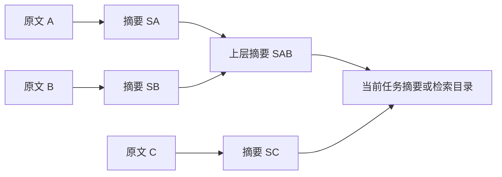

# 上下文压缩重设计：四种架构候选

> 状态：设计提案，尚未实现或进行新模型实验
>
> 日期：2026-09-09
>
> 范围：允许重做历史表示、摘要调用、缓存策略和任务恢复，不以现有单摘要或 60K 参数为约束。

目标是提高长任务的完成质量，并控制整题费用和延迟。摘要长度、HTTP 成功率和缓存命中率均为
诊断指标；单独改善其中一个，不能证明任务收益。已有实测边界见
[公开基准上下文分析](public-benchmark-context-analysis.md)，不把提案参数算作实测结果。

## 1. 所有候选共同面对的约束

原始记录、模型活动历史与最终请求是三个对象。只改变数据库中的摘要不会释放模型窗口，
最终必须改变出站请求。对于依赖前缀的缓存，替换历史前部之后，原样保留的后缀通常也需要
重新计算；把缓存分成多个客户端“块”并不能让任意块在新位置独立复用。
DeepSeek 还要求匹配已持久化的完整前缀单元，相同短前缀不保证当次命中。
见[DeepSeek 缓存规则](https://api-docs.deepseek.com/guides/kv_cache/)。

设计上应减少切换次数、在每次切换时释放足够空间，并尽量在原文第一次进入上下文前完成减量。
Anthropic 的工具结果清理也会使相关缓存前缀失效，并提供最小清理量控制；不能把“删除旧工具
输出”视为无成本操作。见[Context editing](https://platform.claude.com/docs/en/build-with-claude/context-editing#context-editing-and-prompt-caching)。

## 2. 方案 A：大范围摘要，复用主请求前缀，达到低水位才发布

### 机制

一次处理当前已经形成的较大历史，而不是按统一的小输入上限反复更新摘要：

```text
稳定指令 P + 活动历史 H + 末尾摘要指令 Q
                 ↓
            生成 checkpoint S
                 ↓
P + S + 近期完整执行链 R + 必要状态/证据
```

普通文本摘要路径尽量保持相同模型、system、tools、消息序列及缓存敏感参数。保留 tools 定义
用于前缀复用，不代表执行摘要模型发起的工具操作；工具调用型结果不直接发布为摘要。
若 Provider 提供经过适配和验证的原生 compaction，可由同一接口选用，但保留其原生 item，
不能把 opaque 状态强行当作文本跨 Provider 回放。

生成阶段的前缀复用参考 [Claude Code 工程说明](https://claude.com/blog/lessons-from-building-claude-code-prompt-caching-is-everything)。
压缩后的主请求仍有缓存重建成本；“摘要调用能命中缓存”不等于“压缩全流程不影响缓存”。

### 触发与目标

取消跨模型固定 60K。摘要输入预算依据实际摘要模型的窗口、输出预留、计数误差及成本限制计算。
主模型与摘要模型的预算分别解析。触发时给未来一次较大工具输出和摘要指令留空间，不能等 API
超限才第一次考虑摘要。

采用高低两个水位：到高水位触发，候选重组后的完整请求降到低水位才发布。例子只是待测参数：

```text
模型窗口：131,072
摘要输出预留：8,192；其他余量：8,192
摘要请求可用输入：114,688

主请求约 90K 时准备切换
切换后完整主请求目标 ≤ 40K
同时检查：当前输入 + 摘要指令 + 预测新增量，仍在摘要请求预算内
```

90K/40K 是实验起点，不是最优值或硬保证。固定指令、必要约束和不可拆执行链本身超过低水位时，
先改变这些内容的交付方式，或报告该目标不可达，不能无限重写摘要。

### 适用与代价

- 适合历史尚在同一摘要模型窗口内、前缀缓存较热、需要较完整连续语境的编码任务。
- 主要收益假设：减少压缩次数，并降低摘要调用的冷输入成本。
- 主要风险：一次摘要丢失关键细节、长调用尾延迟，以及大输出跨过预留空间。
- 已超过摘要窗口时转方案 B；换小模型可能失去前缀缓存，需要比较整次费用，不能只看单价。

## 3. 方案 B：分层摘要树，后台预处理，批量切换活动窗口

### 机制

把已结束的历史按时间及工具协议安全边界切成多个叶子区间，各自生成带来源的摘要，再按需要
合并成上层摘要。每一层都按该层模型的实际输入预算分组：



原文、叶子摘要、上层摘要均可按来源回查。

所有应处理区间必须有去向，禁止“只取放得下的前缀，其余区间却被标成已总结”。分别记录
区间分配、实际输入、截断/省略和摘要引用；区间均被读过仍不等于所有事实被保留。
这是对完整覆盖和恢复的设计要求，不是现有开源框架共同具备的保证。

[RAPTOR](https://arxiv.org/abs/2401.18059) 提供了多层摘要与检索的研究参照。用于 Agent 历史时，
必须额外保持时间顺序、工具因果关系、用户更正与文件版本，不能直接照搬文档语义聚类；其问答
结果也不能当成本项目任务成功率。

### 缓存和后台运行

后台仅处理已封闭区间，当前主请求的历史暂不变化。达到一次足够大的释放量后，在模型请求之间
统一切换。切换时核对候选源版本，把摘要生成期间新增的消息、用户更正和运行结果接回，避免
覆盖新状态。距离硬窗口太近时等待或缩小工作范围，不能以后台化为由继续发送超限请求。

后台摘要是在隐藏一部分等待时间，并没有消除模型调用费。叶子摘要可使用不同模型，但通常是
独立冷输入；并行仅在受控并发和预算内使用。多个节点可以提前生成后一次发布，避免每完成
一个叶子就改写主会话前部、连续破坏缓存。

### 适用与代价

- 适合导入超长旧会话、非常长的日志调查、历史真实大于摘要模型窗口的任务。
- 输入容量可分层控制；输出截断时可缩小叶子区间或合并批次，不需要丢弃未处理部分。
- 总调用数、索引管理及合并延迟较高。跨块的否定、更正、依赖最容易被误合并。
- 旧摘要树可以搜索定位，必要时读取叶子原文；不强求把整棵树都挤进一个短根摘要。

## 4. 方案 C：显式任务状态，加按需证据检索

### 机制

把任务持续性从“大段对话的自然语言复述”迁到可更新、可追溯的状态。完整历史继续保存，但
主请求通常只携带当前状态、近期执行链和所需证据：

```text
稳定指令/工具 + 当前任务状态 + 近期完整执行链 + 本步所需证据
```

状态至少分清以下字段，而非只有一个自由文本 summary：

| 状态 | 更新依据 |
|---|---|
| 当前目标、用户约束、更正 | 保留原始用户来源；摘要推断不能增加授权 |
| 已验证事实 | 关联具体工具结果和环境/文件版本 |
| 决策与原因 | 区分已确认决策、暂定方案与已撤销决策 |
| 未验证假设 | 标注证据缺口，不写成事实 |
| 当前修改与产物 | 文件路径、内容版本或工作区差异；不能仅记录提交 ID |
| 测试记录 | 命令、退出状态、覆盖范围及当时文件版本 |
| 失败尝试和未完成事项 | 保留条件、失败原因与下一步，避免重复试错 |

可由工具确定的状态直接更新；模型负责提出有来源的事实/决策变更。冲突保留旧版本与更正关系，
程序检查来源是否存在，但不能声称这就验证了语义正确性。

早期用户限制、当前目标和活动阻塞常驻。详细代码、日志及历史决策通过 `search/read` 式接口
恢复，并给返回量设预算。不能把关键约束完全托付给检索召回。
这个方向参考 [结构化笔记与按需读取](https://www.anthropic.com/engineering/effective-context-engineering-for-ai-agents)，
本提案进一步要求状态来源、失效检测和版本一致性。

### 缓存安排

不能每轮把最前面的状态快照整个重写。主模型在一个工作阶段使用冻结快照；新变更作为尾部
增量进入会话，阶段边界或达到高水位时才合并快照，并重建一次窗口。必要更正立即追加，不能
为了缓存而推迟生效。检索证据与工具定义的变动同样需要纳入缓存计量。

### 适用与代价

- 适合代码修改、测试、排障等状态可外显、产物可核验的长任务。
- 对上下文长度的依赖可以降低，也便于跨模型和进程恢复；这些是待验证的收益。
- 主要风险是状态提取遗漏、检索漏召回、文件变化使旧事实失效，以及隐性推理依赖没有落入状态。
- 保留近期连续原文和有限叙述说明，作为状态结构无法表达的信息补充；不要求把所有领域塞进固定表。

## 5. 方案 D：按阶段交接，启动新的执行上下文

### 机制

把长任务拆成有验收标准的阶段，例如：定位原因、形成修复、实施、验证。阶段结束保存产物和
交接包，下一阶段使用新上下文开始。可以由同一个进程顺序执行，不要求额外并行 Agent。

```text
阶段 1 → 交接包 + 原始证据/文件产物
                    ↓
阶段 2 新上下文 → 读取交接包、核对文件状态、继续执行
```

交接包包含目标、用户约束、已改文件、验证状态、失败尝试、未完成事项和来源定位。任务未达到
阶段终点却需要切换时，明确标为中途交接，不把未完成步骤写成成功。进程、工作目录和后台
工具句柄也需要恢复或清点，不能只重置对话文本。

参考 [长任务 harness 的上下文重置与交接](https://www.anthropic.com/engineering/harness-design-long-running-apps)。
本文将其作为候选，不把原文特定任务的效果推广到本项目。

### 适用与代价

- 适合阶段较清楚的工程任务、批处理、多问题队列。
- 有机会隔离旧假设与无关探索，阶段验收便于发现交接错误。
- 每次切换都要承担加载和缓存重建成本，可能重复探索。强耦合调试过早交接尤其容易丢信息。
- 子任务并行是独立选项，不能把缩小单个窗口当作降低所有 Agent 合计费用的证据。

## 6. 四种方案都应配套：从源头限制工具输出

工具结果首次进入模型前，就尽量返回能用于决策的内容。测试返回失败用例和关键诊断，文件
检索返回相关片段，结构化查询返回统计或必要行。大原文保存为可定位产物，回读时按行、字段或
查询条件取数据；文件更新后使用版本/哈希防止旧定位误用。

这是增长控制，不属于摘要。首次交付就保持紧凑，通常不会引入“改写已经缓存历史”的代价。
如果事后才清理旧消息，缓存失效仍然存在。小结果直接内联，避免每条都追加一大段引用说明；
错误详情、退出状态和仍需核验的内容不能被通用 head/tail 规则无差别省略。

## 7. 从零设计时的推荐组合

优先验证 **C 为状态中心、A 负责窗口切换、工具源头减量作为基础**。B 处理真正超过模型窗口的
积压或日志导入，D 在自然阶段边界使用；不要求一开始实现全部复杂度。

组件职责可以重新划分为：

| 组件 | 职责 |
|---|---|
| 原始记录与产物库 | 保存消息、工具结果、文件版本和可回读原文 |
| 任务状态管理 | 保存事实、假设、决策、测试和更正关系 |
| 上下文组装器 | 按目标 Provider 构造合法请求，报告各部分容量与来源 |
| 压缩策略控制器 | 决定是否切换、选择 A/B/D、设置完整请求低水位及总预算 |
| 摘要与交接执行器 | 产生候选状态/摘要和实际输入覆盖记录 |
| 发布与恢复 | 核对源版本、检查候选、保留新到消息、原子发布或回退 |

候选工作集的一个实验起点是：固定指令/工具约 8K、状态约 4K、近期执行链约 20K、证据约 8K，
合计约 40K。实际必要内容超过某一项时不能静默删除；在总预算内调整，或改变任务读取方式。
不同任务和模型需要重新定标，不能由这一分配宣称既定压缩率。

## 8. 输入超限、输出截断与协议问题分别恢复

- **输入超限**：按实际摘要模型缩小来源块或转 B。每个叶子/合并请求都计入指令、状态、原文、
  输出与协议空间。过大的单条输入优先结构化提取或分段读取，不丢失其余区间的待处理身份。
- **输出截断**：不直接发布不完整候选。按状态字段分拆生成，或缩小原文块后重新生成；单纯
  凝练截断文本无法补回从未生成的后半部分。合并层也需有输出预算和有限重试。
- **协议不兼容**：在安全工具边界切换；未结束的原生调用、结果和 reasoning 状态按目标协议
  保留。checkpoint 的表示由 Provider adapter 决定，不统一伪造空 reasoning 或搬运不兼容签名。
- **成功但无进展**：重算完整请求；定位固定头部、恢复证据或巨型尾部。低水位无法达到时改变
  工作集，而不是无限重写同一份短摘要。

完整响应、可见摘要与实际发布状态分别存档。程序校验格式、引用、来源范围及版本；质量探针
与后续任务验收验证语义。有效旧状态在新版本通过之前保持可用。

## 9. 如何比较候选

先用同一历史前缀做可控压缩与固定后续问题，比较信息保留；再从同一任务起点完整运行各方案，
比较整题产物和费用。不同摘要会改变后续路径，两种实验分别报告，不把轨迹差异混入单步算法收益。

测试至少覆盖：跨区间更正、仅在思考中出现的重要决定、超长工具结果、超大单轮、后台压缩时
到达的用户更正、文件更新后旧事实失效、输入超限、输出截断，以及摘要生成后首次工具请求。

| 维度 | 指标 |
|---|---|
| 容量与频率 | 同一状态下完整请求前后差、切换次数、每次切换后的可继续步数、再次超压间隔 |
| 保真 | 关键约束/事实/待办保留、假设误记、过时事实使用、重复失败动作、原文回读成功率 |
| 可靠性 | 候选生成、发布、首次续跑、整题完成分别统计；记录失败恢复次数与协议错误 |
| 成本 | 主请求、摘要、分层合并、状态提取、检索回读、阶段交接及重试全部调用 |
| 缓存与延迟 | 每阶段实际 hit/miss/write、重建额外成本、阻塞时延、后台等待和总墙钟 |

费用按 Provider 实际价格及互不重叠的计费字段计算，不能只比较 token 总量或命中比例。
缓存重建损失不要与稳态节省重复计算。一个用于触发决策的近似条件是：

```text
预计剩余步数 × 每步稳态费用节省
  > 全部压缩辅助费用 + 一次缓存重建额外费用
```

这里只是成本近似，质量恶化或将要超限时不能靠这条公式决定继续。短任务可能没有足够后续步骤
回本，长任务的更低工作集也可能带来更好的检索与执行质量，均需实测。

试验顺序建议：源头减量共同基线 → A 与现有实现对照 → C+A → 超长样本单独比较 B → 有自然
阶段的任务比较 D。每项记录重复次数、实际运行轨迹及失败样本，先筛选再扩大样本；本轮没有
执行这些实验，也没有给出预期费用或任务通过率的数值承诺。
