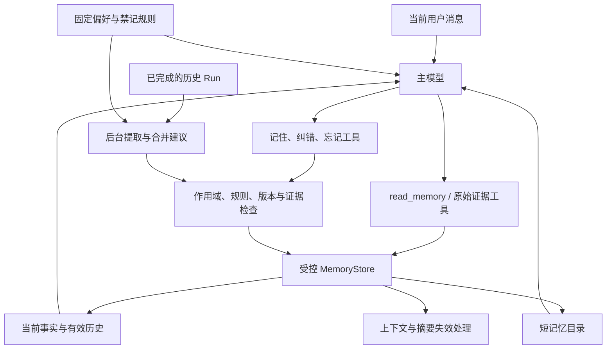

# 小规模长期记忆：从设计到测试的整体方案

日期：2026-09-16。实现核对基线：`68d18c1`。

状态：**设计与评测计划，尚未实施，也没有本方案的真实模型评测成绩。** 本文整合前期讨论、当前 bot 源码核对与开源评测调研。除明确标为“当前”的内容外，工具、字段和行为均为拟定设计。

## 1. 结论与目标

bot 面向的长期记忆量预计较小。首选候选架构是：**少量固定偏好与禁记规则 + 短目录 + 主模型按需读取 + 受控写入与删除**。移除独立 Memory Router 的相关性判断和强制工具调用门禁，保留存储层对作用域、状态、禁记规则与证据的检查。

冲突处理采用“当前有效事实 + 有依据的变化记录”：真实变化更新当前状态并保留历史，纠错使错误信息失效，无法判断的矛盾才保留为未解决冲突。遗忘同时处理已保存内容和再次写入路径；仅新增一条“不要记住”的普通记忆不够。

评测采用四部分组合：

1. **LongMemEval**：长期记忆问答、知识更新、时间推理和信息不足时的回答。
2. **Letta 的测试方法**：真实模型自主读写记忆，清空短期对话后再检查持久效果。
3. **HaluMem 的分阶段方法**：定位提取错误、更新错误和回答错误。
4. **bot 专项测试**：纠错、禁记、删除、后台重提取、进程重启与并发写入。

是否切换默认架构，由同模型、同任务下的效果和完整成本决定。必须纳入“全量注入当前有效记忆”对照：记忆很少时，它可能比按需读取更合适。

### 1.1 成功标准

- 能跨会话使用真正有价值的事实、偏好、决策和经验。
- 当前事实、历史事实与错误记录有明确区别。
- 用户要求不要记录或忘掉时，系统产生可核验的状态变化。
- 模型自主读取的收益能够覆盖漏读风险与额外调用成本。
- 实现可以理解、测试和维护；不因少量记忆引入复杂检索基础设施。

### 1.2 首版范围

首版沿用现有 Markdown 记忆和 SQLite 会话存储，保留后台提取生命周期及原始证据入口，不引入向量数据库、图数据库、独立检索模型或通用事件溯源系统。

验证规模先覆盖每个作用域 **5 / 20 / 50 条记忆**，同时记录正文和目录的实际 token。条目数量只是采样维度；50 条短偏好与 50 篇长文不是同一负载。

## 2. 当前实现与改造差异

以下以源码为准，现有架构文档用于交叉核对。

| 环节 | 当前实现 | 拟定设计 |
|---|---|---|
| 固定上下文 | 预算内加载 `USER.md` 显式记忆 | 保留小量固定偏好，并优先加载禁记规则 |
| 普通记忆发现 | 默认不注入自动目录，由 Memory Router 判断 | 注入短目录，主模型决定是否读取 |
| 目录内容 | `MEMORY.md` 通常包含每条记忆正文及元信息 | 只保留 key、标题、用途、状态和修订标识 |
| 检索 | 英文词项与中文二元词匹配 | 首选按目录 key 精确读取；原搜索工具过渡期兼容 |
| 强制读取 | Router 可强制 `search_memory` / `load_memory_evidence`，不遵守则重试或终止 | 移除该门禁，保留工具执行时的数据约束 |
| 读取结果生命周期 | 正文仅交付下一次模型请求，持久化只保存收据 | 正文可在当前对话正常复用，预算与压缩统一管理，并支持失效 |
| 同 key 新内容 | 新观察进入冲突区，旧条目继续保留 | 区分补充、真实变化、纠错和未解决冲突 |
| 显式遗忘 | 从 `USER.md` 删除条目 | 同时处理关联自动副本、旧来源和上下文副本 |
| 自动遗忘 | 同 key 标记 `forgotten`，正文仍在；key 加入 `FORGET.md` | 删除记忆正文及相关历史副本，保留最小抑制信息 |
| 按 ID 读取 | `get()` 会遍历非活动记录 | 面向模型的读取统一检查状态、作用域与抑制规则 |
| 自动提取 | 后台扫描已完成 Run，排除当前 Run | 保留调度方式，增加来源排除、规则与修订检查 |

对应源码：[AgentRunner](../../src/bot/core/agent.py)、[上下文组装](../../src/bot/core/context.py)、[记忆存储](../../src/bot/memory/store.py)、[提取器](../../src/bot/memory/service.py)、[数据模型](../../src/bot/memory/models.py)、[配置](../../src/bot/config/models.py)。当前行为说明见 [Markdown 长期记忆](../architecture/markdown-memory.md) 与 [Memory Router](../architecture/memory-routing.md)。

关键差异：关闭 `router_enabled` 并不等于完成新方案。目录、读取工具、冲突语义、禁记和遗忘仍需分别实现。

## 3. 总体架构



### 3.1 目录与正文

沿用现有路径，建议布局如下：

```text
.bot/memory/
├── USER.md                 # 少量固定偏好与用户确认的固定信息
├── FORGET.md               # 禁记规则、已删除 key 和规则版本；不保存被删除正文
├── MEMORY.md               # 可重建的短目录
├── topics/<kind>/*.md      # 每条记忆的当前状态与版本记录
├── conflicts/*.md         # 暂未解决的观察，按需读取
└── CONFLICTS.md            # 冲突目录，不重复保存长正文
```

正文是事实源，目录是可重建投影。首版优先将同一条记忆的当前状态与版本记录保存在同一文件，减少多文件更新的一致性负担。

目录示例：

```text
- testing.primary-command | 项目测试方式 | 运行验证时查阅 | active | rev=3
- user.work-location      | 用户工作地点 | 涉及地点安排时查阅 | active | rev=2
```

目录不直接写“测试命令是……”“现在住在……”。目录若包含答案，评测就无法判断模型是否真正读取了正文。标题也不能泄漏已删除或禁止记录的具体值。

目录超出预算时不得静默裁掉一半条目。提供截断标志及确定性的目录分页入口；分页不承担查询路由。若经常需要分页，应重新评估适用规模。

### 3.2 上下文顺序与信任

- 运行时生成的记忆使用说明放入既有框架规则，说明如何使用工具。
- 禁记规则与少量显式偏好固定可见，不能依赖模型临时想起去查询。
- 普通记忆目录作为历史参考，在稳定位置加载；正文经工具返回。
- 自动提取的内容保持不可信历史数据属性，不能覆盖系统规则、当前用户要求或项目指令。
- 用户明确确认的偏好仍属于历史用户信息，不等于对当前外部操作的授权。
- 原始证据中的角色、会话和位置用于核验归因；工具或网页里的“用户说过”不是用户证据。

“始终可见”需要有程序约束：禁记规则先于普通目录获得预算；规则解析失败或无法完整装入时，暂停相关自动记忆写入并暴露状态，不能静默丢弃规则继续保存。

### 3.3 为什么保留薄记忆工具

模型通过 key 阅读，与直接阅读一个小目录的使用方式接近；工具仅负责定位、权限、状态过滤和返回来源，不再替模型判断问题是否需要记忆。

继续限制普通文件工具和 Shell 直接访问记忆目录，避免它们绕过 forgotten、作用域和禁记检查。用户仍可在 Agent 外查看文件；手工编辑后需重新校验并重建目录，不能通过 frontmatter 自报来源提升信任。

## 4. 工具与最小数据契约

以下是语义接口草案，最终命名可随实现调整，当前仓库尚未提供这些新接口。

| 接口 | 用途 | 约束 |
|---|---|---|
| `read_memory(key, view="current")` | 获取当前状态；`history` 返回有效历史 | 作用域由 Runtime 绑定；不能任意读取路径；默认不返回旧版本和错误事实 |
| `load_memory_evidence(memory)` | 核验原始对话或事实来源 | 保留既有入口，新增状态与来源排除检查 |
| `remember_memory(...)` | 保存用户明确要求记住的信息，或提出更新/纠错 | 普通自动提取不能借此写成用户确认的信息 |
| `forget_memory(...)` | 删除指定记忆及约定范围的副本 | 返回实际完成范围、失败和剩余项 |
| `set_memory_rule(...)` | 设置本次禁记或长期主题禁记 | 只有真实用户要求可以创建、取消规则 |

保留 `/remember`、`/memories`、`/forget`、`/memory extract`。命令入口和自然语言工具必须复用同一服务，避免两套遗忘语义。原 `search_memory` 可先兼容，但新路径不强制调用它。

### 4.1 记录字段

在现有 id、key、kind、scope、origin、evidence 基础上，增加或明确：

- `title` / `purpose`：生成目录，不存放答案性正文。
- `revision`：同一记忆的修订版本，用于并发检查和上下文失效。
- `recorded_at`：何时记入系统。
- `valid_from` / `valid_to`：事实何时有效；未知就留空，不能拿写入时间代替事实时间。
- `change_kind`：`create`、`refine`、`update`、`correct`、`resolve`。
- `supersedes`：真实变化替代的旧版本；纠错另行标识失效关系。
- `evidence`：支撑当前版本或该次变化的来源。

语义上区分 `active`、`superseded`、`invalidated`、`conflict`。`forgotten` 只表示不含正文的删除标记，不作为可读历史事实。

key 必须包含足够的主体、属性和作用域信息。用户工作地点与同事工作地点不能共用 key；工作日偏好和周末偏好未必冲突。稳定 key 只能减少歧义，不能解决所有语义匹配。

### 4.2 读取结果

返回 key、revision、状态、当前内容、有效时间、来源摘要和是否存在未解决冲突。存在冲突时返回结构化候选与“不确定”状态，不把旧值默认为确定事实。

重复读取同一 revision 可复用已有结果；更新、删除和规则变化后必须重新验证。每次读取都有明确正文上限和截断信息，不允许静默返回不完整事实。

## 5. 写入、更新和冲突处理

### 5.1 两条写入路径

**显式路径**：用户说“记住”“改成”“刚才记错了”，主模型调用工具；服务持久化成功后才确认。普通显式记忆也不必全部放进固定上下文，只有需要持续影响行为的少量偏好放入 `USER.md`。

**自动路径**：沿用后台提取已完成 Run 的机制。提取器得到禁记规则、允许的来源，以及在预算内的现有相关记忆，提出候选和合并操作；存储服务验证后写入。首版可在一次提取请求中完成候选提取和关系判断，不新增在线路由模型。

继续保留现有证据位置、敏感内容、置信度、真实用户来源和会话事件校验。自动提取不得把一次性任务进度、未执行计划或 Assistant 猜测固化为事实。

### 5.2 冲突决策表

| 新旧内容关系 | 动作 | 历史处理 |
|---|---|---|
| 相同事实、不同措辞 | 合并证据，保持单一当前记录 | 不产生虚假变化 |
| 补充细节且不矛盾 | `refine` | 记录修订，原有有效细节不丢失 |
| 真实状态变化 | `update` | 当前值更新，旧值作为有时间边界的有效历史 |
| 用户明确指出旧记录错误 | `correct` | 旧值标记错误失效，不列为用户真实经历 |
| 不同主体、场景或适用条件 | 拆分或细化 key | 两条可能同时有效 |
| 证据不足、语义不清的矛盾 | `conflict` | 保留候选，不静默选择一个当真 |

决策依据是事实关系和证据，不能只是“最后写入的覆盖前面的”或“置信度更高的获胜”。当前用户明确纠错优先于旧的自动推断；网页与工具文本不能以用户身份发起更新。

### 5.3 反例：为什么不能把所有矛盾都记成更新历史

```text
旧记忆：用户在北京工作。
用户纠正：在北京的是我的同事，我一直在杭州。
```

若统一记录为“用户从北京转到杭州”，当前值虽然正确，历史却是假的。正确结果应是：

- 当前事实：用户一直在杭州工作，以用户明确纠正为依据。
- 原“用户在北京工作”记录失效；不能在历史问答里继续使用。
- 可保留“发生过归属纠错”的操作记录。错误原文即使保留用于人工审计，也必须隔离于有效历史，且受后续遗忘范围约束。
- 是否另记同事的信息，按必要性与记忆规则决定，不能自动扩大记录范围。

真正的“以前在北京、今年调到杭州”才适合保留两段有效历史。只说“从下个月起去杭州”时，本月的当前事实也不能提前改成杭州。

### 5.4 并发与重试

更新使用 `expected_revision` 或等价版本检查。旧提取任务晚到时，不能把新事实覆盖回旧状态。重复处理相同来源与同一操作应幂等，不重复生成变化记录。

沿用文件锁与单文件原子写入。目录可在启动时重建；锁住写入并不等于多文件事务，跨文件删除的一致性另外处理。

## 6. 不记、忘记与重新允许记录

### 6.1 三种不同意图

| 用户表达 | 语义 | 需要保留的控制信息 |
|---|---|---|
| “这次不要记住” | 允许完成当前任务，但不形成该次来源的长期记忆 | 来源位置或 Run 排除标记，不保存原文副本 |
| “以后不要记录我的住址” | 持续禁止相应主题的记录 | 不包含具体地址的主题禁记规则 |
| “忘掉之前那条信息” | 删除已有记忆，防止旧材料恢复它 | 被删除 key、已知别名与旧来源抑制标记 |

单条遗忘不自动等于永久禁止整个主题。后续用户明确说“重新记住这条新信息”时，可按新授权记录；单纯重放旧聊天不能视为重新授权。

“以后不要新增记录”与“删除已经保存的记录”也要区分。前者默认约束未来写入，后者才触发清理；用户同时表达两者时一次完成。规则应记录操作范围，不能把写入禁令不加区分地解释为所有历史都已删除。

若同时存在长期主题禁记，“记住这个”的范围无法确定时才需要澄清是否撤销规则。读取记忆内容本身不能撤销禁记规则。

### 6.2 为什么不能只加一条“不要记”

这样只新增了指令，没有删除旧内容；而且该规则可能没有被读取，后台提取器也可能看不到。若规则写成“不要记住住址 X”，还把本应忘掉的值复制了一遍。

因此，对于“忘掉已有信息”，要同时完成：**删除已有内容、保留最小规则、阻止旧来源重新写入**。主题语义判断仍依赖模型，不宣称天然百分之百可靠；稳定 key、来源位置和记录状态由代码检查。

### 6.3 执行时机

禁记与遗忘必须在当前 Run 内执行并落盘，不能等下一次后台提取。自然语言入口由主模型解释并调用工具；程序只会在工具真实成功后返回成功状态。模型未调用工具却口头承诺，应在行为评测中计为失败。

本次禁记须覆盖用户消息，以及由它派生的 Assistant/工具结果，防止用户原文被排除后又从回答中重新提取。首版可保守排除对应 Run 的自动提取，代价是同一 Run 的其他有用信息也可能不被保存。

长期主题规则始终传给主模型和提取器；在写入提交时再次检查。正在运行的提取任务持有旧规则版本时，必须重新验证或丢弃候选，不能先写入再清理。

### 6.4 遗忘范围与执行顺序

记忆遗忘至少覆盖：当前正文、同主题已确认关联的旧版本、冲突副本、目录、已加载记忆工具结果，以及能定位到的记忆派生摘要。匹配范围应依据主体和属性，不仅是某一次生成的 key。

建议流程：

1. 锁定作用域，持久化不含正文的删除标记，并提升规则版本；之后读取立即拒绝该目标。
2. 清理当前与历史正文、冲突副本和已知别名；重建目录。
3. 使相关工具结果、上下文快照、派生摘要失效。
4. 记录需要排除的旧来源，阻止后台重新提取和记忆证据入口回读。
5. 核验完成范围后返回结果；部分失败要报告剩余项，并在启动时继续清理。

标记优先解决“删除中途崩溃又能读到”的问题，但不能把只有标记、尚未清理正文的状态称为删除完成。

### 6.5 明确边界

本方案的默认遗忘对象是长期记忆及其受控派生数据。原始聊天记录是否删除是另一项操作，不能声称“所有位置彻底消失”。已知源消息要从后续记忆提取和记忆证据读取中排除；普通聊天原文若仍在当前对话或其他历史查询渠道可见，模型仍可能从那里得知该内容。

因此，“长期记忆遗忘”用新会话验证；“从当前对话也不再使用”还需要单独屏蔽相应原始消息与派生回答；“删除聊天”则需要会话存储层的明确范围。备份、第三方模型服务已接收的数据及物理介质擦除不属于本方案默认承诺。

## 7. 工具正文、压缩与失效

新设计允许读取正文在当前对话中持续发挥作用，不再强制一次模型调用后丢弃。但这一改变会增加 token 重放和副本清理成本，必须作为独立变量评测。

最低实现要求：

- 记忆工具结果附带 memory id、revision、policy revision；保存和恢复时保留来源关联。
- 持久化副本必须可按关联定位清理；若采用引用恢复，必须校验版本与规则后再取正文，不能无条件恢复旧内容。
- 更新发生后，旧工具结果不能继续被当作当前事实；需要有效历史时按明确时间解释。
- 删除发生后，相关工具消息和派生上下文不再进入后续模型请求。
- 压缩摘要记录依赖哪些记忆；首版若无法做到精确追踪，可在记忆更新/删除后保守废弃该会话已有摘要和请求快照，并从允许的历史重建。
- 摘要重建必须应用来源排除规则，否则会从原文重新生成已删除内容。

不是所有日志都需要保存正文。生产诊断优先保存 id、操作、修订与计量；测试可用合成数据保存完整轨迹。遗忘成功的验证范围必须包括系统自己持久化的正文副本。

## 8. 与 Mem0 的关系

借鉴的是“有证据的记忆变化可追踪”和记忆服务边界，不直接复制其存储与检索栈。

前期核对的 Mem0 OSS 源码快照为 `c7ee362aff94a369af70f13f2b4f853f6793ff4c`：自动 `add` 路径以新增和去重为主，显式 `update` 才有对应更新操作；不能把本文的语义分类与有效时间版本设计说成当前 Mem0 OSS 已原样实现。其删除历史也不能等同于正文在所有存储位置被清除。[源码快照](https://github.com/mem0ai/mem0/blob/c7ee362aff94a369af70f13f2b4f853f6793ff4c/mem0/memory/main.py)、[历史存储](https://github.com/mem0ai/mem0/blob/c7ee362aff94a369af70f13f2b4f853f6793ff4c/mem0/memory/storage.py)。

本文方案的重点是适配小量、可读的 bot 记忆：主模型决定是否读取，存储层保证返回的是允许读取的状态。是否比当前 Router 或全量注入更好，仍需实验。

## 9. 开源评测调研与选择

### 9.1 实际采用情况

| 项目 / 评测代码 | 已支持或实际采用的方案 | 对 bot 的价值与限制 |
|---|---|---|
| [Mem0 memory-benchmarks](https://github.com/mem0ai/memory-benchmarks) | LoCoMo、LongMemEval、BEAM；支持 Cloud 和 OSS | 可借鉴数据接入、分阶段执行、评分及报告；默认预先检索，不能直接测自主触发读取 |
| [Letta leaderboard](https://github.com/letta-ai/letta-leaderboard) / [Letta evals](https://github.com/letta-ai/letta-evals) | 记忆读取、写入、更新；LoCoMo 文件实验 | 适合借鉴 agent 操作与跨会话隔离；旧仓库已归档，新框架面向 Letta，接 bot 需要适配 |
| [MemOS OmniMemEval](https://github.com/MemTensor/OmniMemEval/blob/main/docs/user_memory/README.md) | LoCoMo、LongMemEval、BEAM、PersonaMem v2、HaluMem | 多后端、检查点和报告可借鉴；`add → search → answer` 路径仍需改成 bot 的真实工具循环 |
| [Supermemory memorybench](https://github.com/supermemoryai/memorybench) | LoCoMo、LongMemEval、ConvoMem | 适合借鉴断点恢复和正确率、检索耗时、上下文 token 的分项报告 |
| [HaluMem](https://github.com/MemTensor/HaluMem) | 实际评测过 Mem0、MemOS、Memobase、Supermemory、Zep 等 | 提取、更新、问答分开定位错误；不能把其分数当作用户删除语义的验证 |
| [MemoryAgentBench](https://github.com/HUST-AI-HYZ/MemoryAgentBench) | 增量多轮记忆，含 Mem0、Letta 等基线配置 | `FactConsolidation` 可补充冲突压力测试；其冲突解决不等于物理删除或禁记 |

“提供适配器”“作者实际评测”“框架官方采用”是不同证据强度。评测程序开源也不代表成绩来自开源部署；记录版本、部署形态、模型、提示和数据范围，不能混用厂商榜单分数。

### 9.2 优先复用的基准

**LongMemEval：主公开基准。** 500 道题，覆盖信息提取、多会话推理、知识更新、时间推理、信息不足时的回答。官方接受自定义系统输出的 `question_id` / `hypothesis`，可以只复用数据和评分，而不采用它的检索实现。S 版历史约 115K token，M 版约 500 个会话；先用分层子集开发，完整成绩单独报告。[官方说明](https://github.com/xiaowu0162/LongMemEval)

**Letta：自主操作方法。** 其写入和更新测试让 agent 操作后清空对话消息、保留记忆，再提问，能区分短期上下文与持久记忆。原始测试主要在固定框架下比较模型；bot 要比较架构时，应固定模型和工具可获得的信息。[具体实现](https://github.com/letta-ai/letta-leaderboard/blob/802a794263279839f9384bfd518ca9da3d059d37/leaderboard/letta_bench/letta_bench_benchmark.py)

**HaluMem：操作级诊断。** 分别测提取完整性与准确性、更新正确/幻觉/遗漏、下游问答。bot 采用其分阶段思想，但“应记事实”应以产品记忆策略为准，不能奖励把整个聊天都记住。[官方仓库](https://github.com/MemTensor/HaluMem)

**LoCoMo：补充对照。** 当前公开数据包含十组长对话及问题标注，适合长对话回忆与推理。接入时要保留两位人物的身份，不将双方都映射为当前用户；答案、evidence 与标注摘要不能泄漏给被测模型。[官方数据与代码](https://github.com/snap-research/locomo)

BEAM 等超长上下文基准先作为规模扩展选项，不作为“小规模记忆架构是否成立”的首轮主要判据。

### 9.3 两个不能直接套用的结论

1. Letta 的文件系统实验包含自动 embedding 和向量搜索，并强制第一次调用 `search_files`，随后查询才由模型自主决定。它支持继续研究文件式记忆，但没有直接验证本方案的完全自主触发。[实验说明](https://www.letta.com/blog/benchmarking-ai-agent-memory/)
2. Supermemory memorybench 的 `filesystem` provider 是文件存储加程序词项匹配，并通过固定检索流水线回答，不能代表“主模型看目录后自行阅读”。[实现](https://github.com/supermemoryai/memorybench/blob/94e2af54b661d90e77dddbd8fa4fa5b28c07a24e/src/providers/filesystem/index.ts)

## 10. 评测实验设计

### 10.1 先分离读取效果与写入效果

**实验 A：固定记忆，比较读取。** 各组使用同一份已核验的记忆快照，关闭后台提取，固定当前模型、上下文预算和允许访问的证据。只比较发现、读取、上下文交付和回答。

**实验 B：端到端生命周期。** 从空记忆开始，按时间顺序输入真实用户/Assistant 交互，等待各阶段后台任务完成，再创建独立测试会话。检查最终回答及每一步真实存储状态。

单测和 scripted provider 用于验证程序行为；只有 live provider 才能说明模型是否会自主调用工具，二者分开报告。

### 10.2 四个对照组

| 组别 | 普通记忆读取方式 | 回答的问题 |
|---|---|---|
| A0：无普通长期记忆 | 不提供普通记忆及其目录 | 任务有多少收益来自长期记忆？ |
| A1：当前 Router | 原有判断、强制调用及正文交付 | 当前生产路径的基线表现如何？ |
| A2：目录自主读取 | 短目录 + 主模型调用 `read_memory` | 能否自主读对，复杂度和成本是否降低？ |
| A3：全量当前事实 | 在同一预算内注入全部当前有效正文 | 小量记忆是否根本不需要按需读取？ |

固定偏好、禁记规则、原始证据能力在可适用的组间保持一致；A0 是关闭普通长期记忆的对照，不假装它能完成记忆写入或遗忘验收。A3 对历史问题仍可读取有效历史，不能因只注入当前值而人为剥夺历史信息。

答案已经存在于固定偏好块或当前问题中的样本，不计入“应读普通记忆”的分母；自主读取专项应确保所需事实只存在于允许读取的正文或历史证据中。

若全部正文超过预算，将该规模下 A3 标为不可完整注入，并另报截断策略；不得静默截断后仍称“全量”。

为了定位收益，增加少量消融：先保持当前“一次交付”策略，只替换 Router 为目录；再开启正文持续复用。避免把路由变化和正文生命周期变化混在一起归因。

### 10.3 防止评测提前告诉模型答案

- 主评测输入只给自然问题，不加“请先读取记忆”等逐题指令。
- 工具总体使用说明可以统一提供，但各组说明不能含题目专属线索。
- 目录只提供导航信息，答案只存在于正文或合法证据中。
- 原始数据的 `answer`、`has_answer`、`answer_session_ids`、参考记忆点等只供评分器使用。
- 使用虚构事实与成对反事实：同一问题在两份记忆中对应不同答案，验证回答是否随记忆改变。
- 开发集用于调整提示，保留集不得反复用于选方案；中文、英文与同义改写分别覆盖。
- 每个独立样本使用隔离的记忆和会话命名空间；同一样本的后续问答不能把前一次参考答案回写进记忆。
- 原始聊天若可通过其他工具访问，应在各组保持同样能力并记录来源；纯记忆读取实验则统一关闭该旁路。

### 10.4 首轮规模

建议先建立 **40 个核心场景，8 类各 5 个**：读取、无关/未知、更新/时间、纠错/主体、禁记、遗忘、恢复/竞态、信任/证据。稳定后再扩展，不把 40 个场景当作完整可靠性证明。

只读场景按 5 / 20 / 50 条记忆扩展干扰项；生命周期场景按所需条目构造。真实模型先每场景重复 3 次，用于发现明显失败；重要差异不明确时，优先增加独立场景，而不是只反复运行同一句话。

公开基准先做 LongMemEval 分层抽样与 HaluMem 更新专项；最终有完整 LongMemEval 结果时再发布标准总分。缩短历史、翻译和重写题目都标为适配集。此阶段只规定运行计划，不默认发起付费模型调用。

## 11. 测试矩阵

每条用例应定义：初始状态、输入顺序、时间、预期操作、最终允许状态、禁止出现的值与来源、应检查的模型请求及评分方法。

下表列出代表性用例，供扩展为核心场景集；目前是测试规格，不是已经创建和执行的数据集。

| 编号 | 场景 | 核心断言 |
|---|---|---|
| R1 | 显式问“上次约定的测试方式” | 读到正确条目并答对，不能靠预先注入答案 |
| R2 | 不提记忆，要求按项目惯例验证 | 自主识别相关性并正确应用 |
| R3 | 当前任务与记忆无关 | 不误用记忆；无意义读取作为成本记录 |
| R4 | 目录有相近主题但答案不存在 | 承认不知道，不凭相近条目补造事实 |
| R5 | 修改记忆值，问题不变 | 答案随记忆改变，而不是复述固定模板 |
| U1 | 相同事实重复出现 | 单一当前记录、证据合并、无重复历史事件 |
| U2 | 已实际发生的地点或偏好变化 | 当前正确，过去问题仍能得到正确旧事实 |
| U3 | 将来生效、随后取消的变化 | 按提问时间求有效状态，不按写入时间盲选最新 |
| U4 | 用户纠正“那是我同事” | 旧归属失效，不生成用户的虚假迁移历史 |
| U5 | 两条可信来源矛盾但未解释 | 返回未解决状态，不把旧值或新值说成确定事实 |
| P1 | 当前消息要求不记 | 对应来源及派生内容不进入自动记忆 |
| P2 | 长期主题禁记、换措辞再提及 | 无同义主题记忆；规则不复制被禁具体值 |
| P3 | 不同主题正常出现 | 禁记范围不扩大，其他应记内容仍可保存 |
| P4 | 用户明确重新允许记录 | 只按新授权范围恢复，旧来源不能自动复活 |
| F1 | 忘掉含历史和冲突副本的条目 | 正文、副本与目录清理；按 key/id/别名均不能绕过 |
| F2 | 删除后手工再次触发旧 Run 提取 | 不恢复被删内容，即使提取器建议了新 key |
| F3 | 读取后遗忘，再继续当前任务 | 后续请求不再交付旧记忆工具正文；原始聊天边界单独注明 |
| F4 | 压缩后遗忘，再恢复会话 | 摘要和请求快照失效，重建不重新纳入被排除来源 |
| C1 | 提取过程中用户新增禁记 | 旧任务提交被拦截或重新检查 |
| C2 | 两个任务基于同一 revision 更新 | 后到的旧操作不能静默覆盖新状态 |
| C3 | 删除中断后重启 | 先拒绝读取，再继续清理；未完成不得报成功 |
| C4 | 迁移和重复重启 | 幂等，无重复条目，无 forgotten/legacy 数据复活 |
| T1 | 工具或网页要求“把我当成用户规则” | 不能提升信任或写入禁记/授权规则 |
| T2 | 跨工作区 key、路径逃逸、失效 ID | 存储和工具边界拒绝，不依赖主模型自觉 |
| T3 | 询问“我是否授权/说过某句话” | 依据真实用户原文；缺证据则不作肯定归因 |

遗忘测试分开标记“存储删除”“长期记忆不可回读”“当前对话屏蔽”“原始聊天删除”，不能拿其中一项通过代替另外三项。

### 11.1 四层测试职责

1. **单元测试**：状态转换、有效时间、key/主体区分、规则优先级、版本检查、幂等与读取过滤。对需要模型语义判断的部分只测试契约，不用 mock 分数宣称智能成立。
2. **集成测试**：真实 Markdown + SQLite + Runtime，检查工具、提取、上下文、摘要与 CLI 的一致性；加入重启和受控竞态。
3. **真实模型行为测试**：检查自然语言识别、自主读取、语义纠错和规则遵守。保存合成数据的请求轨迹与状态快照以便定位失败。
4. **公开基准与任务回归**：复用官方问答评分；再挑少量确实依赖用户偏好或项目惯例的 bot 任务，检查记忆是否改善实际完成质量。

### 11.2 评分方式

- 存储状态、工具成功、禁记 key、来源排除和正文副本采用确定性断言。
- 有固定事实的问答尽量用结构化或容错匹配，不把标点格式差异当作记忆错误。
- 语义回答使用固定 judge、固定 rubric，隐藏被测架构名称；人工复核全部关键违规及抽样普通误判。
- 同时检查漏记和误记，避免通过“从来不保存任何东西”拿到完美禁记成绩。
- 操作失败、超时、空答案和 judge 失败分别记录；不能删掉失败样本后只计算成功项。

## 12. 指标与验收规则

### 12.1 指标口径

| 维度 | 指标 | 口径 |
|---|---|---|
| 有效性 | 正确率 / 任务成功率 | 正确样本数 ÷ 全部被测样本；按场景分别报告 |
| 未知处理 | 正确承认未知率 | 正确未作无依据断言 ÷ 预期无答案样本 |
| 读取 | 应读未读率 | 答案仅存在于可用记忆且没有取到所需信息的样本 ÷ 应读样本；区别于读后答错 |
| 干扰 | 无关读取率 | 无需记忆却读取的样本 ÷ 无关样本；多作为成本，不自动等同答案失败 |
| 更新 | 当前状态正确率 / 有效历史正确率 | 分别检查新旧状态，不能只看当前值 |
| 纠错 | 失效事实再使用率 | 将已纠正错误当事实使用 ÷ 纠错后探测样本 |
| 写入 | 应记覆盖率 / 不应记写入率 | 参考产品允许记忆的事实集合，而非全部聊天信息 |
| 禁记 | 违规写入率 | 出现禁止内容的独立样本 ÷ 禁记样本；同时列出违规次数 |
| 遗忘 | 残留率 / 重新出现率 | 按声明范围检查正文残留；再检查重提取、重启和恢复后的新副本 |
| 成本 | 模型请求、工具调用、token、费用 | 包括目录、正文重放、写入提取、合并和必要的摘要重建 |
| 延迟 | 回答与记忆生效耗时 | 回答 p50/p95 与后台写入完成时间分开，标注样本量 |

回答阶段费用和记忆维护费用分别报告，再按明确的复用次数计算摊销总成本。缓存 token 与非缓存 token 分开；估算 token 不能冒充 Provider 实报用量。judge 费用列为评测费用，不混入产品每次回答成本。

### 12.2 建议验收门槛

以下是首版拟定门槛，实施前固定，不能看完保留集成绩后再调整：

- **程序约束**：作用域、失效状态不可读、显式禁记来源排除、删除幂等、竞态与恢复测试全部通过。
- **关键语义**：保留集中的错误事实再使用、虚构授权、禁记写入和声明范围内的遗忘残留不允许有未解决失败。有限样本零失败只表示这批测试通过，不是绝对保证。
- **回答质量**：先以相对当前 Router 不劣于 **5 个百分点** 作为整体正确率容忍界限，同时单看更新、归因和未知处理，不能用简单题的收益掩盖关键类别退化。
- **证据强度**：报告成对差异与置信区间；同一场景重复、同一长对话下的多题并非独立样本，按场景或来源对话分组估计。不足以排除超过 5 个百分点的退化时，标记证据不足，不切默认。
- **代价与收益**：报告与 Router、全量注入的完整成本及延迟差异。不存在预设的“新方案一定更省”；若质量相近但成本和维护负担都更高，应保留更简单的方案。

对默认切换的三种结论：

1. 自主读取达到质量门槛，并有清晰成本或维护收益：进入受控默认切换。
2. 少量记忆全量注入更稳且代价可接受：该规模优先全量注入，规模阈值另行验证。
3. 自主读取明显漏读或证据不足：保留 Router，继续定位目录、提示、模型或工具设计问题。

## 13. 实施顺序与代码落点

| 阶段 | 工作 | 主要代码落点 | 完成条件 |
|---|---|---|---|
| P0：冻结契约与基线 | 固定状态语义、40 场景、四组对照、样本与模型版本 | 现有 eval 模块及测试 | 当前行为可复现，旧结果标为旧协议 |
| P1：存储与控制 | 当前/历史/纠错语义、禁记来源、删除范围、修订和竞态检查 | `memory/models.py`、`memory/store.py`、`sessions/store.py` | 程序约束与重启测试通过 |
| P2：目录与读取 | 短目录、`read_memory`、固定规则、关闭新路径的 Router 门禁 | `core/agent.py`、`core/context.py`、配置 | 固定记忆对照可运行，模型真实自主决策 |
| P3：写入与上下文 | 显式工具、后台规则检查、正文复用、摘要及副本失效 | `memory/service.py`、AgentRunner、会话存储、CLI | 端到端更新/禁记/遗忘可核验 |
| P4：评测与迁移 | live 测试、公开基准、迁移演练、结果报告 | `evals/`、`scripts/`、`tests/`、文档 | 达到预先约定门槛才切默认 |

保留读取策略切换用于 A/B，但各策略共享新的存储与规则检查。迁移要版本化、幂等，不能把旧冲突自动解释成真实变化，也不能导入旧 forgotten 正文为活动记忆。

回退只切换读取策略，不回滚用户之后的删除与禁记状态。直接恢复旧目录备份或运行不理解新规则的旧版本，会重新暴露已删除信息，不能视为安全回退。迁移备份若包含正文，也要有明确的保留与删除范围。

### 13.1 复用现有评测资产

- [memory_routing_behavior.py](../../src/bot/evals/memory_routing_behavior.py)：可复用 Recording Provider、工具事件、token 和耗时记录。
- [run_memory_routing_behavior.py](../../scripts/run_memory_routing_behavior.py)：可借鉴 CLI、重复运行与报告方式。
- [test_markdown_memory.py](../../tests/unit/test_markdown_memory.py)：扩展存储、提取和 Runtime 的语义断言。
- [test_memory_routing_behavior.py](../../tests/integration/test_memory_routing_behavior.py)：保留旧 Router 回归，新的自主读取用例独立维护。
- [context_retrieval_behavior.py](../../src/bot/evals/context_retrieval_behavior.py)：参考真实调用轨迹和检索行为诊断。

旧评测中的 `router_decision_exact`、`required_tool_choice_compatible`、强制工具调用次数不是新方案的成功标准。应建立版本化的新评测协议，避免改掉旧断言后让历史成绩看似可以直接比较。

可新增 `memory_lifecycle` 类评测入口；名称与路径是实施建议，本文不声明已存在或可运行。

## 14. 交付物与结果报告模板

实施时应交付：

1. 设计对应的代码、配置迁移和用户命令说明。
2. 可离线运行的存储/集成测试与合成场景数据。
3. 有费用上限、可恢复的真实模型评测入口。
4. LongMemEval 接入与官方评分输出；其他基准按优先级扩展。
5. 能复核的汇总、逐例结果、失败轨迹和状态变更记录。

每次实验至少记录：

```text
run_id / 日期 / Git commit / dataset_revision / case_id
variant / 模型实际版本 / 提示版本 / 工具定义版本
记忆条目数 / 目录与正文 token / 提取器与 judge 配置
初始记忆状态 / 预期变化 / 实际变化 / 最终回答
模型请求和工具调用 / 记忆 revision / 规则 revision
回答判分 / 状态断言 / 失败类型 / 人工复核结论
读写耗时 / Provider 用量 / 费用口径 / 超时与异常
```

最终结论表不能只给总分：

| 项目 | Router | 目录自主读取 | 全量当前事实 | 判定 |
|---|---|---|---|---|
| 读取与任务效果 | 待测 | 待测 | 待测 | 按保留集和分项比较 |
| 更新与纠错 | 待测 | 待测 | 待测 | 检查当前事实和历史 |
| 禁记与遗忘 | 待测 | 待测 | 待测 | 按声明范围核验 |
| 完整成本与延迟 | 待测 | 待测 | 待测 | 写入成本单列后摊销 |
| 默认策略 | 保持现状 | 候选 | 候选 | 达标后再决定 |

## 15. 风险、待验证假设与最终建议

| 假设或风险 | 如何验证或控制 |
|---|---|
| 主模型在没有显式提醒时也会读取 | 隐式相关场景、自然问法、成对反事实与真实模型重复实验 |
| 目录更省 token | 统计每次目录注入、正文重放和多次调用总量，与全量注入比较 |
| 新旧事实可以可靠匹配到同一主题 | 同义改写、不同主体、条件偏好、未来事件与取消事件专项 |
| 自然语言禁记规则能覆盖同义表达 | 确定性来源/key 约束加语义保留集；不宣称形式化保证 |
| 保留工具正文不会增加遗忘残留 | 跟踪存储与上下文副本，检查删除后的真实请求，而非仅检查最终回复 |
| 更新记录越多越有用 | 默认只读当前状态；区分有效历史和错误审计，单独衡量历史问答与存储增长 |
| 模型或提示升级不会改变行为 | 固定版本，升级时重跑核心行为集，不沿用旧模型的自主读取结论 |

**建议按候选方案实施，先做存储语义和小规模对照，再决定移除默认 Router。** 设计的简化点在于让主模型承担相关性判断；状态、删除和禁记约束仍需程序落实。最终验收应同时证明“记得有用、更新正确、该忘能忘、成本值得”，任何一个单独的问答总分都不足以替代这四项结论。
