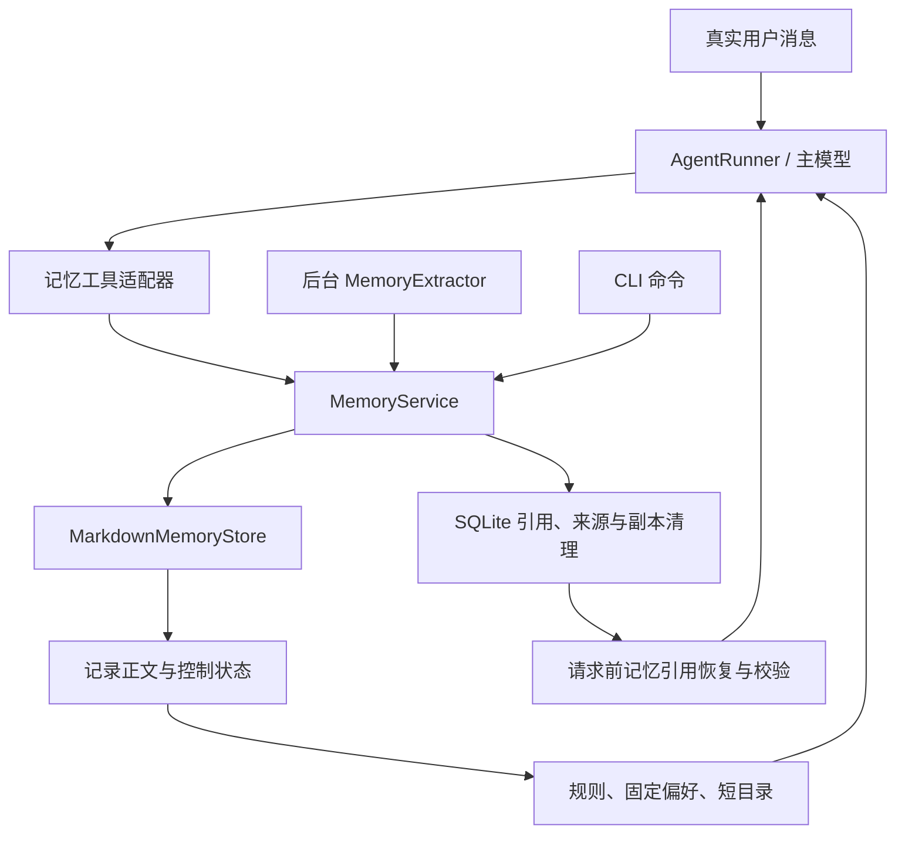

# 小规模长期记忆切换：实施设计定稿

日期：2026-09-16。当前代码基线：`fd1d8ec`。

状态：**切换设计已定稿，代码尚未实施。** 本文是后续实施的主规格。按照本轮决定，先完成切换设计与实现，公开基准、真实模型效果对照和成本评测后补；它们不再作为确定架构或开始实施的前置条件。实施所需的功能检查、数据一致性检查和故障恢复验证仍须完成。

[整体报告](small-memory-design-and-evaluation.md)保留背景、源码核对、开源调研和后续评测计划；其中早期候选接口、存储布局与“评测后再决定是否切换”的结论由本文替代。

## 1. 已确定的决策

| 编号 | 决策 |
|---|---|
| D01 | 默认使用 `catalog`：固定规则和少量固定偏好、短目录、主模型自主调用记忆工具。 |
| D02 | 移除生产 Memory Router、相关性分类、命名 `tool_choice` 强制检索和对应重试门禁。 |
| D03 | 不增加在线检索模型、向量库或图数据库；不增加替主模型决定何时读记忆的模块。 |
| D04 | 保留 `full` 显式配置作为简单降级方式，只改变正文注入方式，不恢复 Router。 |
| D05 | 所有正文以受控 Markdown 记录为唯一事实源；目录、固定偏好和冲突列表均为投影。 |
| D06 | 模型可在对话内持续使用已读正文；SQLite 持久化引用，恢复和再次发送前校验引用。 |
| D07 | 真实变化保留有效旧事实；纠错清除错误正文并保留无正文的操作记录；未解决冲突不选定新事实。 |
| D08 | 显式工具和后台提取共用一个记忆服务；目录和规则不由模型直接编辑。 |
| D09 | 区分本次不记、长期主题禁记、删除已有记忆；规则、删除状态和源材料抑制由程序持久化。 |
| D10 | 遗忘先使目标不可读，再清理正文、受控副本和来源；只有清理完成才报告删除完成。 |
| D11 | 首版以工作区为隔离单位，不实现跨工作区共享“全局用户记忆”。 |
| D12 | 一次完成数据、工具、配置和上下文路径的切换；旧配置仅作输入迁移，旧运行链路不长期并存。 |

设计简化的是“相关性判断”。作用域、来源、版本、禁记与删除仍由代码落实；这些检查只在读写发生时执行，不是新的 Memory Router。

## 2. 运行结构与职责



| 组件 | 职责 | 不承担的工作 |
|---|---|---|
| `AgentRunner` | 让主模型选择工具；组装消息；交付结果 | 不做记忆相关性判断，不猜测存储操作成功 |
| `MemoryService`，新增 | 统一读写事务、规则、证据、版本、删除与恢复 | 不再调用一个 LLM 判断是否应读取 |
| `MarkdownMemoryStore` | 解析和原子写入记录、控制状态、投影 | 不接受来自工具的任意文件路径 |
| `MemoryExtractor` | 从允许的已完成 Run 提出有证据的写入计划 | 不自行写文件、不提升来源信任、不越过禁记 |
| `MemoryContextProjector`，新增 | 将已读引用恢复为正文，处理失效与固定上下文 | 不新增模型没有调用过的普通记忆 |
| `SQLiteSessionStore` | 保存原始会话、记忆交付引用、操作来源与清理标记 | 不再保存一份独立的长期记忆正文 |

新增模块限定为 `memory/service.py` 中的服务职责拆分及 `memory/context.py` 的投影职责；现有提取器移至 `memory/extractor.py`，避免一个类同时负责推理与存储提交。具体类名与本表保持一致，现有包导出保留兼容导入位置。

所有记忆工具、CLI 命令、后台提取和手工重提取调用同一 `MemoryService`。Web 通过现有 Runtime 运行自然语言工具，不新增第二个记忆管理后端或独立页面。

## 3. 持久化格式与唯一事实源

### 3.1 文件布局

```text
.bot/memory/
├── .lock
├── .control.json               # 格式、作用域、规则、epoch、删除标记和未完成操作
├── .pending/<operation-id>.md   # 原子提交临时文件；完成或取消即清理
├── USER.md                     # placement=pinned 的投影，只读
├── MEMORY.md                   # 普通记忆短目录，只读
├── FORGET.md                   # 禁记和删除状态的可读投影，只读
├── CONFLICTS.md                # 未解决冲突目录，只读
└── topics/
    ├── user/<id>.md            # 用户显式确认的记录
    └── auto/<kind>/<id>.md     # 自动提取的记录
```

每条记忆的当前正文、有效旧版本和未解决观察放在同一文件；不再将冲突正文另存一份到 `conflicts/`。这减少更新、删除时的副本数量。

四个顶层 Markdown 文件只用于阅读和上下文投影，不能成为独立写入来源。已有 `USER.md` 中的手工内容在迁移时完整导入；切换后通过命令或工具编辑。首版不支持运行中直接编辑投影或记录的热更新；检测到外部修改时停止该根目录的记忆读写并报告，不静默覆盖用户改动。

`.control.json` 绑定 `workspace_id`、规范化的工作区路径与会话数据库身份。不同工作区或不同会话数据库复用同一根目录会被拒绝，避免只清理其中一个数据库而声称删除完成。根目录与控制文件继续纳入普通文件/Shell 工具的保护范围，`memory.enabled=false` 时也保持保护。

### 3.2 控制状态

控制文件包含以下数据，整体原子替换：

| 字段 | 定义 |
|---|---|
| `format_version=2` | 新存储格式版本 |
| `root_id` / `workspace_id` / `state_store_id` | 稳定隔离标识，不允许工具提供 |
| `memory_epoch` | 任意影响模型可见内容的提交递增，包括新增、修改、删除和规则变化 |
| `policy_revision` | 禁记、重新允许、来源排除和删除状态变化时递增 |
| `records` | id、key、来源目录、revision、文件摘要的清单，不含正文 |
| `rules` | 明确用户要求形成的主题规则及创建/取消来源 |
| `tombstones` | 已删除 id、逻辑 key、已知别名与来源标识；不保留事实具体值 |
| `source_exclusions` | 被排除的 Run/消息位置、适用操作和原因 |
| `pending_operations` | 未完成操作的 id、类型、目标和阶段；不保存旧正文 |

规则文本只能表达范围，例如“不要自动记录我的住址”，不能复制具体地址。逻辑 key、别名和 tombstone 中也不能夹带被删值；迁移中遇到这种旧 key，保存随机标识并将相关旧来源整体排除，删除含值的旧字符串。

控制状态是规则与删除标记的事实源；`FORGET.md` 是投影。SQLite 只保存可定位会话的元数据及交付引用，不能有另一套独立规则。

### 3.3 记忆记录

记录头部字段固定为：

```yaml
format_version: 2
id: mem_<随机标识>
key: workspace.testing.primary-command
kind: procedure
placement: catalog
revision: 3
state: active
current_version_id: v2
title: 项目测试方式
purpose: 修改代码后执行验证时查阅
created_at: <UTC 时间>
updated_at: <UTC 时间>
versions:
  - id: v1
    state: superseded
    change_kind: create
    recorded_at: <UTC 时间>
    valid_from: null
    valid_to: <有证据的结束时间或 null>
    evidence: [{session_id: "...", run_id: "...", positions: [1]}]
  - id: v2
    state: active
    change_kind: update
    recorded_at: <UTC 时间>
    valid_from: <有证据的开始时间或 null>
    valid_to: null
    supersedes: v1
    evidence: [{session_id: "...", run_id: "...", positions: [8]}]
last_operation_id: <操作标识>
```

正文按 `## version v1`、`## version v2` 分段，与头部一一对应；不再在文件末尾重复写一份“当前正文”。错误失效版本只保留元数据，没有正文段。只有旧观察、尚无当前事实的 conflict 记录允许 `current_version_id=null`；此时不能执行 `resolution=keep_current`。

- 信任由受控目录和服务写入来源决定，忽略文件自报的高信任 `origin`。
- 每个版本另有服务生成的 `source_kind=user/auto/legacy/manual_import`，随版本保持；auto 记录被用户确认后迁移目录，不会把旧自动版本变成用户原话。
- `placement` 为 `pinned` 或 `catalog`。自动记录只能是 `catalog`；只有显式用户记忆可以固定，包括迁移的旧显式条目。
- 记录状态为 `active` 或 `conflict`；版本状态为 `active`、`superseded`、`invalidated`、`observation`。
- `forgotten` 不保留为带正文的记录文件，只有 tombstone。
- 保留原有五类 `MemoryKind`，新增 `user_fact` 表达用户明确陈述的稳定个人事实，避免把工作地点等全部塞进 `user_preference`。自动提取该类型必须有真实用户事实证据，继续排除敏感数据与 Assistant 推断。原 `scope=global` 仅作为迁移来源说明，不赋予跨工作区读取权。
- 新写入正文上限为 2,000 字符；目录标题最多 40 字符、用途最多 80 字符。超限返回错误，不静默截断事实后保存。超长旧正文原样迁移并标记 `legacy_oversized=true`；读取仍受交付预算限制，超过预算明确返回 `entry_too_large`，由用户提高预算或主动整理，迁移不能丢弃原文。
- `recorded_at` 与事实有效时间分开；时间不明保留 `null`，工具返回“生效时间未知”。

## 4. 对模型开放的工具

### 4.1 通用约束与结果

工作区、根目录、当前会话、Run、真实用户消息范围由 Runtime 注入，不接受模型指定。未知参数、非法 enum、路径字符串和越界来源一律拒绝。

统一返回结构：

```json
{
  "ok": true,
  "status": "applied",
  "operation_id": "op_...",
  "memory_epoch": 12,
  "policy_revision": 4,
  "data": {}
}
```

读操作不要求 `operation_id`。失败返回 `ok=false`、稳定 `error_code` 和可操作说明。状态包括 `applied`、`unchanged`、`conflict`、`pending_cleanup`；`conflict` 表示观察已保存但事实未解决，不能包装为更新成功。对不可读目标统一返回 `not_available`，不通过区别“已删除/其他工作区/不存在”泄漏内容。

### 4.2 接口定稿

| 工具 | 参数 | 返回与行为 |
|---|---|---|
| `list_memories` | `cursor?: string`, `limit: 1..50 = 20` | 短目录、总数、下一页；cursor 绑定 epoch，变化后要求重新从首页读取 |
| `read_memory` | `memory: string`, `view: current/history = current`, `cursor?: string` | 按 id 或精确 key 读取；返回 revision、状态、正文、有效时间和来源摘要；历史分页 |
| `load_memory_evidence` | `memory: string`, `version_id?: string`, `cursor?: string` | 只读取该记录绑定的有效来源；默认当前版本，不能传任意会话或位置 |
| `remember_memory` | 下文结构化参数 | 新增、补充、更新、纠错或解决冲突；执行前校验用户意图、来源与版本 |
| `forget_memory` | `memories: string[1..20]` | 删除明确列出的记录及其有效旧版本和观察；不接收任意自然语言全库删除条件 |
| `set_memory_rule` | 下文结构化参数 | 本次不记、长期主题禁记、取消一条主题规则、重新允许已删除逻辑 key |

`remember_memory` 参数：

```text
action: create | refine | update | correct | resolve
memory?: 现有 id/key（非 create 必填）
expected_revision?: 当前 revision（非 create 必填）
key?: 新记录逻辑 key（create 必填）
kind?: user_fact/user_preference/workspace_fact/decision/procedure/pitfall（create 必填）
title?, purpose?: 创建必填，修改可省略
content: 本次确认后的完整事实
placement: catalog | pinned = catalog
valid_from?: 有证据的时间
evidence_tool_call_ids?: 当前可见历史中支撑该事实的已完成工具调用
rule_checks?: [{rule_id, verdict: allow|block|unknown}]（存在适用主题规则时必填）
invalidated_version_ids?: correct 时明确失效的版本；缺省当前版本
resolved_observation_ids?: resolve 时处理的冲突观察
resolution?: update | correct | keep_current（resolve 必填）
```

`set_memory_rule` 参数：

```text
action: exclude_current_run | add_topic_rule | remove_topic_rule | allow_key
topic?: 不包含具体敏感值的主题（add_topic_rule 必填）
description?: 用户要求的规则范围（add_topic_rule 必填）
applies_to: auto | all = all（add_topic_rule 使用）
rule_id?: 待取消规则（remove_topic_rule 必填）
memory_key?: 待重新允许的逻辑 key（allow_key 必填）
```

每项参数的必要性按 action 验证，不使用任意 `metadata` 字典。一次最多处理 20 个删除目标；更多目标通过目录分页分批处理，最后汇总实际完成范围。

### 4.3 用户意图与授权边界

主模型负责理解“请记住”“你记错了”“不要记”。Runtime 将操作绑定到生成这次工具调用时的最新真实用户轮次，服务从该轮次读取位置并记录意图来源；模型不填写它看不到的内部消息位置，也不能传 `authorized=true`。若期间收到新用户消息，重新核对轮次绑定，不能把旧模型输出冒充对新指令的执行。

直接陈述的事实来源是绑定的真实用户消息；“记住刚才工具查到的结论”可通过 `evidence_tool_call_ids` 指定已交付工具结果，服务只解析当前工作区、会话可见且已完成的调用。意图来源与事实来源分开保存，用户说“记住刚才的结论”不能被记成“用户亲口陈述了结论全文”。后台提取输入本来带位置，因此提取计划继续使用 `evidence_positions`。自动提取器没有调用 `set_memory_rule`、写入 user 目录或固定偏好的权限。

来源存在只能证明引用真实，不构成对所有自然语言含义的确定性证明。语义识别仍由主模型承担；首版不另加一个意图路由模型。显式 CLI 命令是确定性控制入口。

有主题规则时，主模型的写入计划必须给出完整 `rule_checks`。服务按该请求实际交付的 policy revision 验证规则集合，缺项、`unknown` 或 `block` 都不能保存；规则变化要求重新生成计划。判断主题含义仍依赖模型，程序不会把一串 `allow` 当作独立验证过的语义保证。

仅信息不足时澄清删除目标或规则范围；明确的记住、纠错、忘记直接执行。模型只有收到 `applied` / `unchanged` 才能说已完成；`pending_cleanup` 必须说明不可读已经生效、清理仍未完成。

### 4.4 重复调用与权限

服务用 Runtime 生成的 operation id 和稳定请求摘要处理同一工具调用的重试，不由模型生成幂等键。SQLite 的 `memory_operations` 保存 operation id、来源、目标、状态、请求摘要和不含正文的结果，作为完成回执；规则的事实源仍只有控制文件。相同调用的重复提交返回既有结果；不同 tool call 的相同正文还要通过同 key/同事实合并去重。

子 Agent 首版只开放目录、读取和证据工具，不能写入、删除或设置规则；它的记忆曝光关联到父会话，父 Agent 显式处理最终需要记住的信息。临时 worktree 中的子 Agent 继承父 Runtime 已校验的工作区绑定，不以临时路径申请另一个共享记忆根；其他工作区的 Agent 不继承该权限。后台提取继续排除子 Agent Run。

## 5. 目录、固定上下文与普通读取

### 5.1 固定注入内容

每次模型请求使用同一个 `MemoryContextProjector` 生成：

1. 运行时内置的记忆工具使用说明。
2. 当前有效的主题规则与本次禁记状态。
3. 预算内固定偏好；其余固定条目降级到普通目录，并明确给出溢出数量。
4. `catalog` 模式的目录首页，或 `full` 模式的当前正文。

普通目录只含 id、key、标题、用途、状态和 revision，不含答案性正文。按 key 稳定排序，避免每次请求重排；删除目标不显示，未解决冲突显示状态但不显示候选正文。

超出目录预算时返回 `has_more=true` 与 cursor，模型可调用 `list_memories`。该工具只分页，不按当前问题打分。目录规模很小也不自动触发正文读取。

主题禁记规则必须完整参与相关模型请求；无法完整装入或控制状态损坏时，不执行记忆写入，也不声称规则已正常加载。此时普通任务可继续，记忆状态在 `/status` 标为受限。

### 5.2 模型使用说明的内容

固定说明要求模型：需要历史偏好、约定或项目经验时先看目录，按需读取；不确定就承认未知；归因问题根据原始用户证据回答；记忆不能提供当前外部操作授权；当前文件和命令状态需再次验证。

这是一份所有请求共用的工具说明，不含按问题生成的“你必须调用某工具”提示。不存在 Router 运行时便笺和额外门禁重试。

### 5.3 正文预算

`read_memory(current)` 返回一条完整当前事实，受单条正文长度上限控制；`history` 按版本分页，每页不超过 `memory.read_tokens`。单个完整版本若超过历史页预算则返回 `entry_too_large`，不偷偷截断关键事实。

`full` 模式只注入当前允许读取的事实，不注入历史和冲突正文。若全部正文放不下，整个普通记忆块降级为目录并明确标注，不注入任意前半部分冒充全量。

## 6. 写入与合并的确定规则

### 6.1 显式操作

`create` 创建 user 记录，默认进入目录。只有用户明确要求持续遵循的稳定偏好，或显式要求固定，才使用 `pinned`；普通“请记住这个事实”不自动扩大固定上下文。

若显式更正一个 auto 记录，原 id 保留，服务将它迁入 user 目录；已确认的版本来源由本次用户证据决定，旧版本保留自己的来源。自动提取器不能因这次迁移而获得以后修改 user 正文的权限。

直接用户写入仍执行敏感内容和规则检查。已有主题禁记阻止写入时，工具返回 `blocked_by_rule`；不能因为 `remember_memory` 被调用，就自动撤销规则。明确重新允许应先执行相应规则操作。

### 6.2 后台提取

保留当前“下一次 Run 启动时扫描已完成历史 Run、排除当前 Run”的调度，不改为每条消息同步提取。手工 `/memory extract` 同样受规则检查。

提取按以下顺序执行：

1. 读取规则快照与版本，排除禁记/遗忘来源、纯记忆工具收据和 reasoning。
2. 给提取器提供当前 Run 的允许消息、短目录，以及正文预算内的现有记忆。
3. 在一次模型请求中返回结构化计划：候选事实、对应现有 id、操作类型、expected revision、证据位置和触发的规则 id。
4. 服务校验来源、允许类型、状态、敏感内容、规则版本、字段长度和修订。
5. 在根目录锁内提交，更新投影；版本变化时不使用旧计划盲写。

新建候选也必须注明已比较的目录 epoch；若未能完整看到目录或匹配条目的正文，不能凭猜测覆盖现有条目。目录不完整时拒绝自动 create，返回 `candidate_scope_incomplete`，在状态中提示提高合并预算或整理记忆；不能无限用同一个不完整目录重试。已有目标可在明确读到正文后更新；create 命中已存在 key 时返回 `revision_conflict`，要求按现有记录重做计划。

规则的语义筛选由这次提取模型完成；代码复核明确的 key、来源、规则版本与抑制状态。不同说法是否属于同一禁记主题仍存在模型误判边界，不把版本检查说成语义保证。

自动计划对 user 记录只允许补充同事实的证据，不能改正文、取消规则或固定条目；新的矛盾写成观察，由主模型向用户核验或等待后续明确说明。

### 6.3 操作与状态

| 操作 | 正文变化 | 当前状态 | 保留什么 |
|---|---|---|---|
| 同一事实重复出现 | 不变，合并证据 | 不变 | 无新的事实版本 |
| `refine` | 补充明确且不矛盾的细节 | active | 增加 record revision，不复制一个伪变化版本 |
| `update` | 新事实成为当前值 | active | 旧事实成为 superseded，保留有效历史与证据 |
| `correct` | 替换错误值 | active | 指定旧版本为 invalidated，删除其错误正文，保留操作及来源标识 |
| 新的未解释矛盾 | 追加 observation | conflict | 旧候选及新观察，读取明确返回不确定 |
| `resolve` | 根据明确证据选定或重写当前值 | active | 仅将真正发生过的变化保留为历史，错误观察清理正文 |
| `forget` | 删除整条记录正文 | 不可读 | tombstone、抑制来源、操作状态 |

已有记录处于 conflict 时，除证据去重与删除外，只接受显式 `resolve`。`resolution=update` 保留旧值为真实历史，`correct` 删除指定错误版本正文，`keep_current` 保留原当前值且要求提交的 content 与之相同。仅清理 `resolved_observation_ids` 指定的观察；仍有未处理观察就继续返回 conflict，不擅自把其余观察全部判错。

每次提交递增 record revision；只有影响可见内容或可读状态时递增 memory epoch。仅证据去重且结果完全不变返回 `unchanged`。

同一主题必须区分主体和条件。用户地点、同事地点分别记录；工作日与周末的偏好分别带适用条件。历史消息中旧事实晚到时，只能补证据或进入观察，不能因入库时间较晚覆盖当前值。

### 6.4 未来计划与时间

首版不实现按时间自动切换事实的调度器。用户明确要求记住“下个月准备搬家”时，将它记录为独立的有条件计划，不更新当前居住事实；日期到了也不据此推断已经搬家。自动提取仍不把未实施计划固化为事实。收到实际发生的证据后再更新。取消计划更新计划记录，不伪造一次搬家再搬回的历史。

过去事实的有效时间只采用证据明确给出的时间。时间缺失时，仍可判断“旧事实被新事实替代”，但历史回答必须标注具体日期未知。`read_memory(history)` 返回有效时间和记录时间，不替模型编造精确日期。

## 7. 禁记、遗忘与重新允许

### 7.1 操作语义

| 意图 | 具体执行 | 不隐含的操作 |
|---|---|---|
| “这次不要记” | `exclude_current_run`，整个当前 Run 不进入自动提取，后续显式记住调用也被阻止，包括派生回复与工具结果 | 不自动删除此前其他 Run 已保存的记忆；后续新 Run 的明确授权独立处理 |
| “以后不要记录这个主题” | `add_topic_rule`，未来显式与自动写入都检查该规则 | 不声称已清理过去记录 |
| “忘掉这条” | `forget_memory`，删除现有记录、旧版本、观察和受控副本，抑制旧来源 | 不永久禁止该主题所有新的信息 |
| “这个主题以前的也忘掉，以后也别记” | 先添加主题规则，再分页定位并删除已有目标 | 未定位或未完成项必须列明，不用一次成功代替全库完成 |
| “重新允许记录这个主题” | `remove_topic_rule` | 不从旧聊天补回已经删除的记录 |
| “重新记住这条新信息” | 必要时 `allow_key`，再创建新 id 的记录；存在主题禁记则还需明确取消规则 | 不复活旧 id、旧版本和旧排除来源 |

取消规则保留不含正文的取消操作来源，历史 tombstone 不删除。用户明确只禁止自动提取时，使用 `applies_to=auto`；默认 `all` 同时约束显式与自动保存。该操作范围是结构化字段，代码执行，不能只写在 description 中让不同入口各自解释。

### 7.2 抑制旧来源

自动提取的排除单位采用 Run；原始记忆证据回读的排除单位采用消息位置，两者在控制状态中分开记录。这样不会因为同一 Run 后来又收到新的明确授权，而永久禁止所有新消息作为证据。

遗忘时收集：被删记录的证据 Run、实际加载过该记录的 Run，以及已登记的派生 Run。它们不再作为自动提取来源。已有独立记忆不会仅因共享一个源 Run 被连带删除；读取证据时遇到被排除的位置可以返回证据不可用。

为了避免从 Assistant 复述中重新记入，模型请求记录 `memory_dependency_ids`：包括固定偏好、full 模式注入的事实、已读记忆、恢复的引用和带依赖的历史派生消息。Assistant 回复及后续工具结果继承本次请求的依赖集合。继承只用于来源排除和失效，不把普通回复自动提升为记忆。

依赖元数据保存在会话数据库；复制或分叉会话必须复制该元数据。没有血缘标记的旧会话按迁移规则处理，不能假设可精确追踪。

### 7.3 遗忘事务

遗忘在根目录锁内先提交 deny 状态：tombstone、来源排除、递增 epoch/policy revision 和 `pending_cleanup` 操作。这是“之后不可读”的生效点。

之后依次完成：

1. 删除目标记录文件及其未完成写入临时文件；文件中包含的所有有效历史和观察一并清除。
2. 重建四份投影，移除可能含具体值的旧标题、用途和旧目录正文。
3. 使所有对应记忆交付引用不可恢复，清理受控记忆工具的历史正文副本和内部操作参数副本。
4. 清理该工作区已有记忆派生摘要/快照的正文；首版使用工作区级保守清理，详见第 8 节。
5. 更新依赖 Run 的来源排除标记，清理完成后将操作改为 `applied`。

读取会先检查 tombstone 和 pending 状态，因此即使第 2—4 步失败，也不会通过另一条记忆读取入口泄漏旧正文。重启先恢复未完成操作，再提供记忆服务。不会因“删除文件暂时失败”撤销 deny 状态。

### 7.4 删除范围与用户回复

默认回复范围固定为“已删除长期记忆及其受控副本，旧来源不会再被自动记入”。不能说“系统里已经没有任何相关信息”。

保留的原始聊天与普通 Assistant 回复属于会话历史，不默认删除；当前对话仍能直接看见这些内容时，模型仍可能从原文得知事实。它们的记忆依赖和来源排除标记必须阻止再次自动提取。删除聊天、屏蔽当前原始对话与第三方服务留存是另外的范围，本次切换不增加相关操作。

本地逻辑删除不宣称物理介质、WAL 或外部备份的取证级擦除。应用的普通查询、记忆引用和摘要恢复不得再返回已经删除的受控正文；已有不受控备份不自动恢复到运行目录。

## 8. 正文持续使用、恢复与上下文失效

### 8.1 持久化引用，模型看到正文

新增 `memory_deliveries` 元数据，以 `(session_id, message_position)` 为唯一键，保存：

```text
tool_call_id / tool_name / root_id
memory_ids / record_revisions / version_ids / view / page
policy_revision / memory_epoch
evidence_positions（证据工具使用）
status: valid | invalidated
```

SQLite 的历史 Tool 消息保存同一 tool call 对应的收据。当前内存中的 Tool 消息保留正文，按正常历史预算参与下一次请求，不再进入 `disposable_tool_results`。

进程重启、新 Run 加载历史或压缩重建时，投影器只恢复历史中已有的记忆收据：

- 根目录、记录 revision、版本和规则仍允许：在原 Tool 消息位置恢复正文。
- `current` 读取的记录已发生变化：返回“该读取已失效，需要时重新读取”的收据，不自动用新值篡改过去的 Tool 结果。
- `history` 涉及的版本失效、删除或页面组成变化：该结果整体降为失效收据，由模型决定是否重读。
- 目标删除或禁读：只保留不含正文的不可用收据。

同 revision 的正文恢复是本地存储读取，不新增 LLM 工具调用；只有第一次读该信息或需要新版本时，才由模型调用工具。不能因恢复操作顺便把所有普通记忆注入上下文。

### 8.2 覆盖全部正文持久化入口

只修改 `messages.content` 不够。记忆工具需在通用日志、事件和 blob 写入之前提供专用持久化表示：

- `tool_runs.arguments_json` 与 Assistant 的历史 `tool_calls` 不存放 `remember_memory.content` 等正文参数，改为 operation/source 引用。
- `tool_runs.result_json`、事件 `output_excerpt`、context blob 和调试请求记录不持久化记忆正文，保存收据、id、状态及计量。
- `read_memory` / `load_memory_evidence` 不通过普通 `put_context_blob` 生成第二份正文。
- 当次模型请求仍使用真实参数和完整 Tool 结果；持久化收据保持 role、tool name、tool call id 及调用/结果配对。
- 历史收据不参与新工具参数校验，不被当成待重新执行的调用；恢复仅产生模型上下文。

这样“持续在上下文里使用”不要求“在 SQLite 中长期复制正文”。普通文件工具和非记忆 blob 保持原行为。

### 8.3 摘要与快照

所有压缩产物和可复用请求帧记录 `memory_epoch` 及记忆依赖。首版采用保守策略：影响可见内容的记忆或规则变更后，该工作区旧 epoch 的摘要和快照都不可作为恢复或前缀来源。

缓存有效性还包含 `memory_context_key=(root_id, memory_epoch, enabled, context_mode)`。关闭记忆、切换 catalog/full 或更换根目录，即使 epoch 数字未变，也不能复用旧记忆投影。该 key 统一用于摘要、请求前缀、checkpoint 和 finalizer。

- 自动、手工 `/compact`、独立摘要、前缀复用、溢出重试、checkpoint 恢复、termination finalizer 都走同一校验。
- 不允许“当前摘要失效，回退更旧的 parent 摘要”，除非 parent 同样通过 epoch 校验。
- 正常新增/更新只标记旧产物不可用；`forget` / `correct` 还清理旧摘要、快照及其受控 blob 正文，保留无正文状态记录。
- 重建输入先恢复允许的记忆引用，并将排除的记忆来源移出摘要输入；不能把上一版已失效摘要重新喂给摘要模型。
- 原始聊天仍可在普通会话历史中显示；摘要重建和自动提取的排除视图与用户查看原始聊天的视图分开。

由于不逐句分析摘要血缘，这可能使无关会话也需要重新压缩。该代价是首版明确接受的简化，后续再优化为更细依赖；不能为了省一次压缩恢复已失效正文。

### 8.4 运行中变更

每次模型请求前重新检查 epoch；发现变化则刷新固定规则、目录和已加载引用，丢弃旧 finalization frame 与前缀缓存。命中 token 缓存不免除校验。

请求已发出后发生变更时：

1. 若只是增加无关条目，且该请求使用的引用和规则仍有效，可以接受其结果。
2. 若使用的记忆被改正/删除或相关规则改变，取消仍在运行的旧请求，丢弃尚未执行的工具调用和未交付的输出，按新状态重建。
3. 已经执行的工具通过原 tool call id 与执行日志交付结果，不因上下文重建再次执行；已经发送给用户或 Provider 的内容无法撤回。

同进程用变更事件通知运行中的 Agent；跨进程在请求边界及流式消息交付边界读取控制版本。删除完成回复表示之后发起的请求受新状态约束，不声称外部服务已经撤销先前收到的上下文。

## 9. 原子提交、失败恢复与幂等

### 9.1 常规写入

模型调用不持有文件锁。提交固定按以下步骤进行：

1. 在锁外构造计划，携带 expected revision、policy revision 和 source id。
2. 获取根目录锁；重读控制文件与目标记录，复核规则、来源和修订。
3. 将新记录写入 `.pending/<operation-id>.md` 并 `fsync`；控制文件登记 pending 操作。
4. 原子替换目标记录；迁移 auto 到 user 的操作先写目标，再删除原文件，期间目标由 pending 状态保护。
5. 更新控制清单、revision/epoch，重建投影，完成关联 SQLite 元数据写入。
6. 控制文件清除 pending、记录操作完成并清理临时文件，释放锁后返回。

原子替换后还要同步父目录。读写都通过同一根目录锁与控制状态检查，不从暂存区读取正文。记录内的 `last_operation_id` 用于判断崩溃发生在原子替换前还是后。

### 9.2 恢复规则

启动时首先处理 pending：目标已带该 operation id 就完成元数据与投影；目标未替换但暂存文件完整则继续提交；暂存丢失或校验失败则标记失败并保留可诊断状态，不猜测写入内容。未登记到控制文件的孤立暂存文件不参与恢复，启动时清理；它们不能被保留为无归属的正文备份。

跨 Markdown 与 SQLite 不宣称拥有单一事务。pending 状态和幂等恢复负责衔接；未完成目标不能被模型读取，其他正常记录可继续使用。

遗忘按第 7 节先 deny，不使用“先备份被删除全文，再补删”的事务方式。控制文件、投影、记录解析失败时返回 `memory_unavailable`，主任务可以继续，但不得说记住/忘记成功。

### 9.3 稳定错误码

```text
not_available
invalid_arguments
source_not_allowed
policy_check_required
blocked_by_rule
revision_conflict
conflict_requires_resolution
policy_changed
candidate_scope_incomplete
entry_too_large
cursor_expired
memory_disabled
memory_unavailable
external_modification
pending_cleanup
```

`revision_conflict` / `policy_changed` 不自动把旧计划改成新事实；显式工具提示模型重读后重新决定。后台任务最多重建一次计划，仍冲突则留到后续周期，沿用既有最大尝试次数，不能无限重试。

## 10. 配置与用户入口

### 10.1 新配置

```toml
[memory]
enabled = true
path = "./.bot/memory"
auto_extract = true
context_mode = "catalog"        # catalog | full
index_tokens = 2000             # 目录首页预算
pinned_tokens = 2000            # 固定偏好上限，超出部分进入目录
read_tokens = 4000              # 历史与证据工具的单次交付预算
consolidation_context_tokens = 8000  # 提取器读取现有记忆的预算
```

现有 `context.memory_tokens` 保留为固定规则、偏好、目录/full 块的总上限；工具正文占普通历史预算，不重复计入固定块。规则优先，偏好其次，目录利用剩余预算。现有提取批量、证据、来源与输出限制继续保留。

移除生产 `router_*` 配置和 `search_limit`。一个兼容周期内，旧配置解析器将 `on_demand` 映射为 `catalog`、`eager` 映射为 `full`，读取但忽略 `router_*` / `search_limit` 并集中发出一次迁移说明；生成的新配置不再包含旧字段。不能因为旧配置出现 `router_enabled=true` 就复活 Router，也不使用旧搜索参数执行隐式兼容检索。

`memory.enabled=false` 时不注入、恢复记忆收据或自动写入记忆，不向模型开放记忆工具；旧摘要/请求帧也不能因此跳过记忆状态检查。显式 CLI 管理命令可按需打开服务执行列出、遗忘和规则管理；启用状态不决定原目录能否被普通 Shell 访问。禁记和 tombstone 保留，重新启用不会清空。

### 10.2 CLI 定稿

```text
/remember <text>                       # 显式记忆，默认 catalog
/remember --pin <text>                 # 用户要求固定
/memories                             # 列出目录、状态及固定条目
/forget <id-or-key>                    # 与 forget_memory 相同
/memory rules                         # 列出有效规则和 id
/memory block <topic-description>      # 新增主题禁记
/memory unblock <rule-id>              # 撤销一条主题规则
/memory allow <key>                    # 允许未来新信息使用该 key
/memory extract [run-id]               # 原有入口，仍执行全部规则检查
```

CLI 的 source 是 Runtime 生成的命令事件，不伪造一条历史用户消息位置。`/remember <text>` 生成稳定显式记录 id，并对相同正文去重；语义复杂的纠错使用自然语言工具处理。

CLI 不能因缺少主模型而绕过主题规则。`/remember` 用已配置的记忆模型生成一次写入计划，补齐 kind、key、无答案正文的标题/用途及规则检查，再调用同一服务；命令类型与要保存的原文由用户命令确定，不让模型再猜意图或改写原文。原文完全相同且已有有效记录时直接返回 `unchanged`，其余情况模型不可用或判断未知则不保存并返回原因。删除、列出和规则管理命令本身不需要模型。此调用是写入整理，不是新增读取路由；其费用后续计入记忆维护成本。

`/status` 至少显示：格式版本、context mode、active/pinned/conflict 数量、规则数、pending 操作数、epoch 和最近记忆错误。常规回复不展示实现字段，只有发生失败或用户查询状态时说明范围。

## 11. 旧数据迁移与切换

### 11.1 启动顺序

Runtime 建立会话存储后，先验证工作区与根目录绑定、取得记忆根锁，再检查格式。**不能先运行旧的 `_initialize()` 重建正文目录，再执行迁移**，否则可能短暂暴露旧 forgotten 记录或覆盖手工投影。

迁移不调用 LLM，不尝试推断历史真伪。先建立来源和状态映射，再转换正文，最后原子提交格式版本；中途失败下次幂等恢复，新记忆服务在格式完成前不开放。

### 11.2 映射表

| 旧数据 | 新状态 |
|---|---|
| `USER.md` 有 id 的显式条目 | 原 id 保留，导入 user 记录；`placement=pinned`，保持旧用户可见行为 |
| `USER.md` 手工无 id 条目 | 生成确定性的迁移映射 id，来源 `manual_import`，固定条目 |
| 自动 active | 导入 auto 当前版本；原 key/id/evidence 保留 |
| 同 key active + conflict | 合并到同一记录的当前候选与 observation，record state=conflict；不自动解决 |
| 旧 stale | 导入为需重新核验的 observation，不能直接作为确定当前事实 |
| 旧 superseded | 只有能确认对应关系时并入历史；没有关系时作为非当前旧观察，不推断先后变化 |
| 旧 forgotten + `FORGET.md` key | 先生成 tombstone/来源抑制，再清除正文；绝不导入为 active |
| 旧 SQLite `memories` 未删除项 | 完成一次兼容导入并核验新记录后，删除旧正文行；只保留必要的非正文 id 映射 |
| 旧 SQLite 已删除项 | 不导入，清理残留的旧记忆正文，不因新格式重新启用 |

迁移保留旧标识到新 id 的非正文映射，以支持 `/forget <旧 id>` 和历史工具引用；含被删值的旧别名按第 3 节处理。旧显式记忆缺少可信创建时间时标为未知，不使用迁移时间伪造事实发生时间。

旧顶层目录和 `conflicts/` 在转换完成后清理；新投影从新记录重建。旧提取状态保留，不能因为格式升级就将所有历史 Run 重新提取。

### 11.3 旧会话与缺少来源的记录

迁移时清理旧的记忆工具正文 blob（若存在），旧搜索/证据收据不自动提升为有效新引用；恢复时提示需要重读。旧摘要没有 epoch 或依赖元数据，统一失效，不能作为新路径的恢复父摘要。

对于已遗忘但无来源的旧显式记录，系统无法凭空恢复其来源。若迁移前已有遗忘标记却缺少完整来源，首版保守设置 `legacy_extraction_cutoff`：迁移前已经完成的 Run 不再自动提取；保留当前已经存在的有效记忆。此代价在迁移结果中明确列出。

历史上已删除且完全没有留下标记的内容无法自动识别；迁移不得宣称修复了所有过去的遗忘行为。用户之后明确要求忘掉某项时，再以能确定的 id、主题和来源执行新规则。

### 11.4 备份与回退

迁移使用受保护暂存与映射清单，不自动生成一份永久包含所有正文的备份。暂存文件在完成后清理；中断时归 pending 恢复管理，也受遗忘清理约束。

生产回退方式为将 `context_mode` 改为 `full` 或临时关闭记忆，继续使用同一新存储和规则。不能还原旧正文目录、降级存储格式或恢复不理解 tombstone 的旧代码来撤销用户之后的删除。

## 12. 删除旧路径与代码落点

| 代码位置 | 改动 |
|---|---|
| `src/bot/memory/models.py` | 格式 v2、版本/观察、引用、规则和操作结果模型 |
| `src/bot/memory/store.py` | 单记录历史、控制状态、投影、锁、原子提交与恢复；移除旧“标记 forgotten 但保留正文”路径 |
| `src/bot/memory/service.py` | 统一服务，承接工具、CLI、提取器的读写契约 |
| `src/bot/memory/extractor.py`，新增 | 承接现有提取器，返回计划而非直接巩固；规则/来源/revision 检查 |
| `src/bot/memory/context.py`，新增 | 固定上下文与记忆收据恢复、依赖和 epoch 校验 |
| `src/bot/memory/routing.py` | 从生产路径移除；不以另一名称保留相同判断链 |
| `src/bot/core/agent.py` | 去掉 `_MemoryRoutingState`、`_start_memory_routing`、required tool gate；注册新工具；请求前投影和终止路径校验 |
| `src/bot/core/context.py` | 明确记忆规则/目录信任，保持 Tool 角色和调用配对，支持记忆交付元数据 |
| `src/bot/sessions/store.py` | memory deliveries、依赖、操作来源、epoch、摘要失效与正文清理；不新建长期记忆正文表 |
| `src/bot/compaction/` | 所有策略共享 epoch 与来源排除检查；失效 parent 不参与恢复 |
| `src/bot/cli/runtime.py` | 服务初始化、根绑定、迁移、子 Agent 权限和关闭恢复顺序 |
| `src/bot/cli/app.py` | 命令统一进入服务、新配置与状态输出 |
| `src/bot/config/models.py` | 新模式/预算、旧配置解析迁移、移除生产 Router 参数 |

工具名 `search_memory` 不再向新请求注册。为恢复旧会话，保留历史工具名称的识别；仍在执行的旧 Run 不热切换，先完成或取消后升级 Runtime。若旧客户端直接请求已退休工具，返回 `tool_retired` 和新工具说明，不暗中运行旧检索链。

旧 Router 评测代码保留为历史资料，不能在新 Agent 上继续要求旧 `tool_choice` 行为。实施时只更新会被新契约影响的基本功能断言与失效入口说明；新的对照评测框架、公开数据接入和成绩报告留到后续任务。

## 13. 实施分段与完成定义

按依赖顺序完成，避免只关 Router 却没有可用的目录与遗忘服务：

| 顺序 | 可交付内容 | 必须满足的功能约束 |
|---|---|---|
| S1 | 数据模型、服务、控制状态、迁移与恢复 | 旧有效记忆可迁入；已删除内容不恢复；同一操作重试无重复写入 |
| S2 | 目录、读取、固定规则、工具注册与配置切换 | 默认 catalog；模型可读；生产请求没有 Router 提示或强制 tool choice |
| S3 | 显式写入、纠错、禁记、遗忘及后台计划 | 命令与工具同语义；受规则限制的旧任务不能提交；错误事实不变成真实历史 |
| S4 | 引用持续交付、压缩/终止/重启校验与清理 | 有效正文可复用；失效正文不从收据、摘要或前缀恢复；无孤立 Tool 协议消息 |
| S5 | 清理旧配置和链路、更新当前架构与使用文档 | 新默认和旧配置迁移一致；恢复方式只使用新存储；文档明确实际完成状态 |

S1—S4 通过与改动相关的单元/集成功能验证后，S5 将默认切换完成。**不等待 LongMemEval、模型 A/B、统计显著性或成本胜出结论。** 这些后补工作用于衡量效果和继续改进，不再阻塞本轮设计与切换。

当前本次任务完成的是上述实施设计，尚未执行 S1—S5，也未改变运行默认值。

## 14. 已关闭的设计分歧与后续事项

以下选择不再留给实施时临时决定：正文唯一事实源、冲突与历史存放位置、持久化引用、纠错时错误正文处理、禁记控制位置、来源排除粒度、全量模式溢出行为、未来计划语义、跨进程失效、旧数据映射、降级方式与子 Agent 权限，均已在本文明确。

后续只保留两类工作：

- **按规格实现并做功能验证**：不能把文档定稿误报为切换已经完成。
- **补充效果与成本评测**：沿用整体报告的公开基准和四组对照思路；旧 Router 对照在历史版本或独立适配环境运行，不重新加回生产链路。先前的 5 个百分点等门槛只作为后续讨论材料，不是当前发布阻塞条件。

自然语言识别、主体匹配与主题禁记仍依赖模型，设计不承诺没有语义误判；代码负责把已经识别出的意图执行成可核验、可恢复的状态变化。
