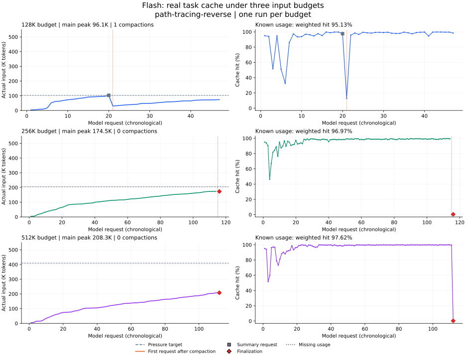

# Flash：128K / 256K / 512K 输入预算与真实任务缓存

日期：2026-09-14。任务为 Terminal-Bench `path-tracing-reverse`，每个输入预算各执行一次。
这是实际 AgentRunner 的整题测试；不使用合成填充、不重复请求预热，不强制任务继续执行。

**三档已知 usage 的全程缓存命中率分别为 95.13%、96.97%、97.62%。但实际输入峰值
只有 96K、175K、208K，没有覆盖实际输入达到 256K 或 512K 的情况。** 128K 组正常完成
并通过全部验收；另外两组分别达到时间和输出上限，均只通过 2/3 项。
结果只支持本轮配置与执行轨迹的描述，不能证明扩大预算带来稳定收益。

## 任务与控制变量

任务要求从 `/app/mystery` 可执行程序还原独立的 `/app/mystery.c`，源码压缩后小于 2K，
编译后的行为与原程序一致。最终执行任务自带的官方验收。选择依据是此前同题双路径
三场正常完成、83–151 步且经历多次压缩；历史轨迹仅用于选题，不作为本轮结果。

| 设置 | 三组共同条件 |
|---|---|
| 代码 | `0063506` 的运行时代码，同一份冻结 wheel；本次新增评测脚本不修改运行时 |
| 模型 | 请求 `deepseek-v4-flash`，实际响应模型另行记录 |
| 模型窗口 | 1,000,000 tokens |
| 输出额度 | 主请求 32,768；其他摘要行为由统一的现有策略决定 |
| 参数 | temperature=0，thinking=disabled |
| 压缩 | `a_fallback`，压力比例 0.8，低水位 40,000，近期历史目标 20,000 |
| 隔离 | 独立干净容器，同一任务文件、工具和 wheel；无 Skill、子 Agent、跨会话记忆 |
| 限额 | 每组最多 240 步、Worker 1,740 秒；官方 Agent 超时 1,800 秒 |
| 费用上限 | 每组按全部输入未命中的保守口径设 $20 上限；不是预计实际花费 |
| 顺序 | 运行前冻结随机顺序：128K → 512K → 256K；串行执行 |

唯一配置差异是 `context.max_input_tokens`。K 统一表示 1,000 tokens。

| 组别 | 输入硬上限 | 压力目标 |
|---|---:|---:|
| 128K | 128,000 | 102,400 |
| 256K | 256,000 | 204,800 |
| 512K | 512,000 | 409,600 |

模型窗口固定为 1M，避免旧的 131,072 窗口和输出预留把三档实际预算都限制在同一范围。
本地计数还有工程预留，实际 API 输入峰值不应与压力目标强行等同。

官方当前说明旧 `deepseek-v4-flash` 名称已路由到 V4.1 Flash。本次保留兼容名称，使
现有运行时继续使用其固定版本计数器；计数器只用于预算估算，实际长度和命中率以 API
usage 为准，并报告估算误差。模型版本变化使本轮不能与旧 Flash 实验直接作因果比较。
[官方模型与价格说明](https://api-docs.deepseek.com/quick_start/pricing/)

## 指标口径

每个实际请求读取 Provider 的 `raw_usage`，核验
`prompt_cache_hit_tokens + prompt_cache_miss_tokens == prompt_tokens`。

```text
全程加权命中率 = Σ prompt_cache_hit_tokens / Σ prompt_tokens
```

全程包括首次请求、主请求、摘要、带 usage 的失败尝试和收尾；首次请求不假设为冷缓存。摘要专属事件与累计
`model.usage` 不重复计数。另列主请求、摘要阶段、首请求、剔除首请求及实际输入长度分桶。
没有 usage 的请求不按零费用处理，重试与中断的未知费用保留为限制。

费用按本次核对的公开 Flash 价格从 usage 估算，不是账单。每百万 tokens 高峰时价格为
命中 $0.006、未命中 $0.30、输出 $1.20，非峰时为一半。统一峰时费用用于三组比较，
按事件时间折算的费用单列；跨计价边界的请求只能近似计价。
[价格来源](https://api-docs.deepseek.com/quick_start/pricing/)

## 结果

### 完整任务与缓存

| 输入预算 | 实际主输入峰值 | 全阶段命中率 | 主请求命中率 | 压缩发布 | 官方验收 | 完成步骤 | Agent 分钟 | 结束原因 |
|---|---:|---:|---:|---:|---:|---:|---:|---|
| 128K | 96,104 | **95.13%** | 95.03% | 1 | **3/3** | 46 | 8.20 | 正常完成 |
| 256K | 174,531 | **96.97%*** | 98.29%* | 0 | 2/3 | 114 | 29.27 | 1,740 秒时间上限 |
| 512K | 208,271 | **97.62%** | 99.09% | 0 | 2/3 | 111 | 18.70 | 主响应达到 32,768 输出上限 |

三组实际响应模型名均为 `deepseek-flash`，没有 Harbor 基础设施异常。256K 和 512K 的
源码存在、编译通过，但图像相似度测试失败，因此都不是整题通过。
后续 [失败复盘](context-length-flash-failures.md) 核对了最终文件、重复生成与工具终止等待，
区分直接结束原因和产物未通过的原因。

星号：256K 的第 115 次主请求在 10:37:51 UTC 已开始流式返回，但时间上限中断后没有
terminal usage；另有一条完整的收尾 usage。该组共 116 条请求审计记录、115 条完整 usage。
缓存率只使用已知 usage，不把缺失请求当成零输入；真实全程比例可能更高或更低。
128K 为 47/47，512K 为 112/112。已知输入和输出之和与三份 Agent 结果文件一致。



图中左列为实际输入，右列为单请求命中率；各组横轴是本组请求顺序，不表示相同任务状态。
灰色虚线为压力目标，橙线标注摘要发布后首请求，灰色方块是摘要请求，红色菱形是收尾。
256K 末端的点线表示缺少 usage 的请求，图中没有替它补造命中率。

### 缓存下降发生在哪里

**128K 的一次摘要发布改变了请求前缀。** 压缩前主请求输入 96,104，命中 95,872，
命中率 99.76%；摘要请求输入 102,978，命中率 97.57%。摘要发布后首个主请求输入
降到 30,303，但只命中 3,840，命中率降到 **12.67%**，未命中 26,463。其后任务继续
执行并完成。这个切换的具体数字直接来自相邻 API usage，不把全部未命中都称为可节省量。

**两组异常收尾带来了大额未命中。**

| 组别 | 收尾输入 | 命中 | 未命中 | 收尾命中率 | 占本组已知未命中的比例 |
|---|---:|---:|---:|---:|---:|
| 256K | 172,985 | 640 | 172,345 | **0.37%** | 44.29% |
| 512K | 208,008 | 640 | 207,368 | **0.31%** | 62.26% |

这与现有收尾路径的请求切换及此前 [tool_choice 实测](tool-choice-cache-probe.md)一致。
本轮没有做相同终止状态的 `auto/none` 对照，不能把全部差额精确归因于某一个字段。
但可以确认，只报告 98.29% / 99.09% 的主请求缓存率会漏掉实际收尾成本。

### 实际长度覆盖

只看主请求、按 API 输入长度分桶；每格为“完整 usage 请求数 / 加权命中率”。

| 实际输入区间 | 128K 配置 | 256K 配置 | 512K 配置 |
|---|---:|---:|---:|
| [0, 128K) | 46 / 95.03% | 68 / 97.31% | 52 / 97.53% |
| [128K, 256K) | 未覆盖 | 46 / 99.07% | 59 / 99.72% |
| [256K, 512K) | 未覆盖 | 未覆盖 | 未覆盖 |
| ≥512K | 未覆盖 | 未覆盖 | 未覆盖 |

本任务在当前 Flash 和运行限制下没有自然增长到 256K 以上。256K、512K 两组都未触发
各自压力目标，因此不能用这两场判定“实际 512K 比实际 256K 更容易命中”。128K 以上
已观测的正常执行阶段有较高复用；其比例也受新增内容规模、请求阶段和任务轨迹影响。

三组首请求均为输入 3,905、命中 3,712（95.06%），存在服务端已有缓存，不是严格冷启动。
剔除首请求后，三组主请求加权率仍分别为 95.03%、98.29%、99.09%；这一处理不消除
后续跨组缓存复用，也不消除模型生成轨迹差异。

### 用量与费用

| 预算 | 已知输入 | 缓存命中 | 缓存未命中 | 已知输出 | 统一峰时费用 | 按时段折算费用 |
|---|---:|---:|---:|---:|---:|---:|
| 128K | 2,745,588 | 2,611,840 | 133,748 | 75,673 | $0.146603 | $0.146603 |
| 256K | 12,846,381 | 12,457,216 | 389,165 | 67,783 | ≥$0.272832 | ≥$0.136416 |
| 512K | 13,979,530 | 13,646,464 | 333,066 | 123,460 | $0.329951 | $0.248213 |

合计 275 条请求记录，其中 274 条完整 usage：输入 29,571,499，命中 28,715,520，
未命中 855,979，输出 266,916。统一峰时已知费用合计 **≥$0.749386**，按事件时间
折算 **≥$0.531232**。两者均为 usage 估算，不是账单核对值。

本轮 512K 的命中比例高于 128K，但已知未命中、累计输入、费用和耗时也更高，且未通过任务。
因此不能从命中百分比单独得出预算优化结论，更不能从每档一次推导稳定的任务成功率。

### 256K 的工具终止等待

256K 在 10:16:52 UTC 请求 `terminate_process`，工具到 10:24:50 才返回，等待
**477.69 秒**。只读进程快照显示原启动进程组已退出，`timeout` 和 `geo` 仍在另一个
进程组中运行；到其自身 `timeout 600` 到期后，bot 恢复执行。现有
[`LocalExecutionTarget`](../../src/bot/execution/local.py) 终止已登记进程组、随后等待
输出读取完成的实现与此现象一致；本轮没有更改运行时或从外部终止该计算。

恢复后的首请求输入 115,900、命中 115,328，命中率 **99.51%**。这一个样本中，约八分钟
的等待没有造成明显缓存丢失；不能推广为固定 TTL 保证。等待影响了完成任务可用的时间，
所以 256K 的耗时差不能直接归因于上下文预算。

## 产物与验证

- [汇总、原始 usage 和来源哈希](../data/context-length-flash-cache-results.json)
- [逐请求 CSV](../data/context-length-flash-cache-requests.csv)
- [缓存与输入曲线 SVG](../data/context-length-flash-cache.svg)
- [可复用的任务入口](../../scripts/run_context_length_task.py)
- 本地完整产物：`artifacts/context-length-flash-20260914/`，包含冻结配置、任务哈希、
  wheel、原始事件、Agent/Harbor 结果、官方验收、图表和导出脚本。

验证了三份配置只在输入上限上不同，预算未被旧模型窗口截断，运行与分析阶段的冻结资产
哈希一致；275 条审计记录中缺失的一条未计入 token 分母。新增配置/报告测试及既有审计
测试共 **18 passed**，Ruff 检查通过，曲线已渲染并目视检查。

准备图表时，一次 `uv run` 意外重建了本地 `.venv`。已恢复原 Python 3.14.5，并重装项目
dev/web 依赖及 hatchling；此前的单个依赖版本未做快照，不能称为逐字节恢复。相关 18 项
检查重新通过。三组评测均使用已冻结 wheel、独立 Harbor 环境和容器，冻结文件核验通过；
此后绘图使用项目外的临时环境。详情及哈希保留在数据附件引用的本地环境记录中。

## 复现

```sh
.venv/bin/python scripts/run_context_length_task.py \
  --output artifacts/context-length-flash-new --task /path/to/path-tracing-reverse

caffeinate -i .venv/bin/python scripts/run_context_length_task.py \
  --output artifacts/context-length-flash-new --run

.venv/bin/python scripts/run_context_length_task.py \
  --output artifacts/context-length-flash-new --report
```

准备阶段冻结任务、三份配置、wheel、tokenizer 及其 SHA-256；运行和报告阶段检查这些文件。
报告保存在实验目录的 `report.json`。`STOP` 文件阻止尚未开始的组启动；不会杀死正在执行的组。

一个任务、每档一次，只能描述本轮观察，不能建立可靠排序或估计成功率。预算不是实际
上下文长度，未达到的长度区间必须明确标为未覆盖。随机生成轨迹、服务端跨组复用和
执行时段差异均可能影响结果。
