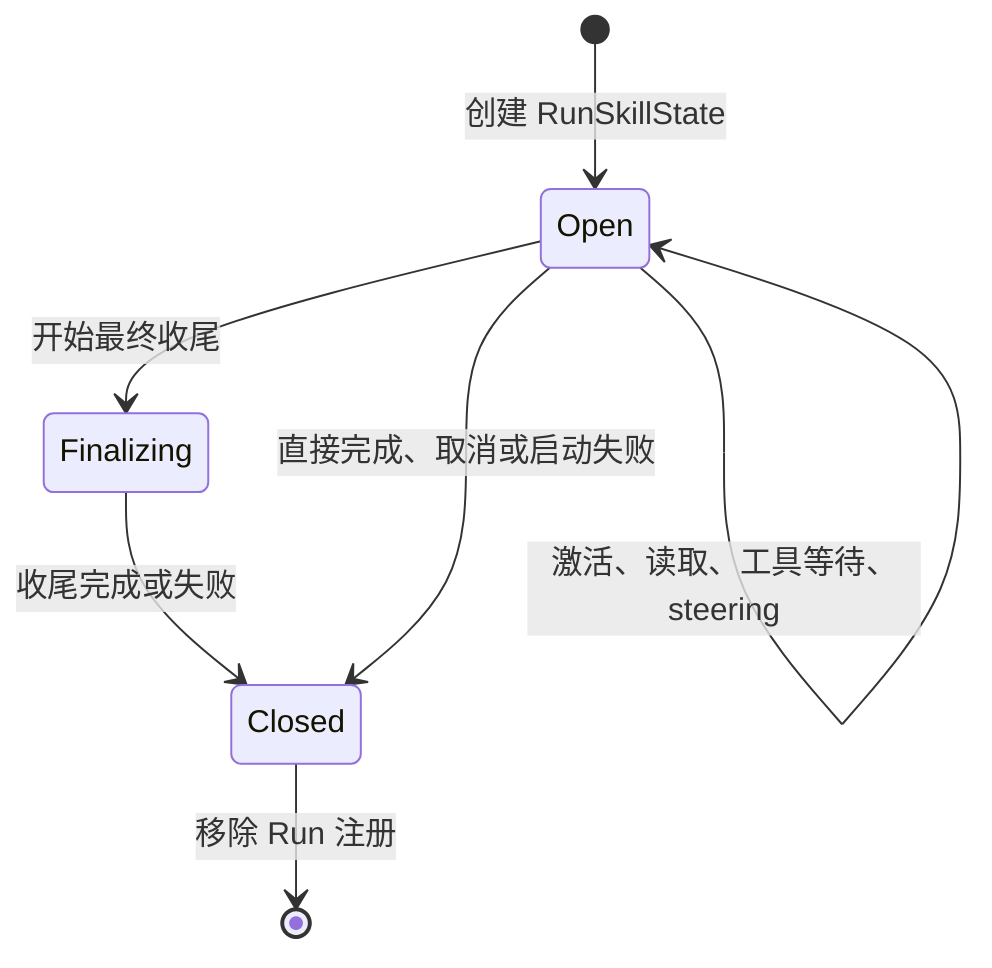

# Skill 按任务释放：生命周期设计方案

> 状态：设计提案，尚未实现。
>
> 日期：2026-09-08；核对基线：`3301148`。
>
> 目标：一次 Agent Run 结束后，释放该 Run 的 Skill 激活状态与自动注入正文；保留可审计、可回读的历史证据。本文中的新类型、接口、事件和验收项均为拟议内容。

## 1. 核心决策

采用 **Run 作用域的 Skill 状态 + 统一退出清理 + 历史请求视图减载**。

1. 第一版把“任务结束”定义为一次 `AgentRunner.run()` 的退出，不依赖模型自己判断 Skill 是否用完。
2. 自动激活和本次 `$skill-name` 显式指定都只对本 Run 生效；`explicit` 表示选择来源，不表示永久常驻。
3. 同一 Run 的多次模型调用、steering、工具等待、审批和最终收尾共用状态，不逐 step 释放。
4. 新 Run 从空激活集合开始，按本次显式选择或模型决策重新激活。
5. Skill Catalog 继续共享并提供能力发现；释放不删除目录、文件、Transcript 或 blob。
6. 清理只作用于当前 Run，不能清空另一个会话或子 Agent 的 Skill。
7. 自动注入的操作说明与历史工作证据分开处理，避免清空 active 后旧正文仍通过 Tool Result 反复进入请求。

不在第一版引入模型判断相关性、自动 TTL、逐轮 LRU 或跨 Run 隐式继承。需要多轮常驻时，后续可增加用户明确指定的 session pin；它必须是独立策略，不能由一次显式激活推导出来。

## 2. 当前问题与改动依据

| 当前实现 | 影响 | 设计调整 |
|---|---|---|
| `SkillManager.active` 是 Runtime 中的可变字典 | 正常 Run 结束仍保留；不同 session 共用 Runner 时也没有按 Run 隔离 | Catalog 与激活状态分离，每个 Run 一个状态对象 |
| `run()` 没有统一关闭 Skill 状态 | 完成、异常、取消等路径缺少释放动作 | 用覆盖启动和收尾的最外层 `finally` 清理 |
| 自动激活返回完整正文，同时 Active Skill 层再次注入 | 正文重复；释放 active 后历史副本仍存在 | 激活结果改为短收据与可回读引用 |
| `load_skill_resource` 是普通持久 Tool Result | 资源正文可能跨任务自动回放 | 当前 Run 内维持现有行为，跨 Run 请求视图降为来源收据 |
| `_finalize_termination()` 还会构造模型请求 | 太早释放会让收尾缺少方法和约束 | 收尾请求结束后再关闭 Run 状态 |
| 当前 idle 信号先于 `finish_run()` 完成 | 自动续跑可能在旧任务清理前开始 | 将释放和持久化尝试纳入同一准入保护周期，最后才发布 idle |
| CLI/Web 使用全局 `reset()` 和 `active` | 新会话操作可能影响同 Runtime 的其他执行 | 状态查询按 session/run；新会话不再全局清空 |

依据：[SkillManager](../src/bot/skills/catalog.py)、[AgentRunner](../src/bot/core/agent.py)、[Runtime](../src/bot/cli/runtime.py)、[CLI](../src/bot/cli/app.py)、[Web](../src/bot/web/server.py)。

## 3. “释放”的准确含义

释放包含三件事：关闭当前 Run 的激活集合，停止为该 Run 重建 Active Skill 上下文，撤销该 Run 继续执行 Skill 加载操作的资格。它不撤销工具本身的执行权限，也不销毁共享 Catalog 的内容缓存。

| 内容 | Run 结束后的处理 |
|---|---|
| Catalog 名称、说明和文件定位 | 保留，下一 Run 仍可发现 Skill |
| 本 Run 的 Active Skill header/body | 不继承到下一 Run |
| 本 Run 的激活状态和自动激活计数 | 关闭、从执行状态注册表移除 |
| 激活与资源读取轨迹 | 保留原始记录；模型请求采用有界收据 |
| 工具真实执行结果、用户指令、任务结论 | 保留，继续遵循通用历史预算与压缩规则 |
| Skill 正文与资源 blob | 保留现有 session 访问控制，可按需回读；容量与 GC 另立任务 |
| 权限、审批、TODO、后台进程与子 Agent | 沿用各自生命周期，不随 Skill 释放而清空 |

不能把“释放”描述为模型遗忘所有相关知识。用户消息、最终答案或摘要可能仍引用 Skill 内容；这里保证的是停止自动加载已结束 Run 的 Skill 上下文，且不把历史加载记录解释为本 Run 已激活。

## 4. 任务边界与状态机

### 4.1 结束条件

| 情况 | 是否释放 | 原因 |
|---|---|---|
| 工具调用结束、模型进入下一 step | 否 | 仍是同一个 Run |
| 同一 Run 收到 steering | 否 | 新要求仍在当前执行周期内处理 |
| 等待审批、受管进程或必需子任务 | 否 | 等待不是退出 |
| 正在生成正常最终答案或异常收尾摘要 | 否 | 收尾仍可能需要 Skill 上下文 |
| 返回 `completed` | 是 | 本次 Run 已退出；不代表独立业务验收已经通过 |
| 返回 `failed`、`cancelled`、`limit_reached`、`blocked` | 是 | 本次执行已结束；后续输入使用新 Run |
| 启动、事件发布、收尾或持久化抛异常 | 是 | 内存清理不能依赖成功路径 |
| 子 Agent 进入 `waiting_parent`，其内部 Run 已返回 | 释放子 Run | 上层 task 可继续，但本次执行已结束；续接时重新激活 |
| 父 Run 结束而后台子 Run 仍运行 | 只释放父 Run | 子任务拥有独立状态 |
| 进程强制退出 | 内存自然消失 | 不能保证执行 finally 或发布释放事件；重启不恢复 active |

跨多次用户输入的长期业务目标，当前并没有统一 task scope。第一版采用可确定的 Run 边界，代价是“继续上次任务”可能重新激活 Skill。后续若引入 task scope，应有明确 task ID 和完成契约，不能只根据 prompt 相似度合并生命周期。

### 4.2 状态转换



`Open` 可读写激活集合；`Finalizing` 只允许读取已有状态；`Closed` 禁止激活与资源加载。关闭幂等，重复清理不能影响其他 Run，也不能重复生成逻辑释放记录。

## 5. 数据结构与接口

### 5.1 Catalog 和运行状态分离

共享的 `SkillCatalog` 负责扫描、资格校验和定义。每个 Run 创建独立 `RunSkillState`：

```python
# 设计接口示意，不是已实现代码。
@dataclass
class RunSkillState:
    session_id: str
    run_id: str
    catalog_snapshot: SkillCatalogSnapshot
    status: Literal["open", "finalizing", "closed"]
    active: dict[str, ActiveSkillBinding]

    def activate(self, name, reason, *, explicit): ...
    def load_resource(self, name, path): ...
    def snapshot_active(self): ...
    def close(self, *, reason) -> SkillReleaseRecord | None: ...
```

`ActiveSkillBinding` 保存名称、显式/自动来源、Skill 正文 hash 和引用。自动激活数量上限在本 Run 内计算。重复激活保持幂等；显式再次选择已自动激活的 Skill 时，来源升级为 explicit，避免仍错误占用自动激活名额。

Catalog snapshot 固定本 Run 使用的名称、正文和定义版本。`/skills reload` 生成新代目录供后续 Run 使用，不原地修改已有 Run 的 snapshot。资源文件仍按读取时的内容返回并记录 hash，第一版不承诺整个资源目录已做不可变文件快照。

同一 Run 的 Catalog 摘要、激活查询与正文组装必须读取同一代 snapshot，不能只冻结正文、却让目录继续读取正在 reload 的全局对象。snapshot 的代际 ID 和来源 hash 保存在内部审计字段，不为追踪方便把随机标识加入模型稳定前缀。

### 5.2 显式传递 Run 状态

将状态作为参数传入 `_run_loop()`、`_active_skill_items()`、`_activate_skill()`、`_load_skill_resource()`、`_termination_context_items()` 和 `_finalize_termination()`。工具 schema 中是否提供资源读取能力，也由当前 Run 的状态决定。

不能在每次 `run()` 时给 `self.skills` 换一个新 Manager：同一 Runner 的其他 session 可能同时执行。也不能增加全局 `self.current_run` 来隐式寻址。

为 CLI/Web 观测可保留 `_run_skill_states[run_id]` 注册表，以及受准入锁保护的 session → active run 索引。执行路径使用已经持有的状态对象，注册表只负责定位与观测。

### 5.3 持久化范围

第一版不新增“持久活动 Skill”表。激活状态属于本次运行内存，历史使用和释放原因写事件，Skill 正文及资源继续使用现有 blob 存储。重启、fork、后台自动续跑均不从旧 `skill.activated` 事件重建 active。

子 Agent 每次 Run 仍可从自己的 `spec.explicit_skills` 激活，这是新 Run 的显式配置，不是继承父 Run 的活动状态。

## 6. 退出路径与异常安全

### 6.1 正常退出顺序

```text
取得 session Run 准入权
→ 注册本 Run 的 Skill 状态
→ start_run / run.started
→ 执行模型与工具循环
→ 正常最终答案，或异常收尾
→ 处理本 Run 必要的结束逻辑、尝试 finish_run
→ finally 同步关闭 Skill 状态
→ 有界尝试发布 skill.scope_released
→ 从注册表和 steering 表移除本 Run
→ 最后释放准入权并设置 idle
```

现有内部 `run.completed` 等事件可能早于最终清理，不将其当成可以开始下一 Run 的信号。后台续跑统一等待最后的 idle。`finally` 必须覆盖 `start_run()` 和 `run.started` 发布等启动动作，避免只保护 `_run_loop()`。

### 6.2 清理的保证

- `close()` 是同步、无外部 I/O、幂等的状态关闭动作，不能因事件 sink 故障而跳过。
- 收尾模型请求必须在 close 之前完成；收尾失败仍进入同一清理路径。
- 单次取消和清理期间再次取消都必须最终移除本 Run。日志发布可以有界等待，最后的注册表移除和 idle 发布另由嵌套 finally 兜底。
- `finish_run()` 失败时不伪报持久化成功；仍释放内存状态，向调用方反馈存储错误。未落库的运行状态由既有恢复机制处理。
- 释放事件失败不能让已经关闭的状态重新变成 active，也不能无限阻塞后续 Run。
- 观测事件的失败单独记录，不覆盖原有执行或存储异常；保持主失败原因可定位。
- 移除注册表项时比较对象或 run ID 所有权，旧 Run 的迟到清理不能删除后来注册的状态。

程序强制终止不具备事件恰好一次保证。观测端必须结合 Run 状态区分正常释放与进程中断，不能将缺少释放事件等同于仍在占用上下文。

## 7. 请求视图：真正停止正文的跨任务自动回放

仅做生命周期清理只能去掉 Active Skill 层，无法解决历史 Tool Result 中的全文副本。因此完整交付需要同时覆盖本节。

### 7.1 激活结果改成短收据

`activate_skill` 成功后生成正文 blob 引用，并返回有界收据，例如：

```json
{
  "status": "activated",
  "skill": "kunpeng-performance-analysis",
  "lifetime": "current_run",
  "body_delivery": "context_budgeted",
  "context_ref": "<session-authorized-body-reference>",
  "source_sha256": "<body-hash>"
}
```

正文主要通过 Active Skill 层提供；激活收据不再复制完整操作手册。重复激活返回同一版本的短收据，不追加第二个 binding。

这里必须保留恢复路径：正文可能被 16K Skill 子预算或全局 Planner 卸载，`activated` 不能被解释为“完整正文已进入请求”。header 和收据说明预算语义并给出 `context_ref`，模型通过已有 `load_context_reference` 的 query / range 回读；回读沿用一次性交付规则。

显式激活也生成同版本正文引用并用于 header，但不伪造一个模型未请求的 Tool Call。header 本身如果也未被选入，模型仍可从 Catalog 重新激活获得收据。

### 7.2 资源正文在 Run 内与跨 Run 的不同处理

第一版保留 `load_skill_resource` 在当前 Run 内的普通历史回放，避免同时改成一次性交付造成多步任务频繁重读。资源读取结果记录稳定来源、读取内容 hash、原始引用及生产 Run 信息。

加载另一 Run 的历史时，只对可验证来源的 Skill 加载结果做请求投影：

```text
旧 Assistant Tool Call：load_skill_resource(skill, path)
旧 Tool Result：大量资源正文

本次模型请求副本：
Assistant Tool Call：保持原调用与 tool_call_id
Tool Result：保持同一 tool_call_id，换为资源路径、摘要性元数据与原始 context_ref 收据
```

SQLite 消息和原 blob 不修改。真实分析工具的结果、用户输入、最终答案不受此规则影响。需要旧资源细节时回读原引用；回读只是查看证据，不自动把对应 Skill 标成 active。

用持久 `PositionedMessage.run_id` 和匹配的 Assistant Tool Call / Result 确定来源，再验证内部工具名和结果结构；不能相信正文里自报的 run ID 或 skill 名。未来读取 metadata 时同样要绑定真实生产记录，不能从任意外部 Tool Result 推导投影资格。

### 7.3 旧版本、压缩和恢复

- 对旧版 `activate_skill` 全文结果，能确认匹配的内部调用和原文引用时，仅在新请求副本中转换为收据；不重写历史数据库。
- 无法确认来源或无法保留有效引用的旧记录，维持通用历史策略并报告诊断，不猜测、删除或伪造回读位置。
- 主请求和 finalizer 使用同一投影器；压缩输入也使用一致的 Skill 加载结果视图，来源哈希仍针对原始持久消息计算。
- 现有摘要保留历史效力，不为本功能强制重建；后续摘要应保留工作结论和引用，避免复制整份手册。
- 无法保证旧摘要、用户引用或模型最终答案中完全不存在 Skill 原句；这不属于活动状态泄漏，也不是本功能可通过字符串清除解决的问题。
- fork 只继承既有历史及合法引用授权，不复制 active；新 Runtime 和恢复后的新 Run 同样从空集合开始。

## 8. 对缓存和成本的影响

```text
Run A 激活后：稳定区 → Catalog → Skill A → 记忆 → 历史 → 动态状态
Run A 后续步：稳定区 → Catalog → Skill A → 记忆 → 历史增长 → 动态状态
Run B 未激活：稳定区 → Catalog           → 记忆 → 历史收据 → 动态状态
```

同一 Run 内保持正文和排序稳定。跨 Run 去掉 Skill 会在其位置产生前缀差异，因此不承诺缓存命中率上升。连续相关任务重新激活，也可能新增模型往返。

预期收益是减少不相关后续任务中的自动正文注入和重复历史正文；是否降低总费用应计入缓存、激活、回读和压缩成本后实测。优先保持 Catalog 内容稳定，不在模型前缀加入时间戳或随机 run ID；这些追踪字段放在内部状态和事件中，模型只需看到 `current_run` 等稳定生命周期标记。

## 9. CLI、Web、子 Agent 与观测

| 入口 | 拟议行为 |
|---|---|
| CLI `$skill-name`、API `explicit_skills` | 只初始化本次 Run；不自动 pin |
| `/skills`、`/status` | 展示当前 session 的活动 Run Skill；空闲时 active 为空，历史使用可单列 |
| `/skills reload` | 扫描新代 Catalog，供后续 Run 使用；不清理其他 Run |
| CLI `/new`、Web `new_session` | 新会话从空状态开始，删除全局 `skills.reset()` 副作用 |
| Web 状态接口 | 接受明确 session ID 返回其 active run 信息；全局响应不再暴露一份混合激活列表 |
| 已有后台子任务 | 继续使用自己的 RunSkillState，父 Run 结束不影响它 |
| 子任务续接 | 按新子 Run 的 spec 显式配置或模型选择激活 |
| 父任务自动续跑 | 等待清理完成后的 idle，以新 Run 开始；不复制旧 active |

拟新增每个 scope 一条 `skill.scope_released` 事件，包含 session/run、释放原因、Skill 名称与版本、显式来源、清理是否完成。不记录完整正文，也不增加一条需要模型消费的 Tool Result。

运行中监控必须区分“active”与“本次请求实际选入正文”；只看 active 数量不能推断 token 占用。已有 `context.packed` 信息可补充每次实际进入模型的 Skill 层 token。

## 10. 分阶段实施

### 阶段 A：Run 状态隔离与统一清理

新增 RunSkillState 和 Catalog snapshot；替换所有 `self.skills.active` 的执行路径；让主循环、finalizer 和 Skill 工具显式接收状态。整理准入与 idle 顺序，覆盖启动失败、持久化失败、取消、异常收尾。同步适配 CLI/Web 和子 Agent。

完成标准：状态不跨 Run / session 泄漏，退出后为零，收尾和运行中等待不提前释放。此阶段仍不宣称历史正文已经减载。

### 阶段 B：激活收据与历史资源投影

激活返回短收据和正文引用；预算卸载通过引用恢复；已结束 Run 的 Skill 资源历史使用有界投影。接入主请求、finalizer、压缩、resume、fork 和旧数据兼容路径。

完成标准：新格式中不重复自动注入激活正文；下一 Run 不自动回放可识别的旧 Skill 加载全文；原文可回读且调用配对和 Transcript hash 不变。

### 阶段 C：评测、文档与启用

补充离线交互与故障矩阵，更新上下文说明和面试文档；再按固定预算开展真实模型成对回放。通过结构性和行为性门禁后启用。阶段 A、B 和离线验收共同构成第一版完整交付；真实模型效果不足时继续记录成本与质量风险，不虚报收益。

暂不提供 Runtime 全局 sticky 模式作为兼容开关。若必须回退，停止接收新 Run、等待或取消在途工作、回退代码并重建 Runtime；不迁移或恢复旧内存激活集合。旧消息格式继续可读，避免破坏性数据迁移。

## 11. 代码改动地图

| 文件 | 改动重点 |
|---|---|
| [skills/models.py](../src/bot/skills/models.py) | Run 状态、binding、释放记录及 snapshot 数据模型 |
| [skills/catalog.py](../src/bot/skills/catalog.py) | Catalog 与活动集合解耦，显式/自动计数、幂等激活、关闭校验 |
| [core/agent.py](../src/bot/core/agent.py) | 准入、Run 参数传递、工具 schema、Active Skill 组装、finalizer 和统一退出 |
| [core/context.py](../src/bot/core/context.py) | 保持排序不变量，集成历史 Skill 请求投影 |
| [compaction/service.py](../src/bot/compaction/service.py) | 摘要输入使用相同来源视图，原始哈希语义保持 |
| [sessions/store.py](../src/bot/sessions/store.py) | 必要的来源读取与引用授权查询；不改写既有 Transcript |
| [core/events.py](../src/bot/core/events.py) | scope 释放事件，区分状态占用与模型实际注入 |
| [cli/runtime.py](../src/bot/cli/runtime.py) | Catalog 代际更新、子 Run 构造、自动续跑结束边界 |
| [cli/app.py](../src/bot/cli/app.py)、[web/server.py](../src/bot/web/server.py) | 会话范围状态查询、新会话与 reload 行为 |
| [web/static/index.html](../src/bot/web/static/index.html) | 按所选 session 展示活动状态，避免结束后仍显示 active |
| [evals/context_full_stack_soak.py](../src/bot/evals/context_full_stack_soak.py) | 明确显式重新激活与历史恢复的区别 |

## 12. 验收矩阵

所有数字为拟议门禁，本文没有运行新实验，也没有预先填写收益百分比。

| 场景 | 必须观察到的结果 |
|---|---|
| 自动激活后完成 | 本 Run 使用正文；退出后状态关闭、active 注册为空 |
| 用户显式指定后完成 | 本 Run 首请求可加载；下一无关 Run 不继承 |
| 同 Run 多 step / steering / 审批等待 | Skill 不因步骤切换或暂时等待释放 |
| 超限或失败进入 finalizer | finalizer 能访问本 Run 已激活内容；结束后清理 |
| 启动事件失败、执行异常、收尾异常、finish_run 失败 | 当前 Run 状态都清理；数据库失败不伪报成功 |
| 取消，以及清理时再次取消 | 注册最终移除；其他 Run 不受影响 |
| 同 Runner 的两个不同 session 并行 | A 释放后 B 的状态、正文和资源加载继续有效 |
| 同 session 自动续跑竞争 | 新 Run 在旧 Run 完成清理及持久化尝试后取得准入；初始 active 为空 |
| 父 Run 完成但后台子 Run 未完成 | 仅父状态释放，子状态继续有效 |
| 重复激活、显式升级、重复 close | 不重复占名额；显式来源正确；逻辑释放记录最多一次 |
| 正文超 Skill 子预算或全局预算 | 收据可见时提供有效引用；回读可获得需要的内容；不虚称完整正文已注入 |
| 新任务直接读取未激活 Skill 资源 | `load_skill_resource` 拒绝；合法历史 blob 回读仍可用且不自动激活 |
| 资源跨 Run 投影与旧版激活结果 | Call / Result 配对完整；持久消息 hash 不变；原引用能恢复正文 |
| 无效或伪造来源 metadata | 不根据自报 scope 删除普通工具证据 |
| 压缩、resume、fork | 不恢复旧 active；事实和引用按各自规则保留 |
| reload 发生在另一 Run 执行期间 | 已有 Run 定义不被原地替换，新 Run 使用新代 Catalog |
| 不含 Skill 的任务 | 请求语义不变，不新增模型调用或动态前缀字段 |

复用和扩展 [Skill 单测](../tests/unit/test_skills.py)、[Agent 循环集成测试](../tests/integration/test_agent_loop.py)、[自动续跑测试](../tests/unit/test_agent_auto_resume.py)、[上下文全栈测试](../tests/integration/test_context_full_stack_soak.py)。并发测试用事件屏障控制交错，不用固定 sleep 猜测时序。

### 12.1 效果实验

对照旧 sticky 行为与新 Run 生命周期，固定模型、Catalog、工作负载、预算和初始会话。至少覆盖：A 使用 Skill 后 B 无关、A/B 都相关、同任务多步读取、正文超预算、异常后继续、后台子任务续跑。

先离线检验状态、请求形状、引用、协议和评分器，再对每类多个不同语义样本进行真实模型成对重复。不能把同一模板重复次数当成不同任务数量。

报告下列指标：

- 下一无关 Run 的 Active Skill 注入 token：应为 0，前提是本次未重新激活；Catalog token 单独统计。
- 来自旧 Skill 加载结果的自动正文回放：对可识别来源的新格式记录应为 0；旧格式降级数量单列。
- 跨 Run 状态泄漏、跨 session 误清理：确定性验收必须为 0。
- 每任务输入、总费用、模型请求数、重新激活次数、引用回读次数与端到端延迟。
- 最终任务质量、证据可见性和完成率，区分续接任务的重新加载代价。
- 缓存命中率与 miss 峰值作为辅助指标，不以命中率必须提高作为门禁。

验收结论必须同时说明正确性、实际减载和相关任务的额外往返；只有请求变短，仍不足以证明整个方案更好。

## 13. 面试表达

> 我会把 Skill 从运行时常驻状态改成 Run 范围的上下文资源。任务内保持稳定，工具等待、steering 和最终收尾不会提前释放；任务退出后用统一清理关闭状态，并隔离其他会话和子 Agent。同时把激活全文改为可恢复的短收据，处理历史副本，避免只清空 active 却仍然回放旧正文。代价是相关的后续任务可能需要重新激活，因此验收同时看状态隔离、证据可恢复、任务质量和总成本。
