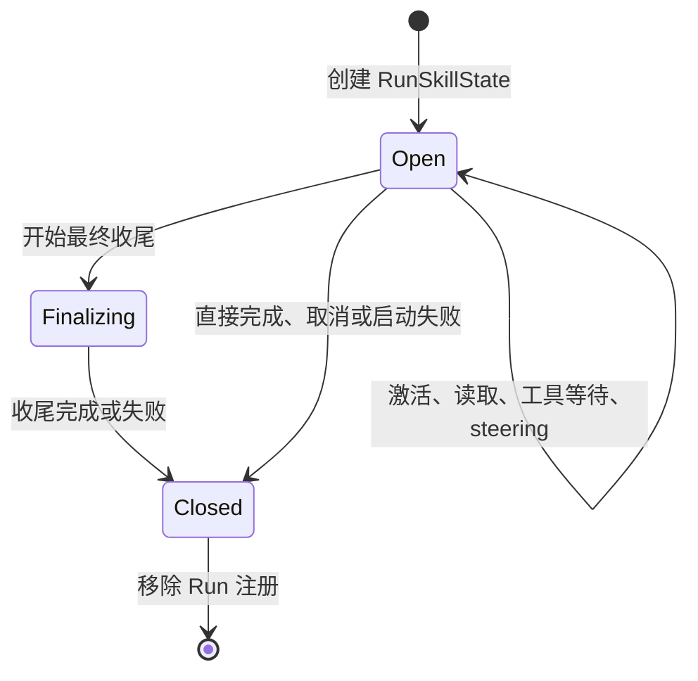

# Skill 上下文管理设计：Run 生命周期、按需交付、裁剪与恢复

> 状态：设计提案，尚未实现。
>
> 日期：2026-09-08；本轮仓库核对基线：`1615c78`；综合[开源框架与缓存调研](skill-unloading-cache-comparison.md)，收敛前面的生命周期、缓存与裁剪讨论。
>
> 目标：保留显式激活与 Run 状态，移除独立 Active Skill 全文层；正文在历史中稳定回放，压缩前按价值裁剪，压缩后在继续执行前验证并恢复必要正文。Run 结束关闭绑定，正文延迟批量卸载。本文中的新类型、接口、事件和验收项均为拟议内容，未修改运行代码，未产生新的实测收益。

## 1. 核心决策

采用 **Catalog + RunSkillState + 带来源的历史交付 + 统一裁剪与恢复**。需要保留的是“当前任务的必要指令可获得、可验证”，不需要用独立前置全文区实现这个保证。

1. 第一版把“任务结束”定义为一次 `AgentRunner.run()` 的退出，不依赖模型自己判断 Skill 是否用完。
2. 自动激活和本次 `$skill-name` 显式指定都只对本 Run 生效；`explicit` 表示选择来源，不表示永久常驻。
3. 同一 Run 的多次模型调用、steering、工具等待、审批和最终收尾共用状态，不逐 step 释放。
4. 新 Run 从空激活集合开始，按本次显式选择或模型决策重新激活。
5. Skill Catalog 继续共享并提供能力发现；释放不删除目录、文件、Transcript 或 blob。
6. 清理只作用于当前 Run，不能清空另一个会话或子 Agent 的 Skill。
7. 正文只在使用点交付一份，不再每步重建前置 Active Skill 全文层。任务结束关闭绑定，正文可作为历史暂留，不能解释为本 Run 已激活。
8. 在自然压缩或满足批量回收条件时移出失效正文，避免每结束一个 Run 就改写历史；硬预算或明确移出要求优先。
9. 在权限与配置允许范围内稳定 Skill 控制工具的 schema，资源读取是否可执行由当前 Run binding 校验，不由 active 集合增删 schema。
10. 执行模型请求前检查最终打包结果，不能以“文件存在”“已经激活”或“摘要提到了 Skill”代替完整可见性。
11. 第一版默认将活动 Skill 的整份正文视为执行依赖，受现有 16K token 聚合预算约束；不依赖模型猜测哪些规则可以丢掉。资源只保护明确登记的所需范围。
12. 先补齐普通 Tool Result 截断、来源识别、压缩恢复与预算失败路径，再移除 `_active_skill_items()`。不允许先删保护、再让模型自行补救。

不在第一版引入模型判断相关性、自动 TTL、逐轮 LRU 或跨 Run 隐式继承。需要多轮常驻时，后续可增加用户明确指定的 session pin；它必须是独立策略，不能由一次显式激活推导出来。

## 2. 当前问题与改动依据

| 当前实现 | 影响 | 设计调整 |
|---|---|---|
| `SkillManager.active` 是 Runtime 中的可变字典 | 正常 Run 结束仍保留；不同 session 共用 Runner 时也没有按 Run 隔离 | Catalog 与激活状态分离，每个 Run 一个状态对象 |
| `run()` 没有统一关闭 Skill 状态 | 完成、异常、取消等路径缺少释放动作 | 用覆盖启动和收尾的最外层 `finally` 清理 |
| 自动激活返回完整正文，同时 Active Skill 层再次注入 | 正文重复；前置层增删影响较长后缀的复用 | 正文在加载位置交付一份，带引用；移除前置全文路径 |
| Skill 工具结果仍经过通用 `_inline_reference()` | 默认约 4K token 的预览不能保证完整交付；不能直接删除现有全文层 | 增加内部交付类型，从原始 blob 构建有界、可验证的请求正文 |
| 历史用户判断主要依赖 `Role.USER` | 显式 Skill 合成消息移入历史后可能被误认作最新用户输入、压缩锚点或可信用户内容 | 由持久来源区分真实用户与合成上下文，统一修改相关判断 |
| Planner 按条目组预算选择；压缩器还会按字符缩短消息 | 提高优先级也不等于正文进入最终请求；摘要不能保证保留全部规则 | 增加依赖清单、最终可见性检查和有界恢复 |
| `load_skill_resource` 是普通持久 Tool Result | 资源正文可能长期占用窗口 | 关闭绑定后标记待回收，在压缩或批量条件下转为来源收据 |
| 资源工具仅在 active 非空时进入 schema | 状态变化也改变 tools 前缀 | 固定已启用的控制工具定义，执行端校验 Run 状态 |
| `_finalize_termination()` 还会构造模型请求 | 太早释放会让收尾缺少方法和约束 | 收尾请求结束后再关闭 Run 状态 |
| 当前 idle 信号先于 `finish_run()` 完成 | 自动续跑可能在旧任务清理前开始 | 将释放和持久化尝试纳入同一准入保护周期，最后才发布 idle |
| CLI/Web 使用全局 `reset()` 和 `active` | 新会话操作可能影响同 Runtime 的其他执行 | 状态查询按 session/run；新会话不再全局清空 |

依据：[SkillManager](../src/bot/skills/catalog.py)、[AgentRunner](../src/bot/core/agent.py)、[Runtime](../src/bot/cli/runtime.py)、[CLI](../src/bot/cli/app.py)、[Web](../src/bot/web/server.py)。

## 3. “释放”的准确含义

逻辑释放包含三件事：关闭当前 Run 的激活集合，停止继承本 Run 的活动绑定，撤销已关闭 scope 继续执行 Skill 加载操作的资格。物理卸载是后续把正文移出模型请求的动作，两者不强制发生在同一时刻。释放不撤销独立的业务工具权限，也不销毁共享 Catalog 的内容缓存。

| 内容 | Run 结束后的处理 |
|---|---|
| Catalog 名称、说明和文件定位 | 保留，下一 Run 仍可发现 Skill |
| 本 Run 的活动绑定和状态说明 | 不继承到下一 Run；不再维护前置全文层 |
| 本 Run 的激活状态和自动激活计数 | 关闭、从执行状态注册表移除 |
| 激活与资源读取轨迹 | 保留原始记录；历史正文先稳定驻留，物理卸载时改为有界收据 |
| 工具真实执行结果、用户指令、任务结论 | 保留，继续遵循通用历史预算与压缩规则 |
| Skill 正文与资源 blob | 保留现有 session 访问控制，可按需回读；容量与 GC 另立任务 |
| 权限、审批、TODO、后台进程与子 Agent | 沿用各自生命周期，不随 Skill 释放而清空 |

不能把“释放”描述为模型遗忘所有相关知识。延迟卸载期间正文仍对模型可见，提示词只能约束其适用性，不能保证它不会影响回答。这里的硬保证是状态与执行资格不跨 Run 继承。若要求下一任务完全不回放可识别的旧加载正文，必须立即投影或切换请求历史，并接受缓存重建；用户引用、最终答案和旧摘要中的相关语句仍按各自规则处理。

## 4. 任务边界与状态机

### 4.1 结束条件

| 情况 | 是否释放 | 原因 |
|---|---|---|
| 工具调用结束、模型进入下一 step | 否 | 仍是同一个 Run |
| 同一 Run 收到 steering | 否 | 新要求仍在当前执行周期内处理 |
| 等待审批、受管进程或必需子任务 | 否 | 等待不是退出 |
| 正在生成正常最终答案或异常收尾摘要 | 否 | 收尾仍可能需要 Skill 上下文 |
| 返回 `completed` | 是 | 本次 Run 已退出；不代表独立业务验收已经通过 |
| 返回 `failed`、`cancelled`、`limit_reached`、`blocked` | 是 | 本次执行已结束；后续输入使用新 Run |
| 启动、事件发布、收尾或持久化抛异常 | 是 | 内存清理不能依赖成功路径 |
| 子 Agent 进入 `waiting_parent`，其内部 Run 已返回 | 释放子 Run | 上层 task 可继续，但本次执行已结束；续接时重新激活 |
| 父 Run 结束而后台子 Run 仍运行 | 只释放父 Run | 子任务拥有独立状态 |
| 进程强制退出 | 内存自然消失 | 不能保证执行 finally 或发布释放事件；重启不恢复 active |

跨多次用户输入的长期业务目标，当前并没有统一 task scope。第一版采用可确定的 Run 边界，代价是“继续上次任务”可能重新激活 Skill。后续若引入 task scope，应有明确 task ID 和完成契约，不能只根据 prompt 相似度合并生命周期。

### 4.2 状态转换



`Open` 可读写激活集合；`Finalizing` 只允许读取已有状态；`Closed` 禁止激活与资源加载。关闭幂等，重复清理不能影响其他 Run，也不能重复生成逻辑释放记录。

## 5. 数据结构与接口

### 5.1 Catalog 和运行状态分离

共享的 `SkillCatalog` 负责扫描、资格校验和定义。每个 Run 创建独立 `RunSkillState`：

```python
# 设计接口示意，不是已实现代码。
@dataclass
class RunSkillState:
    session_id: str
    run_id: str
    catalog_snapshot: SkillCatalogSnapshot
    status: Literal["open", "finalizing", "closed"]
    active: dict[str, ActiveSkillBinding]

    def activate(self, name, reason, *, explicit): ...
    def load_resource(self, name, path): ...
    def snapshot_active(self): ...
    def close(self, *, reason) -> SkillReleaseRecord | None: ...
```

`ActiveSkillBinding` 保存名称、显式/自动来源、Skill 正文 hash、引用与所需交付 ID。自动激活数量上限在本 Run 内计算。重复激活保持幂等；显式再次选择已自动激活的 Skill 时，来源升级为 explicit，避免仍错误占用自动激活名额。

必须分开记录三个维度：`binding` 表示当前 Run 是否选择此 Skill；`residency` 表示已发布请求视图中是全文、部分内容还是收据；`visibility` 表示某次最终请求是否包含指定版本与范围。`ready` 是请求检查结果，不是激活一次后永久成立的字段。

Catalog snapshot 固定本 Run 使用的名称、正文和定义版本。`/skills reload` 生成新代目录供后续 Run 使用，不原地修改已有 Run 的 snapshot。资源文件仍按读取时的内容返回并记录 hash，第一版不承诺整个资源目录已做不可变文件快照。

同一 Run 的 Catalog 摘要、激活查询与正文组装必须读取同一代 snapshot，不能只冻结正文、却让目录继续读取正在 reload 的全局对象。snapshot 的代际 ID 和来源 hash 保存在内部审计字段，不为追踪方便把随机标识加入模型稳定前缀。

### 5.2 显式传递 Run 状态

将状态作为参数传入 `_run_loop()`、`_activate_skill()`、`_load_skill_resource()`、`_termination_context_items()` 和 `_finalize_termination()`；用加载消息和短尾部状态替代 `_active_skill_items()` 的前置全文路径。资源工具的 schema 由启用配置和权限决定；当前 Run 状态决定调用是否允许成功。

不能在每次 `run()` 时给 `self.skills` 换一个新 Manager：同一 Runner 的其他 session 可能同时执行。也不能增加全局 `self.current_run` 来隐式寻址。

为 CLI/Web 观测可保留 `_run_skill_states[run_id]` 注册表，以及受准入锁保护的 session → active run 索引。执行路径使用已经持有的状态对象，注册表只负责定位与观测。

### 5.3 持久化范围

第一版不新增“持久活动 Skill”表。激活状态属于本次运行内存，历史使用和释放原因写事件，Skill 正文及资源继续使用现有 blob 存储。重启、fork、后台自动续跑均不从旧 `skill.activated` 事件重建 active。

子 Agent 每次 Run 仍可从自己的 `spec.explicit_skills` 激活，这是新 Run 的显式配置，不是继承父 Run 的活动状态。

### 5.4 交付来源与请求投影

第一版增加两类持久记录，复用现有 `messages`、`context_blobs` 和 `context_compactions`，不再复制一套 Skill 文件存储：

| 拟议记录 | 最小字段与用途 |
|---|---|
| `context_deliveries` | session、生产 Run、消息 position、交付 ID、内部交付 kind、Skill 名称、版本 hash、blob 引用、交付范围、原始消息 hash；识别真实加载记录并按版本恢复 |
| `context_view_revisions` | session、父 revision、关联 compaction ID、覆盖范围、消息替换/恢复操作及来源摘要、发布状态；保存已生效的请求投影 |

消息与交付来源记录在同一事务追加。原文 blob 可先写入；失败留下的无引用 blob 交给存储 GC，不允许出现已提交消息找不到来源记录的半成品。视图发布通过 session 的活动 revision 指针与父 revision 校验，和 compaction 激活在同一事务完成。允许先保存候选，不允许只生效其中一半。

`context_deliveries.kind` 由内部工具处理器和显式加载路径生成，不能从外部工具返回的任意 metadata 直接导入。查询索引至少覆盖 `(session_id, position)` 和 `(session_id, skill_name, version_hash)`。`PositionedMessage` 的来源通过读取时关联或新增内部字段传递，不能靠解析正文自报身份。

现有持久工具消息本来就可能只有预览，完整结果在 blob 中。因此“保留原始证据”指已存消息保持不变，并保留其可验证原文 blob；不是假设 Transcript 一定包含全文。消息身份 hash 继续针对原始消息，投影另记录 blob hash、范围及策略版本，不能让投影收据替代原始证据身份。

## 6. 退出路径与异常安全

### 6.1 正常退出顺序

```text
取得 session Run 准入权
→ 注册本 Run 的 Skill 状态
→ start_run / run.started
→ 执行模型与工具循环
→ 正常最终答案，或异常收尾
→ 处理本 Run 必要的结束逻辑、尝试 finish_run
→ finally 同步关闭 Skill 状态
→ 有界尝试发布 skill.scope_released
→ 从注册表和 steering 表移除本 Run
→ 最后释放准入权并设置 idle
```

现有内部 `run.completed` 等事件可能早于最终清理，不将其当成可以开始下一 Run 的信号。后台续跑统一等待最后的 idle。`finally` 必须覆盖 `start_run()` 和 `run.started` 发布等启动动作，避免只保护 `_run_loop()`。

### 6.2 清理的保证

- `close()` 是同步、无外部 I/O、幂等的状态关闭动作，不能因事件 sink 故障而跳过。
- 收尾模型请求必须在 close 之前完成；收尾失败仍进入同一清理路径。
- 单次取消和清理期间再次取消都必须最终移除本 Run。日志发布可以有界等待，最后的注册表移除和 idle 发布另由嵌套 finally 兜底。
- `finish_run()` 失败时不伪报持久化成功；仍释放内存状态，向调用方反馈存储错误。未落库的运行状态由既有恢复机制处理。
- 释放事件失败不能让已经关闭的状态重新变成 active，也不能无限阻塞后续 Run。
- 观测事件的失败单独记录，不覆盖原有执行或存储异常；保持主失败原因可定位。
- 移除注册表项时比较对象或 run ID 所有权，旧 Run 的迟到清理不能删除后来注册的状态。

程序强制终止不具备事件恰好一次保证。观测端必须结合 Run 状态区分正常释放与进程中断，不能将缺少释放事件等同于仍在占用上下文。

## 7. 请求视图：加载位置交付与延迟卸载

正文统一进入历史交付路径；Run 状态只描述依赖，不另存一份每轮插在前面的全文。必须同时改造现有工具结果的预览通道，否则移除全文层会丢失当前已有的完整交付能力。

### 7.1 正文交付一次，随后作为历史稳定回放

自动 `activate_skill` 在对应 Tool Result 中交付正文、版本和合法引用；不再同时重建前面的 Active Skill 全文层。显式选择在本次真实用户输入之后追加带不可授权信封的 Skill 消息，不伪造模型未请求的 Tool Call。两条入口产生相同的内部 `skill_body` 交付类型。

交付分为原始证据、持久消息和模型视图三个表示：原文写入 blob；持久消息可保留有界收据；模型视图依据内部交付记录在该消息位置展开正文，并保持这个表示直到明确发布回收决定。Skill 正文不再直接经过普通 `_inline_reference()` 的 4K 预览，不采用 `DISPOSABLE` 的下一步自动到期语义。普通工具结果仍保留通用外置与预览能力。

“交付一次”指只向历史追加一份，不是下一次请求就删除正文。后续 step 沿用同一份已发布历史。活动绑定、正文是否驻留、正文是否完整进入本次请求分别记录；不能用 `activated` 代替后两者。

第一版按完整正文建立依赖，活动正文聚合仍受 `active_skill_tokens=16000` 和全局请求预算约束，不因移入历史而绕过预算。激活前若已知正文无法容纳，返回 `skill_context_budget_exceeded`、所需大小与合法引用，不提交新的成功 binding；不能只给头尾预览却声称完整激活。执行过程中预算变化导致正文缺失，进入第 9 节恢复流程。

后续可支持由 Skill 定义或显式调用指定的阶段/范围契约；第一版不让摘要模型猜测哪些正文规则已不重要。`load_skill_resource` 记录实际读取范围，保留原有范围与大小限制；被执行流程明确登记为下一步依赖的资源范围也参与可见性检查。普通资源和一次性历史证据读取仍遵循通用历史预算，不能把所有附件永久升级为必需正文。

依赖接口区分 `until=run_end` 与 `until=next_request`：活动正文使用前者；资源加载处理器为本次承诺交付的范围登记后者，首次取得有效执行模型响应后释放保护，内容继续作为历史存在。Provider 超限拒绝或发送失败不消耗这次保护。范围必须与实际交付一致，截断时显式记录未交付范围。资源预算计入近期历史与全局预算，不借正文的 16K 名额无限扩张；放不下承诺范围时返回有界读取结果或预算错误，不能伪报完整读取。跨多步资源依赖和正文阶段化作为后续明确契约扩展。

激活工具的返回记录选择是否成功、计划交付范围和引用；`ready_for_request` 由最终打包检查得出。二者分别观测，不在工具返回时虚构“模型已完整看见”。

同 Run 重复激活幂等，正文仍完整可见时返回短收据。新 Run 必须先创建新的 binding；若同版本正文仍在当前已发布视图中完整可见，可引用原加载位置而不追加第二份。仅有原始 Transcript 或 blob，不能算“正文仍可见”。版本变化、正文被裁剪或未完整交付时按需重新交付并记录来源。

复用还要检查最终 Planner 打包结果：投影中有条目、但本次未被选入，仍属于不可见。正文的驻留与回收按 session 投影管理；旧记录被新 Run 重新绑定后，应从普通回收候选中排除，不能只因其生产 Run 已结束就卸载当前仍在使用的正文。

显式加载和内部恢复消息依然是合成上下文。统一的来源判断必须接入最新用户选择、用户信任级别、压缩锚点、近期用户轮数统计和当前输入识别，不能只检查 `Role.USER`。信封继续使用 `can_authorize=false`；Skill 文本不能改变工具权限。

### 7.2 Run 结束关闭绑定，正文加入待回收集合

正常结束、失败与取消只改变 Run 状态及内部待回收索引，不逐条改写已经发给模型的历史正文。当前 active 信息用短尾部状态表达；固定 Core 规则说明历史加载记录不代表本轮激活，且不能授予权限。

在自然 compaction 时合并处理待回收 Skill；需要独立裁剪时，通过最小回收 token 门槛和裁剪后的增长门槛，避免每个 Run 都触发历史改写。配置值经评测后确定，不把固定回合数、时间 TTL 或模型猜测相关性作为首版默认条件。

硬预算无法容纳、用户明确要求移出正文或授权变化禁止继续保留时，立即执行相应处理。缓存优化不能覆盖这些条件。延迟驻留是否造成旧方法干扰，需要独立行为验收，不能仅靠状态测试证明没有干扰。

### 7.3 物理卸载的请求投影

物理回收时，对可验证来源的加载记录生成有界收据：

```text
原 Assistant Tool Call：load_skill_resource(skill, path)
原 Tool Result：大量资源正文

新投影：
Assistant Tool Call：保持原调用与 tool_call_id
Tool Result：保持同一 tool_call_id，换为路径、版本、正文已移出标记和 context_ref
```

激活正文同样处理；显式 Skill 合成消息按真实来源投影为相应的历史收据。只处理已结束 scope 或确需压力卸载的内容，正常情况下保护仍在使用的正文。模型应明确知道需要重新激活还是仅回读历史证据，不能把“已使用过 Skill”的摘要当作正文仍驻留。

SQLite 原始消息和 blob 不修改，工作结论与普通工具结果不按 Skill 规则删除。用持久 `PositionedMessage.run_id`、真实调用配对和内部生成记录验证来源；不能相信外部正文自报的 Skill 名或 metadata。

把批量改写间的稳定区间称为 `cache_epoch`，仅作内部投影与观测版本，不是 Provider 缓存对象。物理回收只在发布新投影时生效；epoch 内不能这一步裁掉、下一步又从原文自动恢复。发布时校验预算、调用配对、引用授权和来源哈希；失败保留旧版本，硬预算仍不满足时返回明确失败或进入既有受控降级。

主请求、finalizer 与压缩器读取同一已发布 revision。执行请求与摘要输入允许采用不同表示，但来源版本相同：摘要可以只读取 Skill 收据，执行请求必须满足正文依赖。摘要、正文收据、必要恢复消息与裁剪范围在新版本一起生效，避免摘要失败后只剩已经删短的原文。恢复和 fork 继承合法的投影决策及引用授权，不恢复 active。

### 7.4 旧数据与摘要

- 对旧版 `activate_skill` 全文结果，只在来源与引用可验证、且到达物理回收条件时转换为收据。
- 无法确认来源或无法保留合法引用的记录，维持通用历史策略并报告诊断，不猜测删除。
- 来源哈希继续针对原始持久消息计算，不以请求副本的收据替换原始身份。
- 后续摘要保留工作结论、来源和必要的重读标记，避免复制整份手册；无需为本功能立即重建全部旧摘要。
- 原始历史、旧摘要和用户引用仍可能包含 Skill 内容；这与 Run active 状态隔离是不同问题。

## 8. 压缩前的工具结果裁剪

### 8.1 谁触发，谁处理

`AgentRunner` 继续负责请求预算判断和溢出处理；新增确定性的 `ToolResultPruner` 生成裁剪候选；针对预算压力，现有 `ContextCompactor` 在裁剪仍不足时调用模型生成摘要。压缩模型沿用现有配置，不增加一个判断 Skill 是否结束的 Agent。

第一版将裁剪接入已有的预算压力与强制压缩路径：

```text
读取已发布视图与本 Run 依赖
→ 计入 tools、正文及协议开销，估算请求
→ 达到既有压缩条件：确定性裁剪候选
→ 已回到目标预算：保留仅裁剪候选，跳过 LLM 摘要
→ 仍超过目标预算：按候选视图生成摘要
→ 恢复仍在执行的 Skill 所需正文
→ 最终打包、依赖与协议验证
→ 原子发布候选，然后发出执行请求
```

模型明确要求压缩或进入强制恢复时，沿用该路径的目标与重试约束；“裁剪够用”只替代以释放预算为目的的摘要，不吞掉独立的显式摘要请求。未触发预算压力时不增加模型调用，也不在每次 Run 结束扫描并改写历史。

### 8.2 裁剪优先级

以下顺序指“先缩短谁”，独立于现有 Planner 的 620/680 等选择分数；提高某条目的分数不能替代裁剪策略。工具结果只处理已结束且可验证的调用，保持 Assistant Call 与所有结果的原子组；同一来源规则也用于可验证的显式 Skill 合成消息，不据此裁剪真实用户输入。

| 顺序 | 内容 | 处理与保留要求 |
|---|---|---|
| 1 | 重复的大结果 | 同类、同范围、同 hash 且确认内容相同，保留候选视图中仍可见的完整代表；其他副本转为引用收据 |
| 2 | 无活动绑定引用的旧 Skill 正文与资源 | 优先处理旧、体积大的记录；保留 Skill/路径、版本、范围和引用，不删除业务结论 |
| 3 | 近期保护区之外、已完成操作的大输出 | 按工具类型生成确定性收据：命令与退出码、文件路径与范围、查询与数量、产物与验证结果 |
| 4 | 近期普通输出、仍未解决的失败诊断及当前依赖证据 | 默认延后；压力仍高时先减掉重复段和大段附带数据，保留错误、关键定位及可恢复引用 |
| 5 | 活动 Skill 的必要正文与明确登记的资源范围 | 执行视图正常不裁掉；若被摘要覆盖，必须在下一次执行采样前恢复。不能仅凭重读提示继续执行 |

当前真实用户要求、Core 规则、必要状态清单不由 Tool Result Pruner 裁剪；未闭合工具调用不得删成悬空结果。第一版不裁剪 Tool Call arguments，避免破坏 JSON、意图记录与调用配对。失败诊断的保护不是永久保留所有失败原文，而是保留可用于继续定位的关键信息和原始引用。

同级先旧后新，再按预计可回收量排序。近期保护沿用现有近期历史窗口作为软保护，硬预算可以触发更深处理；活动正文是有聚合上限的依赖约束，不属于可无限增长的 PINNED 集合。

去重不能只凭工具名或相似文本；保留副本必须实际进入目标视图。若副本位于摘要覆盖范围之外，摘要输入保留必要结论与引用，不能生成指向摘要模型根本没看到的后文的空占位符。判断失败是否解决应使用匹配操作的后续验证结果；没有可靠证据时不自动降级为已解决。

### 8.3 统一策略，分别构造执行输入和摘要输入

Pruner 返回 `PrunePlan`，包含来源位置、原因、旧/新 token 估算、替换收据、引用和保护依赖；不直接改数据库。支持 `purpose=execution|summary`，复用来源识别、保护规则和工具收据模板。

执行视图必须保留本次执行依赖。摘要输入可以把完整 Skill 手册换成版本、引用、加载事件与待办说明，因为压缩后由 Runtime 从原文恢复所需规则。绑定清单由 Runtime 提供并校验，不要求摘要模型准确记住 Skill 状态，也不要求它重新转述整份手册。

现有压缩器的逐消息字符限制和极端降级仍需接入该策略：结构化收据的必需字段先做大小校验，不能再被通用头尾截断切坏；普通大文本可继续有界截取。若连必要收据或单个合法工具组都放不下，显式报告预算不足，不能默默丢掉引用。

第一版不额外启用低压力下的独立微裁剪。后续若启用，必须设置最小回收量和再次触发门槛；拟议规则为裁剪后上下文重新增长至少 `max(上次实际回收量, 最小回收量)` 才允许再次主动裁剪。阈值通过实验选择，不将时间 TTL、固定每 N 轮或 Run 结束作为默认触发器。

## 9. 压缩期间的保护与执行前恢复

### 9.1 保证的边界

需要保障的是：**继续按某 Skill 执行时，当前请求包含该版本所需的原始指令；无法满足时明确停止或报告限制。** 这不是保证模型一定遵守规则，也不表示该 Skill 的所有附件与历史输出都必须保留全文。

依赖清单最小包含 `skill_name`、版本 hash、正文引用、所需范围和绑定来源。内存清单负责执行判断，短尾部合成状态用于告诉模型哪些 Skill 当前有效、哪些内容需要恢复；不包含全文，不添加随机 Run ID 或时间戳。状态相同时序列化内容保持一致。

### 9.2 检查必须发生在最终打包之后

```text
加载/复用交付 → 构建候选视图 → Planner → Provider 请求适配
                                              ↓
                                检查实际将发送的版本、范围与预算
                                  ↙                         ↘
                                满足                       缺失
                              发出请求            本地恢复 → 重新打包 → 再检查
                                                            ↓
                                                  仍不满足：受控终止
```

可见性依据内部来源记录和最终消息内容验证，不能只依靠 `ContextItem.metadata` 自称完整。需要检查内容未被 `_inline_reference()`、`_externalize_message()`、`_aggressively_externalize()`、Planner 或请求适配器再次缩短，以及工具原子组是否进入本次请求。所有执行采样入口共用检查，包括首请求、普通下一步、溢出重试和 finalizer。

在 Planner 选择之前为有界依赖预留空间，选中时保持对应原子组；打包之后再校验。若正文单独能容纳、连同合法工具组却不能容纳，应进入压缩/恢复路径，不能拆坏工具协议来凑预算。`REHYDRATABLE` 只是可恢复标签，不能当成恢复已经发生。

### 9.3 从哪里恢复，放到哪里

1. 原始加载消息仍在当前视图且保持全文时，直接复用，不追加第二份。
2. 正文已转为收据，或原调用已被摘要覆盖时，按 binding 指向的版本从授权 blob 读取、校验 hash 和范围。
3. 在当前历史尾部追加一次带来源信封的恢复消息，作为新的历史交付点；之后稳定回放。已覆盖的旧 Tool Call 不重新拼接，也不伪造一次新的工具调用。
4. 若与压缩一起发生，恢复消息纳入待发布 revision，与摘要一起提交。下一步使用新位置，不反复把旧收据改回全文。

恢复首先走 Runtime 的本地读取，不消耗一次“提醒模型调用读取工具”的额外往返；不从 reload 后的新文件冒充旧版本。引用失效、hash 不匹配或访问被拒绝时明确失败，或由后续新激活选择新的合法版本。历史 blob 回读仍按 session 授权执行，本身不恢复 active，也不授予资源访问资格。

第一版整份活动正文是依赖，所以摘要可以省略手册细节，但摘要结束后必须重新交付整份所需正文。压缩器只负责任务状态摘要，Runtime 负责重建技能执行条件。

### 9.4 有界失败与 finalizer

正常请求准备最多做一次按完整缺失集合的本地恢复与打包。若检查失败或 Provider 报上下文超限，每个 Agent step 共享一次修复机会：必要时先强制压缩，再按新的完整缺失集合恢复、打包并复检。修复后仍失败就终止，不再从另一个异常入口重置计数。也就是每 step 最多两次执行请求准备，本地恢复最多一次/准备；修复前检查未通过时不得发出第一次执行请求。压缩器内部已有的格式修复重试仍按其配置计数，新机制不另起无上限摘要循环。

同一 revision、版本、缺失范围及预算组合恢复失败后，禁止在没有新输入、预算变化或有效进展时再次重复。仍放不下、引用不可用或正文超过聚合预算时，返回明确的原因码，结束本次执行；不能让模型在只看到“请重读 Skill”的情况下继续产生任务动作。

finalizer 当前不提供工具，因此也必须由 Runtime 内部恢复。若正常收尾请求仍无法满足依赖，只允许进入明确的失败报告路径：输出已验证进展、阻塞原因和恢复引用，不声称已经按缺失规则完成任务；连有界失败报告的上下文也放不下时使用确定性错误响应，不再调用模型。

## 10. 对缓存和成本的影响

推荐形状如下，省略其他不变层：

```text
加载前：稳定区 → 已发布历史 → user A
加载后：稳定区 → 已发布历史 → user A → Skill A 正文 → 工具执行历史
新 Run：稳定区 → 已发布历史 → user A → Skill A 正文 → 工具执行历史 → user B
                                                  （旧绑定关闭，正文待回收）
压缩后：稳定区 → 必需用户锚点 / 摘要与引用 → 保留的近期历史 → 必要的 Skill 恢复消息
```

Run 关闭本身不删中段历史；正常情况下也不因为 active 变空而撤掉资源工具 schema。Skill 名称、正文和定义版本稳定，随机 Run / epoch 标识只保存在内部审计，不加入稳定前缀。

短 Run 状态放在请求尾部，作为可变合成上下文，不在历史前面重建；状态刷新不逐次追加进持久历史。Skill 控制工具在启用时以固定顺序纳入控制工具集合，不因当前 active 数量被渐进选择器移出；权限或工具配置真正变化时仍允许更新。必须在最终序列化的请求上检查 schema 稳定性，不能只检查最初构造的列表。

物理删除或改写正文时，从最早变化处开始仍可能损失后缀缓存。批量回收减少重建次数；与必需 compaction 合并减少额外的改写边界。这里只优化 Skill 引入的扰动，Environment、Memory、压缩、渐进工具选择和 Provider 适配仍可能改变请求。

延迟卸载的代价是旧正文继续占窗口、按 Provider 规则计费，且可能干扰后续任务。立即卸载的代价则是前缀重建和相关任务重新读取。验收必须比较总费用、窗口压力、行为质量和重新加载成本，不能承诺命中率必然提高。详细源码对照与成本算例见[调研报告](skill-unloading-cache-comparison.md)。

本次沿用的默认预算是现有配置，不是新实验得到的最佳值：

| 配置 | 当前默认值 | 新方案中的含义 |
|---|---|---|
| `active_skill_tokens` | 16,000 tokens | 活动正文聚合上限，统一在历史交付中记账；失效正文另计历史占用 |
| `tool_result_inline_tokens` | 4,000 tokens | 普通工具预览预算；不能拿它当 Skill 已完整交付的证明 |
| `recent_conversation_tokens` | 20,000 tokens | 近期历史窗口和裁剪软保护依据，不赋予所有近期内容无限保留权 |
| `compaction_max_message_chars` | 12,000 字符 | 现有摘要输入逐消息上限；新策略保证必要收据完整，不能将字符数当 token 数 |

完整请求仍计入 tools、信封、工具组及全局安全预留。活动正文满足 16K 上限，不代表整个请求一定可发送。

第一版选择保守的完整正文依赖，因此运行中的 Skill 仍有每次请求的 token 成本；移除独立区域主要解决重复交付与插入位置，不会让必要指令免费。长 Run 先后使用多个 Skill 可能较早触及聚合上限，阶段化依赖和 Run 内显式提前释放留待后续设计，不能用静默裁掉旧活动正文绕过限制。

## 11. CLI、Web、子 Agent 与观测

| 入口 | 拟议行为 |
|---|---|
| CLI `$skill-name`、API `explicit_skills` | 只初始化本次 Run；不自动 pin |
| `/skills`、`/status` | 展示当前 session 的活动 Run Skill；空闲时 active 为空，历史使用可单列 |
| `/skills reload` | 扫描新代 Catalog，供后续 Run 使用；不清理其他 Run |
| CLI `/new`、Web `new_session` | 新会话从空状态开始，删除全局 `skills.reset()` 副作用 |
| Web 状态接口 | 接受明确 session ID 返回其 active run 信息；全局响应不再暴露一份混合激活列表 |
| 已有后台子任务 | 继续使用自己的 RunSkillState，父 Run 结束不影响它 |
| 子任务续接 | 按新子 Run 的 spec 显式配置或模型选择激活 |
| 父任务自动续跑 | 等待清理完成后的 idle，以新 Run 开始；不复制旧 active |

拟新增每个 scope 一条 `skill.scope_released` 事件，包含 session/run、释放原因、Skill 名称与版本、显式来源、清理是否完成。不记录完整正文，也不增加一条需要模型消费的 Tool Result。

运行中监控必须区分 active、inactive-resident 和 evicted；只看 active 数量不能推断 token 占用。已有 `context.packed` 信息应补充历史加载正文的来源与 token，而不只统计旧 Active Skill 层。物理回收事件单独记录最早改写位置、实际回收量、投影版本和触发原因。

拟补充 `context.pruned`、`skill.context_recovered`、`skill.context_blocked` 事件，分别记录候选/发布状态、裁剪分类、恢复版本、原因和 token 变化。`context.packed` 记录依赖检查是否通过、所需/实际范围与正文重复量。事件不写完整正文，不将内部 Run/revision 标识塞入稳定提示词。

## 12. 分阶段实施

### 阶段 A：状态隔离与来源基础

新增 RunSkillState 和 Catalog snapshot；替换所有 `self.skills.active` 的执行路径；让主循环、finalizer 和 Skill 工具显式接收状态。整理准入与 idle 顺序，覆盖启动失败、持久化失败、取消、异常收尾。同步适配 CLI/Web 和子 Agent，添加交付来源记录与真实用户识别。

完成标准：状态不跨 Run / session 泄漏，退出后为零，收尾和运行中等待不提前释放；合成消息不成为用户授权或压缩锚点。暂保留现有正文路径，不宣称历史正文已经减载。

### 阶段 B：完整交付、可见性与恢复闭环

实现 Skill 专用交付类型、历史视图、依赖预留、最终请求检查和本地恢复；接通压缩、激进外置、finalizer、resume/fork 和发布失败路径。用离线请求构造与影子检查验证，不把两份全文同时发送到真实请求，也不提前关闭旧路径。

完成标准：4K 预览不再被误当完整正文；摘要覆盖或打包遗漏后能恢复正确版本；恢复失败有界终止；发布与回滚没有半成品。该阶段通过后才允许删除独立 Active Skill 全文层。

### 阶段 C：切换历史正文与统一裁剪

切换成加载点单份正文，移除 `_active_skill_items()` 的全文路径，稳定 Skill 控制 schema；加入确定性 Pruner、优先级、待回收索引以及裁剪与摘要的原子发布。第一版只在已有压力/压缩路径减载，独立低压力微裁剪关闭。正常 Run 结束不改写正文；硬预算或明确移出要求按第 7 节处理。

完成标准：同版且完整可见时不重复追加；优先级可验证；绑定关闭与正文卸载分别观测；达到回收条件后正文确实不再回放；回读、协议和预算保证保持。

### 阶段 D：评测、文档与启用

补充离线交互与故障矩阵，更新上下文说明和面试文档；再按固定预算开展真实模型成对回放。阶段 A—C 和离线验收共同构成第一版完整交付；经过行为评测评估旧正文干扰、恢复可靠性与重读成本后再启用。真实模型效果不足时继续记录成本与质量风险，不虚报收益。阶段验收不能只靠状态测试替代最终请求和业务结果测试。

暂不提供 Runtime 全局 sticky 模式作为兼容开关。若必须回退，停止接收新 Run、等待或取消在途工作、回退代码并重建 Runtime；不迁移或恢复旧内存激活集合。旧消息格式继续可读，避免破坏性数据迁移。

## 13. 代码改动地图

| 文件 | 改动重点 |
|---|---|
| [skills/models.py](../src/bot/skills/models.py) | Run 状态、binding、释放记录及 snapshot 数据模型 |
| [skills/catalog.py](../src/bot/skills/catalog.py) | Catalog 与活动集合解耦，显式/自动计数、幂等激活、关闭校验 |
| [core/agent.py](../src/bot/core/agent.py) | 准入、Run 参数传递、稳定控制 schema、加载位置交付、finalizer 和统一退出 |
| [core/context.py](../src/bot/core/context.py) | 真实用户来源判断、依赖预算、历史投影、最终可见性与工具组验证 |
| 拟新增 `core/context_pruning.py` | 确定性 ToolResultPruner、分类优先级、收据模板与候选计划，不直接发布存储状态 |
| [compaction/service.py](../src/bot/compaction/service.py) | 统一摘要输入裁剪，与 Skill 恢复和回收协调发布；保留原始哈希语义 |
| [sessions/store.py](../src/bot/sessions/store.py) | 交付来源、revision、引用授权与事务发布；恢复/fork 不复活旧投影或 active |
| [config/models.py](../src/bot/config/models.py) | 复用既有预算；若以后启用独立微裁剪，再增加显式开关、回收与再触发门槛 |
| [core/events.py](../src/bot/core/events.py) | 分开记录 scope 释放、正文驻留和物理回收 |
| [cli/runtime.py](../src/bot/cli/runtime.py) | Catalog 代际更新、子 Run 构造、自动续跑结束边界 |
| [cli/app.py](../src/bot/cli/app.py)、[web/server.py](../src/bot/web/server.py) | 会话范围状态查询、新会话与 reload 行为 |
| [web/static/index.html](../src/bot/web/static/index.html) | 按所选 session 展示活动状态，避免结束后仍显示 active |
| [evals/context_full_stack_soak.py](../src/bot/evals/context_full_stack_soak.py) | 明确显式重新激活与历史恢复的区别 |

## 14. 验收矩阵

所有数字为拟议门禁，本文没有运行新实验，也没有预先填写收益百分比。

| 场景 | 必须观察到的结果 |
|---|---|
| 自动激活后完成 | 本 Run 使用正文；退出后状态关闭、active 注册为空 |
| 用户显式指定后完成 | 本 Run 首请求可加载；下一无关 Run 不继承激活绑定，旧正文按驻留策略处理 |
| 同 Run 多 step / steering / 审批等待 | Skill 不因步骤切换或暂时等待释放 |
| 超限或失败进入 finalizer | 正常收尾先满足所需正文；无法满足时只报告失败与已验证进展，不在缺少规则时声称完成 |
| 启动事件失败、执行异常、收尾异常、finish_run 失败 | 当前 Run 状态都清理；数据库失败不伪报成功 |
| 取消，以及清理时再次取消 | 注册最终移除；其他 Run 不受影响 |
| 同 Runner 的两个不同 session 并行 | A 释放后 B 的状态、正文和资源加载继续有效 |
| 同 session 自动续跑竞争 | 新 Run 在旧 Run 完成清理及持久化尝试后取得准入；初始 active 为空 |
| 父 Run 完成但后台子 Run 未完成 | 仅父状态释放，子状态继续有效 |
| 重复激活、显式升级、重复 close | 不重复占名额；显式来源正确；逻辑释放记录最多一次 |
| 首次正文超 Skill 子预算 | 返回明确预算失败及引用，不留下成功激活的新 binding，不虚称完整交付 |
| 活动正文被 Planner 丢弃、外置截短或压缩覆盖 | 下一执行请求前恢复正确版本并验证最终载荷；仍不足则有界失败 |
| 4K 预览之外、12K 字符之外和正文尾部存在必要规则 | 压缩前后任务执行均遵守可独立评分的规则；不能只测试摘要中包含 Skill 名称 |
| 连续溢出、缺失引用或版本 hash 不匹配 | 不无限重读/摘要；错误原因可定位，不用当前文件伪装旧版本 |
| 新任务直接读取未激活 Skill 资源 | `load_skill_resource` 拒绝；合法历史 blob 回读仍可用且不自动激活 |
| Run 结束但尚未物理回收 | active 为空；旧加载正文表示保持；不因关闭 binding 增删控制 schema |
| 同版本正文仍完整可见时重新激活 | 新 binding 正常建立；不重复追加正文；缺失或不同版本不能误判可复用 |
| 批量回收、压缩和旧版激活结果 | 只处理可验证来源；Call / Result 配对完整；持久 hash 不变；原引用能恢复正文 |
| 未达回收门槛、裁剪后尚未增长到再次触发量 | 不因新 Run 结束重复改写历史 |
| 硬预算或明确立即移出要求 | 按要求移出正文或受控失败；不为缓存推迟必须执行的卸载 |
| 投影发布失败、恢复与 fork | 没有部分生效；恢复已发布投影；不无意回放已经卸载的全文 |
| 无效或伪造来源 metadata | 不根据自报 scope 删除普通工具证据 |
| 显式加载与内部恢复使用合成 user 消息 | 不取代最新真实用户，不获得用户信任，不计入用户轮数或用户压缩锚点 |
| 重复大输出、旧失效 Skill、近期输出、未解决失败混合 | 确定性裁剪遵守分类与保护；保留代表实际可见，失败诊断与引用可用 |
| 摘要输入触发逐消息字符限制或极端降级 | 收据的版本、范围、引用仍完整；调用配对有效，必要字段不被二次截断 |
| 压缩、resume、fork | 不恢复旧 active；事实和引用按各自规则保留 |
| reload 发生在另一 Run 执行期间 | 已有 Run 定义不被原地替换，新 Run 使用新代 Catalog |
| 不含 Skill 的任务 | 不加入 Skill 正文或空状态噪声；不新增仅用于 Skill 管理的模型调用，普通历史仍遵循通用裁剪策略 |

复用和扩展 [Skill 单测](../tests/unit/test_skills.py)、[上下文打包测试](../tests/unit/test_context_management.py)、[压缩测试](../tests/unit/test_context_compaction.py)、[Agent 循环集成测试](../tests/integration/test_agent_loop.py)、[自动续跑测试](../tests/unit/test_agent_auto_resume.py)、[上下文全栈测试](../tests/integration/test_context_full_stack_soak.py)。并发测试用事件屏障控制交错，不用固定 sleep 猜测时序。

### 14.1 效果实验

设置三组主对照：当前实现；历史单份正文与恢复、关闭新增优先级裁剪；完整方案。这样分别观察正文布局与恢复的收益，以及优先级裁剪的增量效果。旧提案的立即卸载策略可作为补充对照，不作为必须先实现的产品模式。

固定模型、Catalog、工作负载、预算和初始会话。至少覆盖：A 使用 Skill 后 B 无关、A/B 都相关、同任务多步读取并连续压缩、多个 Skill 和大资源、正文超预算、异常后继续、后台子任务续跑。单列 schema 变化，隔离各变体预热与 TTL 差异。

先离线检验状态、请求形状、引用、协议和评分器，再对每类多个不同语义样本进行真实模型成对重复。不能把同一模板重复次数当成不同任务数量。

报告下列指标：

- 下一无关 Run 的旧活动绑定为 0；前置 Active Skill 全文副本为 0；Catalog token 单独统计。
- 旧正文仍驻留时单列 inactive-resident token，不谎报已经减载；物理卸载成功后，对应可识别记录的全文回放为 0，旧格式降级数量单列。
- 跨 Run 状态泄漏、跨 session 误清理：确定性验收必须为 0。
- 每任务输入、总费用、模型请求数、重新激活次数、引用回读次数与端到端延迟。
- 各类裁剪的实际回收 token、LLM 摘要次数与费用、恢复耗时、恢复失败和重试次数；执行原始载荷中的必要正文覆盖率。
- 最终任务质量、证据可见性、完成率和旧 Skill 干扰率，区分续接任务的重新加载代价。
- 缓存命中率、实际缓存读写费用、miss 峰值和最早请求差异位置；区分正常稳定期、卸载边界与恢复期，不以命中率必须提高作为门禁。

验收结论必须同时说明正确性、实际减载和相关任务的额外往返；只有请求变短，仍不足以证明整个方案更好。

已补充[历史会话裁剪容量回放](history-pruning-analysis.md)：量化普通工具结果裁剪的空间潜力，分别报告执行请求与摘要源；该实验不包含 Skill 激活样本，也不证明线上质量或费用收益。

### 14.2 第一版发布门槛

- 确定性用例中，跨 Run/session 绑定泄漏、错误授权、工具协议破坏、半发布投影和静默带缺失依赖继续执行均为 0。
- 被允许继续执行的请求，所需版本与范围的检查覆盖率为 100%；这是 Runtime 的结构性保证，不冒充模型任务成功率。
- 每个失败请求的恢复次数符合预算；启动失败、取消、收尾失败和存储失败均能关闭本 Run 状态。
- 真实领域评测必须使用独立任务验收器，例如补丁测试、生成物结构校验或可核对的事实/规则断言；模型自报完成不能充当成功标签。
- 真实质量与费用暂不设未经数据支持的“提升 X%”。预先声明允许的质量退化幅度和成本目标，成对评测后报告样本数、通过数、分布与不确定性；不得因缓存比例好看而忽略总输入增加或业务质量下降。

## 15. 面试表达

> 我会保留 Skill 的显式激活和 Run 状态，把正文从独立前置层收敛到历史中的单次交付。压缩前先按重复、过期和任务依赖裁剪工具结果；压缩后由 Runtime 恢复当前 Skill 的必要原文，并检查最终请求，不能只让摘要记住 Skill 名称。Run 结束立即关闭绑定，正文随压缩批量卸载，减少历史改写。验收同时看状态隔离、压缩后的规则执行、总费用和真实任务质量；这是一份待实现方案，不能作为已取得的优化成果。
