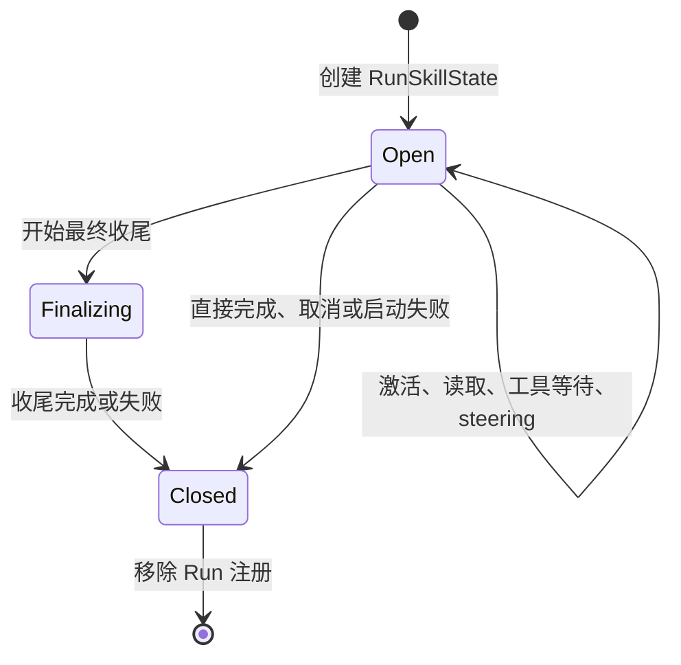

# Skill 按任务释放：生命周期设计方案

> 状态：设计提案，尚未实现。
>
> 日期：2026-09-08；运行代码核对基线：`3301148`；同日根据[开源框架与缓存调研](skill-unloading-cache-comparison.md)修订正文驻留策略。
>
> 目标：一次 Agent Run 结束后立即释放激活绑定；正文只在加载位置交付，随后按压缩或批量回收条件移出请求，保留可审计、可回读的历史证据。本文中的新类型、接口、事件和验收项均为拟议内容。

## 1. 核心决策

采用 **Run 作用域的 Skill 状态 + 统一退出清理 + 历史正文稳定驻留与批量减载**。

1. 第一版把“任务结束”定义为一次 `AgentRunner.run()` 的退出，不依赖模型自己判断 Skill 是否用完。
2. 自动激活和本次 `$skill-name` 显式指定都只对本 Run 生效；`explicit` 表示选择来源，不表示永久常驻。
3. 同一 Run 的多次模型调用、steering、工具等待、审批和最终收尾共用状态，不逐 step 释放。
4. 新 Run 从空激活集合开始，按本次显式选择或模型决策重新激活。
5. Skill Catalog 继续共享并提供能力发现；释放不删除目录、文件、Transcript 或 blob。
6. 清理只作用于当前 Run，不能清空另一个会话或子 Agent 的 Skill。
7. 正文只在使用点交付一份，不再每步重建前置 Active Skill 全文层。任务结束关闭绑定，正文可作为历史暂留，不能解释为本 Run 已激活。
8. 在自然压缩或满足批量回收条件时移出失效正文，避免每结束一个 Run 就改写历史；硬预算或明确移出要求优先。
9. 在权限与配置允许范围内稳定 Skill 控制工具的 schema，资源读取是否可执行由当前 Run binding 校验，不由 active 集合增删 schema。

不在第一版引入模型判断相关性、自动 TTL、逐轮 LRU 或跨 Run 隐式继承。需要多轮常驻时，后续可增加用户明确指定的 session pin；它必须是独立策略，不能由一次显式激活推导出来。

## 2. 当前问题与改动依据

| 当前实现 | 影响 | 设计调整 |
|---|---|---|
| `SkillManager.active` 是 Runtime 中的可变字典 | 正常 Run 结束仍保留；不同 session 共用 Runner 时也没有按 Run 隔离 | Catalog 与激活状态分离，每个 Run 一个状态对象 |
| `run()` 没有统一关闭 Skill 状态 | 完成、异常、取消等路径缺少释放动作 | 用覆盖启动和收尾的最外层 `finally` 清理 |
| 自动激活返回完整正文，同时 Active Skill 层再次注入 | 正文重复；前置层增删影响较长后缀的复用 | 正文在加载位置交付一份，带引用；移除前置全文路径 |
| `load_skill_resource` 是普通持久 Tool Result | 资源正文可能长期占用窗口 | 关闭绑定后标记待回收，在压缩或批量条件下转为来源收据 |
| 资源工具仅在 active 非空时进入 schema | 状态变化也改变 tools 前缀 | 固定已启用的控制工具定义，执行端校验 Run 状态 |
| `_finalize_termination()` 还会构造模型请求 | 太早释放会让收尾缺少方法和约束 | 收尾请求结束后再关闭 Run 状态 |
| 当前 idle 信号先于 `finish_run()` 完成 | 自动续跑可能在旧任务清理前开始 | 将释放和持久化尝试纳入同一准入保护周期，最后才发布 idle |
| CLI/Web 使用全局 `reset()` 和 `active` | 新会话操作可能影响同 Runtime 的其他执行 | 状态查询按 session/run；新会话不再全局清空 |

依据：[SkillManager](../src/bot/skills/catalog.py)、[AgentRunner](../src/bot/core/agent.py)、[Runtime](../src/bot/cli/runtime.py)、[CLI](../src/bot/cli/app.py)、[Web](../src/bot/web/server.py)。

## 3. “释放”的准确含义

逻辑释放包含三件事：关闭当前 Run 的激活集合，停止继承本 Run 的活动绑定，撤销已关闭 scope 继续执行 Skill 加载操作的资格。物理卸载是后续把正文移出模型请求的动作，两者不强制发生在同一时刻。释放不撤销独立的业务工具权限，也不销毁共享 Catalog 的内容缓存。

| 内容 | Run 结束后的处理 |
|---|---|
| Catalog 名称、说明和文件定位 | 保留，下一 Run 仍可发现 Skill |
| 本 Run 的活动绑定和状态说明 | 不继承到下一 Run；不再维护前置全文层 |
| 本 Run 的激活状态和自动激活计数 | 关闭、从执行状态注册表移除 |
| 激活与资源读取轨迹 | 保留原始记录；历史正文先稳定驻留，物理卸载时改为有界收据 |
| 工具真实执行结果、用户指令、任务结论 | 保留，继续遵循通用历史预算与压缩规则 |
| Skill 正文与资源 blob | 保留现有 session 访问控制，可按需回读；容量与 GC 另立任务 |
| 权限、审批、TODO、后台进程与子 Agent | 沿用各自生命周期，不随 Skill 释放而清空 |

不能把“释放”描述为模型遗忘所有相关知识。延迟卸载期间正文仍对模型可见，提示词只能约束其适用性，不能保证它不会影响回答。这里的硬保证是状态与执行资格不跨 Run 继承。若要求下一任务完全不回放可识别的旧加载正文，必须立即投影或切换请求历史，并接受缓存重建；用户引用、最终答案和旧摘要中的相关语句仍按各自规则处理。

## 4. 任务边界与状态机

### 4.1 结束条件

| 情况 | 是否释放 | 原因 |
|---|---|---|
| 工具调用结束、模型进入下一 step | 否 | 仍是同一个 Run |
| 同一 Run 收到 steering | 否 | 新要求仍在当前执行周期内处理 |
| 等待审批、受管进程或必需子任务 | 否 | 等待不是退出 |
| 正在生成正常最终答案或异常收尾摘要 | 否 | 收尾仍可能需要 Skill 上下文 |
| 返回 `completed` | 是 | 本次 Run 已退出；不代表独立业务验收已经通过 |
| 返回 `failed`、`cancelled`、`limit_reached`、`blocked` | 是 | 本次执行已结束；后续输入使用新 Run |
| 启动、事件发布、收尾或持久化抛异常 | 是 | 内存清理不能依赖成功路径 |
| 子 Agent 进入 `waiting_parent`，其内部 Run 已返回 | 释放子 Run | 上层 task 可继续，但本次执行已结束；续接时重新激活 |
| 父 Run 结束而后台子 Run 仍运行 | 只释放父 Run | 子任务拥有独立状态 |
| 进程强制退出 | 内存自然消失 | 不能保证执行 finally 或发布释放事件；重启不恢复 active |

跨多次用户输入的长期业务目标，当前并没有统一 task scope。第一版采用可确定的 Run 边界，代价是“继续上次任务”可能重新激活 Skill。后续若引入 task scope，应有明确 task ID 和完成契约，不能只根据 prompt 相似度合并生命周期。

### 4.2 状态转换



`Open` 可读写激活集合；`Finalizing` 只允许读取已有状态；`Closed` 禁止激活与资源加载。关闭幂等，重复清理不能影响其他 Run，也不能重复生成逻辑释放记录。

## 5. 数据结构与接口

### 5.1 Catalog 和运行状态分离

共享的 `SkillCatalog` 负责扫描、资格校验和定义。每个 Run 创建独立 `RunSkillState`：

```python
# 设计接口示意，不是已实现代码。
@dataclass
class RunSkillState:
    session_id: str
    run_id: str
    catalog_snapshot: SkillCatalogSnapshot
    status: Literal["open", "finalizing", "closed"]
    active: dict[str, ActiveSkillBinding]

    def activate(self, name, reason, *, explicit): ...
    def load_resource(self, name, path): ...
    def snapshot_active(self): ...
    def close(self, *, reason) -> SkillReleaseRecord | None: ...
```

`ActiveSkillBinding` 保存名称、显式/自动来源、Skill 正文 hash 和引用。自动激活数量上限在本 Run 内计算。重复激活保持幂等；显式再次选择已自动激活的 Skill 时，来源升级为 explicit，避免仍错误占用自动激活名额。

Catalog snapshot 固定本 Run 使用的名称、正文和定义版本。`/skills reload` 生成新代目录供后续 Run 使用，不原地修改已有 Run 的 snapshot。资源文件仍按读取时的内容返回并记录 hash，第一版不承诺整个资源目录已做不可变文件快照。

同一 Run 的 Catalog 摘要、激活查询与正文组装必须读取同一代 snapshot，不能只冻结正文、却让目录继续读取正在 reload 的全局对象。snapshot 的代际 ID 和来源 hash 保存在内部审计字段，不为追踪方便把随机标识加入模型稳定前缀。

### 5.2 显式传递 Run 状态

将状态作为参数传入 `_run_loop()`、`_activate_skill()`、`_load_skill_resource()`、`_termination_context_items()` 和 `_finalize_termination()`；用加载消息和短尾部状态替代 `_active_skill_items()` 的前置全文路径。资源工具的 schema 由启用配置和权限决定；当前 Run 状态决定调用是否允许成功。

不能在每次 `run()` 时给 `self.skills` 换一个新 Manager：同一 Runner 的其他 session 可能同时执行。也不能增加全局 `self.current_run` 来隐式寻址。

为 CLI/Web 观测可保留 `_run_skill_states[run_id]` 注册表，以及受准入锁保护的 session → active run 索引。执行路径使用已经持有的状态对象，注册表只负责定位与观测。

### 5.3 持久化范围

第一版不新增“持久活动 Skill”表。激活状态属于本次运行内存，历史使用和释放原因写事件，Skill 正文及资源继续使用现有 blob 存储。重启、fork、后台自动续跑均不从旧 `skill.activated` 事件重建 active。

子 Agent 每次 Run 仍可从自己的 `spec.explicit_skills` 激活，这是新 Run 的显式配置，不是继承父 Run 的活动状态。

## 6. 退出路径与异常安全

### 6.1 正常退出顺序

```text
取得 session Run 准入权
→ 注册本 Run 的 Skill 状态
→ start_run / run.started
→ 执行模型与工具循环
→ 正常最终答案，或异常收尾
→ 处理本 Run 必要的结束逻辑、尝试 finish_run
→ finally 同步关闭 Skill 状态
→ 有界尝试发布 skill.scope_released
→ 从注册表和 steering 表移除本 Run
→ 最后释放准入权并设置 idle
```

现有内部 `run.completed` 等事件可能早于最终清理，不将其当成可以开始下一 Run 的信号。后台续跑统一等待最后的 idle。`finally` 必须覆盖 `start_run()` 和 `run.started` 发布等启动动作，避免只保护 `_run_loop()`。

### 6.2 清理的保证

- `close()` 是同步、无外部 I/O、幂等的状态关闭动作，不能因事件 sink 故障而跳过。
- 收尾模型请求必须在 close 之前完成；收尾失败仍进入同一清理路径。
- 单次取消和清理期间再次取消都必须最终移除本 Run。日志发布可以有界等待，最后的注册表移除和 idle 发布另由嵌套 finally 兜底。
- `finish_run()` 失败时不伪报持久化成功；仍释放内存状态，向调用方反馈存储错误。未落库的运行状态由既有恢复机制处理。
- 释放事件失败不能让已经关闭的状态重新变成 active，也不能无限阻塞后续 Run。
- 观测事件的失败单独记录，不覆盖原有执行或存储异常；保持主失败原因可定位。
- 移除注册表项时比较对象或 run ID 所有权，旧 Run 的迟到清理不能删除后来注册的状态。

程序强制终止不具备事件恰好一次保证。观测端必须结合 Run 状态区分正常释放与进程中断，不能将缺少释放事件等同于仍在占用上下文。

## 7. 请求视图：加载位置交付与延迟卸载

本节修订原先“激活只返回短收据、前置层继续放正文、新 Run 立即改写旧资源”的方案。该方案虽能减小重复量，但正文撤下的位置过早，且跨 Run 历史改写仍会损失前缀复用。

### 7.1 正文交付一次，随后作为历史稳定回放

自动 `activate_skill` 在对应 Tool Result 中交付预算允许的正文、版本和合法引用；不再同时重建前面的 Active Skill 全文层。显式选择在本次用户输入之后追加带不可授权信封的 Skill 消息，不伪造模型未请求的 Tool Call。

“交付一次”指只向历史追加一份，不是下一次请求就删除正文。后续 step 沿用同一份已发布历史。活动绑定、正文是否驻留、正文是否完整进入本次请求分别记录；不能用 `activated` 代替后两者。

正文仍受 Skill 子预算和全局预算约束。首次未完整交付时给出明确的 `body_delivery`、已交付范围和 `context_ref`，允许按 query / range 回读；回读使用现有一次性交付语义，但不把正常驻留的整份 Skill 也改成一步即卸载。实现时需为位于历史中的 Skill 内容保留来源标记和预算归属，不能挪了位置就绕开 16K 子预算。

同 Run 重复激活幂等，正文仍完整可见时返回短收据。新 Run 必须先创建新的 binding；若同版本正文仍在当前已发布视图中完整可见，可引用原加载位置而不追加第二份。仅有原始 Transcript 或 blob，不能算“正文仍可见”。版本变化、正文被裁剪或未完整交付时按需重新交付并记录来源。

复用还要检查最终 Planner 打包结果：投影中有条目、但本次未被选入，仍属于不可见。正文的驻留与回收按 session 投影管理；旧记录被新 Run 重新绑定后，应从普通回收候选中排除，不能只因其生产 Run 已结束就卸载当前仍在使用的正文。

### 7.2 Run 结束关闭绑定，正文加入待回收集合

正常结束、失败与取消只改变 Run 状态及内部待回收索引，不逐条改写已经发给模型的历史正文。当前 active 信息用短尾部状态表达；固定 Core 规则说明历史加载记录不代表本轮激活，且不能授予权限。

在自然 compaction 时合并处理待回收 Skill；需要独立裁剪时，通过最小回收 token 门槛和裁剪后的增长门槛，避免每个 Run 都触发历史改写。配置值经评测后确定，不把固定回合数、时间 TTL 或模型猜测相关性作为首版默认条件。

硬预算无法容纳、用户明确要求移出正文或授权变化禁止继续保留时，立即执行相应处理。缓存优化不能覆盖这些条件。延迟驻留是否造成旧方法干扰，需要独立行为验收，不能仅靠状态测试证明没有干扰。

### 7.3 物理卸载的请求投影

物理回收时，对可验证来源的加载记录生成有界收据：

```text
原 Assistant Tool Call：load_skill_resource(skill, path)
原 Tool Result：大量资源正文

新投影：
Assistant Tool Call：保持原调用与 tool_call_id
Tool Result：保持同一 tool_call_id，换为路径、版本、正文已移出标记和 context_ref
```

激活正文同样处理；显式 Skill 合成消息按真实来源投影为相应的历史收据。只处理已结束 scope 或确需压力卸载的内容，正常情况下保护仍在使用的正文。模型应明确知道需要重新激活还是仅回读历史证据，不能把“已使用过 Skill”的摘要当作正文仍驻留。

SQLite 原始消息和 blob 不修改，工作结论与普通工具结果不按 Skill 规则删除。用持久 `PositionedMessage.run_id`、真实调用配对和内部生成记录验证来源；不能相信外部正文自报的 Skill 名或 metadata。

把批量改写间的稳定区间称为 `cache_epoch`，仅作内部投影与观测版本，不是 Provider 缓存对象。物理回收只在发布新投影时生效；epoch 内不能这一步裁掉、下一步又从原文自动恢复。发布时校验预算、调用配对、引用授权和来源哈希；失败保留旧版本，硬预算仍不满足时返回明确失败或进入既有受控降级。

主请求、finalizer 与压缩输入使用同一已发布视图。压缩输入在旧视图上生成候选摘要，摘要、正文收据与裁剪范围在新版本一起生效，避免摘要失败后只剩已经删短的原文。恢复和 fork 继承合法的投影决策及引用授权，不恢复 active。

### 7.4 旧数据与摘要

- 对旧版 `activate_skill` 全文结果，只在来源与引用可验证、且到达物理回收条件时转换为收据。
- 无法确认来源或无法保留合法引用的记录，维持通用历史策略并报告诊断，不猜测删除。
- 来源哈希继续针对原始持久消息计算，不以请求副本的收据替换原始身份。
- 后续摘要保留工作结论、来源和必要的重读标记，避免复制整份手册；无需为本功能立即重建全部旧摘要。
- 原始历史、旧摘要和用户引用仍可能包含 Skill 内容；这与 Run active 状态隔离是不同问题。

## 8. 对缓存和成本的影响

推荐形状如下，省略其他不变层：

```text
加载前：稳定区 → 已发布历史 → user A
加载后：稳定区 → 已发布历史 → user A → Skill A 正文 → 工具执行历史
新 Run：稳定区 → 已发布历史 → user A → Skill A 正文 → 工具执行历史 → user B
                                                  （旧绑定关闭，正文待回收）
压缩后：稳定区 → 必需用户锚点 / 摘要与引用 → 保留的近期历史
```

Run 关闭本身不删中段历史；正常情况下也不因为 active 变空而撤掉资源工具 schema。Skill 名称、正文和定义版本稳定，随机 Run / epoch 标识只保存在内部审计，不加入稳定前缀。

物理删除或改写正文时，从最早变化处开始仍可能损失后缀缓存。批量回收减少重建次数；与必需 compaction 合并减少额外的改写边界。这里只优化 Skill 引入的扰动，Environment、Memory、压缩、渐进工具选择和 Provider 适配仍可能改变请求。

延迟卸载的代价是旧正文继续占窗口、按 Provider 规则计费，且可能干扰后续任务。立即卸载的代价则是前缀重建和相关任务重新读取。验收必须比较总费用、窗口压力、行为质量和重新加载成本，不能承诺命中率必然提高。详细源码对照与成本算例见[调研报告](skill-unloading-cache-comparison.md)。

## 9. CLI、Web、子 Agent 与观测

| 入口 | 拟议行为 |
|---|---|
| CLI `$skill-name`、API `explicit_skills` | 只初始化本次 Run；不自动 pin |
| `/skills`、`/status` | 展示当前 session 的活动 Run Skill；空闲时 active 为空，历史使用可单列 |
| `/skills reload` | 扫描新代 Catalog，供后续 Run 使用；不清理其他 Run |
| CLI `/new`、Web `new_session` | 新会话从空状态开始，删除全局 `skills.reset()` 副作用 |
| Web 状态接口 | 接受明确 session ID 返回其 active run 信息；全局响应不再暴露一份混合激活列表 |
| 已有后台子任务 | 继续使用自己的 RunSkillState，父 Run 结束不影响它 |
| 子任务续接 | 按新子 Run 的 spec 显式配置或模型选择激活 |
| 父任务自动续跑 | 等待清理完成后的 idle，以新 Run 开始；不复制旧 active |

拟新增每个 scope 一条 `skill.scope_released` 事件，包含 session/run、释放原因、Skill 名称与版本、显式来源、清理是否完成。不记录完整正文，也不增加一条需要模型消费的 Tool Result。

运行中监控必须区分 active、inactive-resident 和 evicted；只看 active 数量不能推断 token 占用。已有 `context.packed` 信息应补充历史加载正文的来源与 token，而不只统计旧 Active Skill 层。物理回收事件单独记录最早改写位置、实际回收量、投影版本和触发原因。

## 10. 分阶段实施

### 阶段 A：Run 状态隔离与统一清理

新增 RunSkillState 和 Catalog snapshot；替换所有 `self.skills.active` 的执行路径；让主循环、finalizer 和 Skill 工具显式接收状态。整理准入与 idle 顺序，覆盖启动失败、持久化失败、取消、异常收尾。同步适配 CLI/Web 和子 Agent。

完成标准：状态不跨 Run / session 泄漏，退出后为零，收尾和运行中等待不提前释放。此阶段仍不宣称历史正文已经减载。

### 阶段 B：加载位置交付与稳定工具定义

把正文交付收敛到加载位置，取消前置全文副本；保留来源、预算、合法引用和重复激活去重。稳定已启用的 Skill 控制工具 schema，在执行端校验当前 binding。正常正文随历史驻留，不沿用一步后立即收据的一次性交付策略。

完成标准：同版、完整可见的正文不重复追加；Run 关闭不单独改写历史或因 active 数量变化增删 schema；资源门禁不受影响；正文不绕过预算。

### 阶段 C：批量回收与可恢复投影

加入待回收索引，在 compaction 或满足回收门槛时生成有界历史投影，保护正常活动正文。投影版本接入主请求、finalizer、压缩、resume、fork 和旧数据路径；发布失败保留旧视图。同步处理硬限额与明确立即移出要求。

完成标准：绑定关闭与正文卸载独立可观测；达到回收条件后正文确实不再回放；调用配对、原始 hash 和合法回读保持；恢复不让旧正文无意重新出现。

### 阶段 D：评测、文档与启用

补充离线交互与故障矩阵，更新上下文说明和面试文档；再按固定预算开展真实模型成对回放。阶段 A—C 和离线验收共同构成第一版完整交付；经过行为评测评估旧正文干扰与重读成本后再启用。真实模型效果不足时继续记录成本与质量风险，不虚报收益。

暂不提供 Runtime 全局 sticky 模式作为兼容开关。若必须回退，停止接收新 Run、等待或取消在途工作、回退代码并重建 Runtime；不迁移或恢复旧内存激活集合。旧消息格式继续可读，避免破坏性数据迁移。

## 11. 代码改动地图

| 文件 | 改动重点 |
|---|---|
| [skills/models.py](../src/bot/skills/models.py) | Run 状态、binding、释放记录及 snapshot 数据模型 |
| [skills/catalog.py](../src/bot/skills/catalog.py) | Catalog 与活动集合解耦，显式/自动计数、幂等激活、关闭校验 |
| [core/agent.py](../src/bot/core/agent.py) | 准入、Run 参数传递、稳定控制 schema、加载位置交付、finalizer 和统一退出 |
| [core/context.py](../src/bot/core/context.py) | 保持因果与信任边界，历史正文预算归属、批量投影与驻留状态 |
| [compaction/service.py](../src/bot/compaction/service.py) | 压缩与 Skill 回收协调发布，摘要保留重读标记，原始哈希语义保持 |
| [sessions/store.py](../src/bot/sessions/store.py) | 来源与引用授权、投影决策持久化和恢复；不改写既有 Transcript |
| [core/events.py](../src/bot/core/events.py) | 分开记录 scope 释放、正文驻留和物理回收 |
| [cli/runtime.py](../src/bot/cli/runtime.py) | Catalog 代际更新、子 Run 构造、自动续跑结束边界 |
| [cli/app.py](../src/bot/cli/app.py)、[web/server.py](../src/bot/web/server.py) | 会话范围状态查询、新会话与 reload 行为 |
| [web/static/index.html](../src/bot/web/static/index.html) | 按所选 session 展示活动状态，避免结束后仍显示 active |
| [evals/context_full_stack_soak.py](../src/bot/evals/context_full_stack_soak.py) | 明确显式重新激活与历史恢复的区别 |

## 12. 验收矩阵

所有数字为拟议门禁，本文没有运行新实验，也没有预先填写收益百分比。

| 场景 | 必须观察到的结果 |
|---|---|
| 自动激活后完成 | 本 Run 使用正文；退出后状态关闭、active 注册为空 |
| 用户显式指定后完成 | 本 Run 首请求可加载；下一无关 Run 不继承激活绑定，旧正文按驻留策略处理 |
| 同 Run 多 step / steering / 审批等待 | Skill 不因步骤切换或暂时等待释放 |
| 超限或失败进入 finalizer | finalizer 仍持有本 Run 状态及预算允许的正文 / 恢复引用；结束后清理 |
| 启动事件失败、执行异常、收尾异常、finish_run 失败 | 当前 Run 状态都清理；数据库失败不伪报成功 |
| 取消，以及清理时再次取消 | 注册最终移除；其他 Run 不受影响 |
| 同 Runner 的两个不同 session 并行 | A 释放后 B 的状态、正文和资源加载继续有效 |
| 同 session 自动续跑竞争 | 新 Run 在旧 Run 完成清理及持久化尝试后取得准入；初始 active 为空 |
| 父 Run 完成但后台子 Run 未完成 | 仅父状态释放，子状态继续有效 |
| 重复激活、显式升级、重复 close | 不重复占名额；显式来源正确；逻辑释放记录最多一次 |
| 正文超 Skill 子预算或全局预算 | 收据可见时提供有效引用；回读可获得需要的内容；不虚称完整正文已注入 |
| 新任务直接读取未激活 Skill 资源 | `load_skill_resource` 拒绝；合法历史 blob 回读仍可用且不自动激活 |
| Run 结束但尚未物理回收 | active 为空；旧加载正文表示保持；不因关闭 binding 增删控制 schema |
| 同版本正文仍完整可见时重新激活 | 新 binding 正常建立；不重复追加正文；缺失或不同版本不能误判可复用 |
| 批量回收、压缩和旧版激活结果 | 只处理可验证来源；Call / Result 配对完整；持久 hash 不变；原引用能恢复正文 |
| 未达回收门槛、裁剪后尚未增长到再次触发量 | 不因新 Run 结束重复改写历史 |
| 硬预算或明确立即移出要求 | 按要求移出正文或受控失败；不为缓存推迟必须执行的卸载 |
| 投影发布失败、恢复与 fork | 没有部分生效；恢复已发布投影；不无意回放已经卸载的全文 |
| 无效或伪造来源 metadata | 不根据自报 scope 删除普通工具证据 |
| 压缩、resume、fork | 不恢复旧 active；事实和引用按各自规则保留 |
| reload 发生在另一 Run 执行期间 | 已有 Run 定义不被原地替换，新 Run 使用新代 Catalog |
| 不含 Skill 的任务 | 请求语义不变，不新增模型调用或动态前缀字段 |

复用和扩展 [Skill 单测](../tests/unit/test_skills.py)、[Agent 循环集成测试](../tests/integration/test_agent_loop.py)、[自动续跑测试](../tests/unit/test_agent_auto_resume.py)、[上下文全栈测试](../tests/integration/test_context_full_stack_soak.py)。并发测试用事件屏障控制交错，不用固定 sleep 猜测时序。

### 12.1 效果实验

对照当前 sticky 行为、前置正文且立即卸载的旧提案、加载位置交付且批量卸载的新提案，固定模型、Catalog、工作负载、预算和初始会话。至少覆盖：A 使用 Skill 后 B 无关、A/B 都相关、同任务多步读取、正文超预算、异常后继续、后台子任务续跑。单列 schema 变化，隔离各变体预热与 TTL 差异。

先离线检验状态、请求形状、引用、协议和评分器，再对每类多个不同语义样本进行真实模型成对重复。不能把同一模板重复次数当成不同任务数量。

报告下列指标：

- 下一无关 Run 的旧活动绑定为 0；前置 Active Skill 全文副本为 0；Catalog token 单独统计。
- 旧正文仍驻留时单列 inactive-resident token，不谎报已经减载；物理卸载成功后，对应可识别记录的全文回放为 0，旧格式降级数量单列。
- 跨 Run 状态泄漏、跨 session 误清理：确定性验收必须为 0。
- 每任务输入、总费用、模型请求数、重新激活次数、引用回读次数与端到端延迟。
- 最终任务质量、证据可见性、完成率和旧 Skill 干扰率，区分续接任务的重新加载代价。
- 缓存命中率、实际缓存读写费用、miss 峰值和最早请求差异位置；区分正常稳定期、卸载边界与恢复期，不以命中率必须提高作为门禁。

验收结论必须同时说明正确性、实际减载和相关任务的额外往返；只有请求变短，仍不足以证明整个方案更好。

## 13. 面试表达

> 我会把 Skill 的运行绑定和正文驻留拆成两个生命周期：工具等待、steering 和收尾期间不提前关闭绑定，Run 退出统一清理并隔离其他会话；正文只在加载位置交付一份，保持控制工具定义稳定，在压缩或达到批量回收条件后替换为可恢复的收据。这减少频繁改写前缀，但旧正文暂留仍有窗口成本和干扰风险，因此验收同时看状态隔离、恢复能力、真实缓存费用与任务质量。
